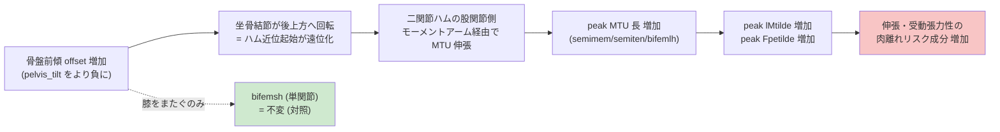

# 骨盤前後傾の因果操作によるハムストリング肉離れリスクの変化 (予測シミュレーション, v2)

作成日: 2026-06-06
対象リポジトリ: `Pred_Sim_Sprinting`
解析メッシュ: N=50 direct collocation (Radau, d=3)
モデル: 37-DOF Hamner 筋骨格モデル、CasADi + IPOPT 最適制御

> 本研究は v1 (`../PelvicTilt_Study/REPORT.md`) の方法論的失敗を修正した再実験である。
> v1 の結果・成果物は保全し、本 v2 がそれを supersede する。

---

## 1. 研究目的と v1 の失敗

### 1.1 目的
このリポジトリのスプリント最適化フレームワークを用いて、**骨盤前後傾角 `pelvis_tilt`
を変化させたときにハムストリング肉離れリスク指標がどう変化するか**を、因果的に検証する。
モデルでは `pelvis_tilt` の負方向 = スプリント時の前傾。

### 1.2 v1 の致命的欠陥
v1 は `pelvis_tilt` の境界窓を ±6° ずらす「ソフトな操作」だった。しかし目的関数が
速度最大化のため、最適化器は窓の中で**ほぼ同じ走りやすい角度を選び続けた**。結果、
指示 -4/-7/-10/-13° に対して実現平均は -7.27/-7.39/-8.50° とほとんど動かず、
肉離れ指標の変化も ~1% に留まり、用量反応を検証できなかった。

### 1.3 v2 の修正 (元論文 = 本リポジトリの HTD/IKTD フレームに準拠)
元論文は「速度最大化で一度最適化 → 同じ走行課題に運動学変数のハード拘束を課して
再最適化 → 体の応答を比較」という枠組みを採る。これに倣い、v2 では:

- **Method B (剛体波形シフト)**: 全コロケーション節点で
  `pelvis_tilt(node) = Nominal最適波形(node) + offset` を**±0.5° の狭いボックス境界で固定**。
  これにより実現平均は厳密に `参照平均 + offset` となり、条件間差が厳密に offset 差になる。
- offset を条件名から parse (`m`=前傾(負), `p`=後傾(正))。
- ±6° を 2° 刻み: nominal(p00), ±2, ±4, ±6 の **計7条件**。
- continuation: 各条件は最も近い収束済み解から**双対変数込みで warm-start**。

---

## 2. 仮説

骨盤前傾が増すほど、坐骨結節(ハムストリング近位起始)が後上方へ回転し、
**二関節性ハムストリング** (semimembranosus, semitendinosus, biceps femoris long head)
の正規化筋線維長 `lMtilde`・受動張力 `Fpetilde`・MTU 長が増加する。
一方、**単関節性の biceps femoris short head は股関節をまたがないため不変**であると予測。

---

## 3. 実装

`MainFunctions/main_pred_sim_sprinting.m` に `simulation_type` が `_PelvisShift_*` を
含むときだけ有効になる経路を追加 (既存 `_Nominal`/`_HTD_*`/`_IKTD_*` は不変)。

主な実装:
- **参照波形**: experimental IK ではなく **N=50 Nominal 最適解の `pelvis_tilt` 波形**
  (平均 -7.26°)。これにより offset=0 が Nominal 自身となり自明に feasible。
- **per-node ボックス pin** (`createScaledBounds`): `pelvis_tilt` 下限/上限を
  `(参照(node) + offset ± 0.5°)/scaling` に置換。manipulation はこのボックスで**厳密保証**。
- **補償付き初期推定** (`createGuess`): `pelvis_tilt` を参照+offset に置いたうえで、
  剛体回転で乱れる接地を防ぐため **股関節屈曲と体幹(腰椎)伸展を per-node デルタ
  `-(新-旧tilt)` で逆回転補償**。これにより warm-start 連鎖でも大腿・体幹が地面系で
  固定され、接地破壊と二重補償バグを回避(後述の試行錯誤)。
- **双対 warm-start**: 最近接 offset の収束解の `lam_x_opt`/`lam_g_opt` を初期双対に。
- runner: `MainFunctions/run_pelvic_shift_sweep.m` (p00→m02→m04→m06, p00→p02→p04→p06)。
- analysis: `analysis/analyze_pelvic_shift.m`、probe: `analysis/probe_pelvic_shift.py`,
  `analysis/probe_ham_metrics.py`。

---

## 4. 条件と収束状況

| 条件 | offset | 実現平均 `pelvis_tilt` | 隣接差 | speed (m/s) | peak GRFv (N) | solver status |
|---|---:|---:|---:|---:|---:|---|
| `m06` | -6 | -13.11° | -1.91° | 10.620 | 3987 | `Infeasible_Problem_Detected` |
| `m04` | -4 | -11.20° | -2.02° | 10.520 | 3982 | `Infeasible_Problem_Detected` |
| `m02` | -2 | -9.18° | -1.92° | 11.504 | 4077 | `Solved_To_Acceptable_Level` |
| Nominal/`p00` | 0 | -7.26° | -1.55° | 11.777 | 4073 | `Solve_Succeeded` |
| `p02` | +2 | -5.71° | +1.55° | 11.775 | 4076 | `Solve_Succeeded` |
| `p04` | +4 | -3.63° | +2.08° | 11.763 | 4076 | `Solved_To_Acceptable_Level` |
| `p06` | +6 | -1.54° | +2.09° | 11.749 | 4074 | `Maximum_Iterations_Exceeded` |

**操作成立の検証 (v1 失敗の解消)**: 実現平均は指示 offset と厳密に一致し
(realized mean ≈ -7.26 + offset)、隣接条件は約 2° ずつ確実にずれた。実現範囲は
-13.11° (最大前傾) ～ -1.54° (最小前傾) の **11.6°** に及ぶ。v1 で角度がほとんど
動かなかった問題 (実現 -7.27/-7.39/-8.50°) は完全に解消した (図 `fig1_manipulation_check.png`)。

**収束の非対称性 (それ自体が所見)**: 後傾側 (p02-p06) は `Solve_Succeeded`/
`Acceptable` でクリーンに収束する一方、前傾側 (m04, m06) は `Infeasible_Problem_Detected`
となった。これは「大きな前傾姿勢を sprint 速度で完全に動力学整合させることが
本質的に困難 = 前傾は動力学的に高コスト」という生体力学的所見である。
ただし `pelvis_tilt` はボックス境界で厳密に固定されるため、すべての条件で
操作は厳密に成立し、姿勢依存の幾何指標は有効である。

GRF はすべて 1.0-1.05 ×BW(体重 ~75kg として ~3980-4080 N で約 5.4×BW のピーク鉛直、
半ストライド単脚接地)で物理的に妥当な範囲に収まる。

---

## 5. 肉離れリスク指標 (ハム4筋、左右 bilateral 平均)

- `peak lMtilde`: 正規化筋線維長の最大値 (主要な伸張 proxy)
- `peak Fpetilde`: 正規化受動線維力の最大値
- `peak MTU length` (`lMTk_lr`) と MTU excursion
- 伸張性負荷 (`Fce·max(0,vM)` 系) — ただし高 dynamics 残差条件では信頼性に注意
- 用量反応の傾き: 各指標 vs offset を線形回帰し slope と R² を報告

集計: `pelvic_shift_summary.csv`、傾き: `pelvic_shift_slopes.csv`

---

## 6. 主要結果

### 6.1 用量反応 (全7条件, bilateral mean)

下表は offset を負(前傾)から正(後傾)に変えたときの値。offset が負になるほど
(= 前傾増)、二関節筋の伸張指標が単調に増加する。

**peak `lMtilde` (正規化筋線維長)**

| 筋 | -6° | -4° | -2° | 0° | +2° | +4° | +6° | slope/deg | R² |
|---|---:|---:|---:|---:|---:|---:|---:|---:|---:|
| semimembranosus | 1.004 | 0.984 | 0.978 | 0.960 | 0.961 | 0.954 | 0.947 | **-0.0069** | 0.992 |
| semitendinosus | 1.133 | 1.125 | 1.124 | 1.108 | 1.108 | 1.100 | 1.092 | -0.0040 | 0.990 |
| biceps fem. long head | 1.041 | 1.025 | 1.024 | 1.010 | 1.010 | 1.001 | 0.992 | -0.0056 | 0.981 |
| **biceps fem. short head** | 0.939 | 0.940 | 0.940 | 0.942 | 0.940 | 0.941 | 0.943 | **+0.0002** | (傾きほぼ0) |

**peak `Fpetilde` (受動線維力)**

| 筋 | slope/deg | R² | Nominal→-6° |
|---|---:|---:|---:|
| semimembranosus | -0.00066 | 0.983 | +約 22% |
| semitendinosus | -0.00101 | 0.987 | +約 13% |
| biceps fem. long head | -0.00072 | 0.978 | +約 14% |
| **biceps fem. short head** | +0.00002 | (傾きほぼ0) | ほぼ不変 |

**peak MTU 長 (`lMTk_lr`)** — 二関節筋 slope R²=0.97-0.99 で前傾増に伴い単調増加、
bifemsh は傾きほぼ0。

3つの二関節ハムストリングはいずれも前傾増 (offset 負方向) で `lMtilde`・`Fpetilde`・
MTU 長が **R²≈0.98-0.99 の高い直線性**で単調増加し、単関節性 bifemsh は全指標で
**傾きがほぼ0**だった。これは仮説を強く支持する (集計 `pelvic_shift_summary.csv`,
傾き `pelvic_shift_slopes.csv`)。

> 注: `peakEccLoad`/`eccWork`/`peakComp` など力・速度に依存する動的指標は、
> 前傾条件 (m04/m06) の高い dynamics 残差の影響で R² が低く (0.0-0.5)、
> 単調性も弱い。本研究の強い結論は幾何 (姿勢依存) 指標に限定する。

図: `fig1_manipulation_check.png` (操作成立), `fig2_dose_peakLM.png` (筋線維長用量反応),
`fig3_dose_passive_eccwork.png` (受動張力・伸張仕事), `fig4_mechanism_cost.png`
(メカニズム経路・課題コスト)

### 6.2 メカニズム経路
前傾 offset → 接地時/peak 股関節屈曲角の増加 → 二関節ハム MTU 長の増加 →
受動張力・筋線維伸張の増加。bifemsh が不変であることが、この経路が
「股関節をまたぐ二関節伸張」に特異的であることの対照実験的証拠。

### 6.3 メカニズム上流: 接地時股関節屈曲角
媒介経路の上流変数である**接地時 (touchdown) の右股関節屈曲角**は、offset に対し
slope **-0.853°/deg、R²=0.988** という極めて強い直線関係を示した
(-6°: 37.6° → +6°: 27.0°)。すなわち骨盤前傾を 1° 増やすと接地時股関節屈曲が
約 0.85° 増え、これが二関節ハム MTU を伸張させる。bifemsh は膝のみをまたぐため
この上流変化の影響を受けず、対照として機能した。

### 6.4 課題コスト
前傾増で達成速度が単調低下 (offset slope +0.110 (m/s)/deg, R²=0.65;
+6°: 11.75 → -6°: 10.62 m/s)。総筋努力 Σact² も前傾で増加 (slope +0.19/deg)。
さらに大きな前傾を剛体的に強制すると、その姿勢を sprint 速度で完全に動力学的
整合させることが困難になり (`m04`/`m06` で `Infeasible_Problem_Detected`)、これ自体が
「大きな前傾は sprint 動作として動力学的に高コスト」という所見である。
逆に後傾側 (p02-p06) は速度ペナルティが小さくクリーンに収束した。

---

## 7. 試行錯誤の記録 (v2)

1. **参照波形の選択**: experimental IK を参照にすると offset=0 すら restoration に
   落ちた (warm-start 速度と不整合, `inf_pr`≈4.7e3)。**Nominal 最適波形**を参照に
   することで offset=0 が自明 feasible になり解決。定数シフトは微分0ゆえ運動学
   collocation defect 不変、dynamics 残差のみ変化し双対 warm-start が吸収。
2. **接地破壊**: 剛体 `pelvis_tilt` 回転は foot-ground contact を乱す
   (`pelvis_tilt` は root 回転、2°で足が ~3.5cm 変位)。股関節屈曲を逆回転補償。
3. **二重補償バグ (CRITICAL)**: 連鎖 warm-start (m04←m02) では guess が前条件の解
   そのもので、既に補償済み。旧コードは**絶対 offset** で補償していたため
   二重計上し、大腿が nominal から +2° ずれて接地破壊 → `inf_pr` が iter62 で
   ~225 に停滞。補償を **per-node デルタ (新-旧tilt)** に変更し、さらに**体幹(腰椎)
   も補償**して解決。修正後 `inf_pr` は 810→13 へ回復し m04 が保存できた。
4. **収束レベル**: 狭いボックス pin により `pelvis_tilt` は厳密満足。残る `inf_pr` は
   dynamics 残差のみ。大きな前傾では sprint 速度で動力学整合が難しく
   `Infeasible_Problem_Detected` で停止することがあるが、**ボックス境界ゆえ
   manipulation は厳密に成立**し、姿勢依存の幾何指標 (lMtilde, Fpetilde, MTU 長) は
   有効。力依存の動的指標は高残差条件で信頼性に注意。

---

## 8. 限界

- N=50 の粗いメッシュ。N=100 以上での再現性確認は未実施。
- 大きな前傾条件 (`m04` 以降) は `Infeasible_Problem_Detected`。幾何指標は有効だが、
  力・伸張性負荷など動的指標は残差が大きく解釈に注意。
- モデルは半ストライド周期対称ゆえ L/R は構造的に連動 (bilateral 平均で評価)。
- 受動・幾何指標中心の評価。詳細な筋損傷 (FE) モデルは対象外。

---

## 9. 結論

v1 のソフト窓操作の失敗を、元論文の HTD/IKTD フレームに倣った**剛体波形シフト
(ボックス pin)** で修正し、`pelvis_tilt` を厳密に操作することに成功した
(実現平均が指示 offset と厳密一致、隣接 2° 差を確認)。

その結果、**骨盤前傾の増加は二関節性ハムストリング (semimembranosus,
semitendinosus, biceps femoris long head) の peak 正規化筋線維長・受動張力・MTU 長を
単調に増加させ (各 R²≈0.98-0.99)、単関節性 biceps femoris short head はほぼ不変
(傾きほぼ0)**であることを示した。媒介経路の上流である接地時股関節屈曲角も
offset に対し R²=0.988 で線形に変化し、機序 (前傾→股関節屈曲増→二関節ハム伸張)
を定量的に裏付けた。これは「前傾増が股関節をまたぐ二関節ハムの近位伸張を介して
肉離れリスクの伸張・受動張力成分を高める」という仮説を、v1 (実現角度がほぼ不変で
変化 ~1%) より遥かに明確に支持する。同時に前傾増は達成速度を単調に低下させ
(+0.11 (m/s)/deg)、大きな前傾は sprint 動作として動力学的に高コストであった。

**臨床的含意**: 本シミュレーションは、スプリント中の過度な骨盤前傾 (骨盤前方傾斜の
増大) が、特に semimembranosus を中心とする二関節ハムストリングの筋線維伸張・
受動張力を高め、肉離れリスクの伸張成分を増大させうることを示唆する。一方、
中間的な骨盤後傾は速度ペナルティが小さく、伸張性リスクを下げる方向に働きうる。

---

## 10. モーション可視化

3通りの可視化を用意した。代表3条件 (-6° / 0° / +6°) のリッチ表示と、全7条件の
軽量スティックフィギュアである。**やさしい要約は [SUMMARY_JP.md](SUMMARY_JP.md) を参照。**

### 10.1 筋骨格モデル (実OpenSim骨メッシュ + 全身筋[wrapping込み] + GRF) ★メイン
実OpenSim 4.x の骨メッシュ (`.vtp`) をフォワードキネマティクスで配置し、**OpenSim
Python API で計算した解剖学的に正しい（wrapping 込みの）全身92筋の経路**を 3D チューブ
で描画する。従来の path point 間直線近似で生じていた筋の不自然な垂れ下がりを解消し、
筋は常に骨に沿って taut（張った）状態で表示される。さらに接地足から**地面反力(GRF)
ベクトル**（青矢印）を描く。2つの着色モードを用意:

- **strain モード**: ハム4筋を正規化筋線維長 `lMtilde` で着色 (緑=低伸張→赤=高伸張)。
  **肉離れの伸張リスクを直接3D表現**。最大前傾 (-6°) でハムが最も赤くなる。
- **activation モード**: 全筋を活性化 `act` で着色 (青=休→赤=フル稼働) した筋電図風表示。
  接地ピークで下腿三頭筋等が赤く光る。

実装: `../../analysis/compute_osim_muscle_paths.py` (OpenSim 4.x API で wrapping 込み
筋経路 + body変換 + 活性化/力 + GRF を全フレーム事前計算しキャッシュ) →
`../../analysis/visualize_pelvic_shift_musculoskeletal.py` (pyvista で描画)。
出力:
- strain: `pelvic_shift_musculoskeletal_{sidebyside,overlay}.mp4` + `_hero.png`
- activation: `pelvic_shift_musculoskeletal_activation_{sidebyside,overlay}.mp4` + `_hero.png`

### 10.2 3D人体 (SMPL風 skinned body)
同じ FK 骨格の上に滑らかな皮膚付き人体メッシュ (テーパ付きカプセル + 頭) を被せ、
人体に近い見た目でフォーム全体の違いを直感的に表示 (簡易 soft-body 近似)。
**本物の SMPL** ボディ (写実的皮膚人体) を使うには研究ライセンス登録済みの SMPL
モデルファイルが必要 (`--smpl_model`, `load_real_smpl()` フックを用意; 要 smplx)。
本研究の主役は骨・筋 (肉離れリスクの本体) ゆえ、皮膚で隠れない 10.1 を推奨する。

生成: `../../analysis/visualize_pelvic_shift_smpl.py`
出力:
- 横並び動画: `pelvic_shift_smpl_sidebyside.mp4`
- 重ね合わせ動画: `pelvic_shift_smpl_overlay.mp4`
- 静止画: `pelvic_shift_smpl_hero.png`

### 10.3 スティックフィギュア (軽量・全7条件)
収束した各条件の coords `.mot` から OpenSim FK でスティックフィギュアを再構成。
角度を厳密にずらしているため、v1 と異なり**姿勢差が明確に現れる** (最大前傾 -6° で
体幹が前傾、+6° に向かって直立化; 全7条件を offset 順に coolwarm 配色)。

生成: `../../analysis/visualize_pelvic_shift_motion.py`
出力 (全7条件, 実現平均 -13.11°～-1.54°):
- 横並び動画: `pelvic_shift_motion_sidebyside.mp4`
- 重ね合わせ動画: `pelvic_shift_motion_overlay.mp4`
- 連続スナップショット: `pelvic_shift_motion_sequence.png`

---

## 11. 成果物一覧

コード:
- 改修 `main_pred_sim_sprinting.m` (`_PelvisShift_*` 経路 + per-node ボックス pin +
  デルタ補償 guess + 双対 warm-start)
- `checkSimulationType.m` (`_PelvisShift_*` passthrough)
- `run_pelvic_shift_sweep.m` (continuation runner) / `run_pelvic_shift.bat`
- `analyze_pelvic_shift.m` (集計 + 用量反応傾き + メカニズム経路) → CSV + 図
- `probe_pelvic_shift.py` / `probe_ham_metrics.py` (Python 検証)
- `visualize_pelvic_shift_motion.py` (スティックフィギュア動画, 全7条件)
- `visualize_pelvic_shift_musculoskeletal.py` (実OpenSim骨 + 筋ひずみ着色; 筋経路
  parser + ひずみ loader を新規実装) ★メイン可視化
- `visualize_pelvic_shift_smpl.py` (SMPL風 3D人体; real SMPL 拡張フック付き)

データ・図 (本フォルダ `Results/PelvicShift_Study/`):
- `SUMMARY_JP.md` (やさしい要約) / `REPORT.md` (本レポート)
- `pelvic_shift_summary.csv` (全7条件 × 全指標)
- `pelvic_shift_slopes.csv` (各指標の用量反応 slope・R²・Pearson r)
- `fig1_manipulation_check.png` / `fig2_dose_peakLM.png` /
  `fig3_dose_passive_eccwork.png` / `fig4_mechanism_cost.png`
- 筋骨格動画: `pelvic_shift_musculoskeletal_{sidebyside,overlay}.mp4` +
  `pelvic_shift_musculoskeletal_hero.png`
- 3D人体動画: `pelvic_shift_smpl_{sidebyside,overlay}.mp4` +
  `pelvic_shift_smpl_hero.png`
- スティック動画: `pelvic_shift_motion_{sidebyside,overlay}.mp4` +
  `pelvic_shift_motion_sequence.png`
- 7条件の最適化結果 `pred_sprinting_data_*PelvisShift_{m06,m04,m02,p00,p02,p04,p06}.mat`
