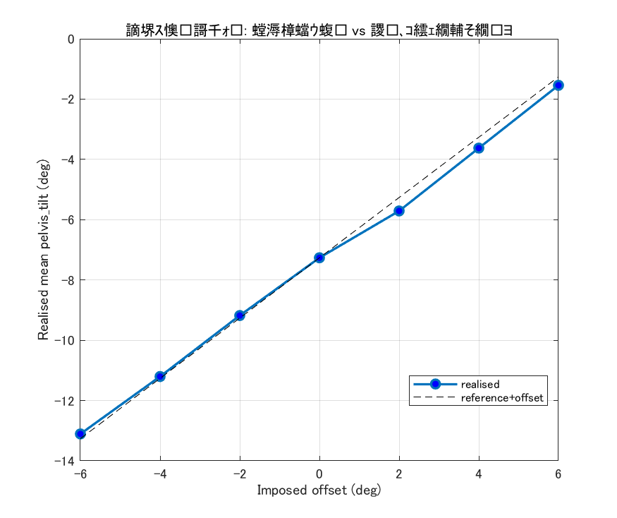
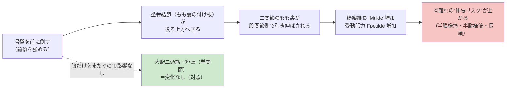
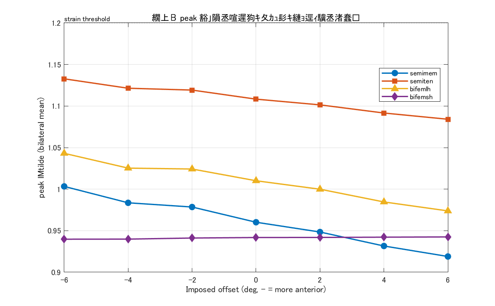
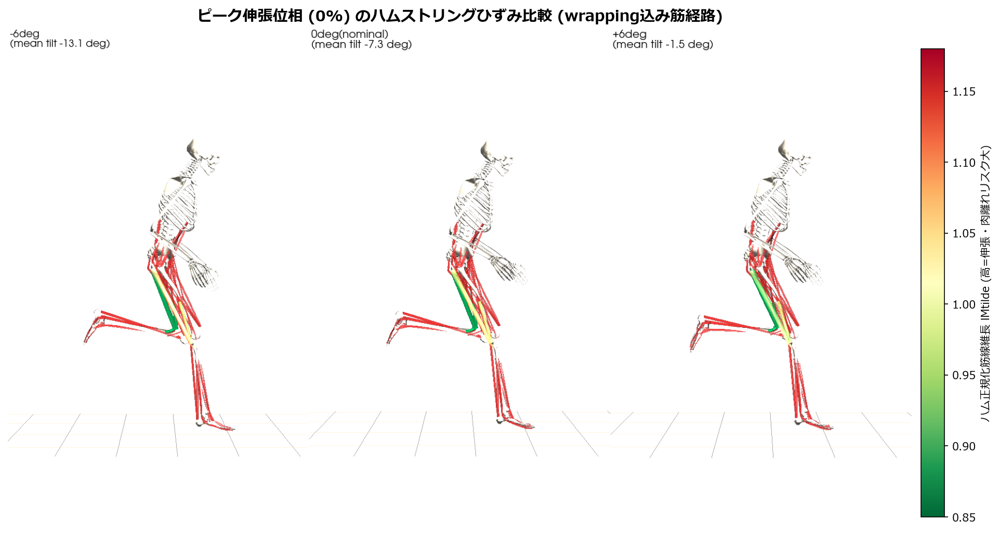

# 骨盤の傾きと「速さ・ケガ」— この1ファイルで全部わかる かんたんガイド

作成日: 2026-06-23
対象: はじめてこの研究を見る人（専門知識ゼロでもOK）
このファイルだけ読めば、**何を・なぜ・どうやって調べ・何がわかったか**が一通り理解できます。
さらに詳しい数値や手法は [REPORT.md](REPORT.md)（専門版）と [SUMMARY_JP.md](SUMMARY_JP.md)（中級者向け要約）にあります。

---

## もくじ

1. [30秒でわかるまとめ](#30秒でわかるまとめ)
2. [この研究はひとことで言うと？](#1-この研究はひとことで言うと)
3. [はじめに：知っておきたい言葉（ミニ辞典）](#2-はじめに知っておきたい言葉ミニ辞典)
4. [なぜこの研究をするの？（背景）](#3-なぜこの研究をするの背景)
5. [何を調べた？（研究の問い）](#4-何を調べた研究の問い)
6. [どうやって調べた？（方法をやさしく）](#5-どうやって調べた方法をやさしく)
7. [なぜ骨盤の傾きでもも裏が変わるの？（しくみ）](#6-なぜ骨盤の傾きでもも裏が変わるのしくみ)
8. [結果①：走る速さ](#7-走る速さはどう変わる)
9. [結果②：地面反力（GRF）](#8-地面反力grfはどう変わる)
10. [結果③：ケガのリスク（もも裏の伸び）](#9-ケガのリスクはどう変わる)
11. [まとめと実践へのヒント](#10-まとめと実践へのヒント)
12. [動画・図の見かた](#11-動画図の見かた)
13. [この研究の限界（正直なところ）](#12-この研究の限界正直なところ)

---

## 30秒でわかるまとめ

> **スプリント（全力疾走）中に骨盤を前に倒す（前傾を強める）ほど、**
>
> - **走る速さ**は **少し落ちる**
> - **もも裏（ハムストリング）の肉離れリスク**は **はっきり上がる**（特に半膜様筋）
> - **地面を蹴る力（地面反力）は ほぼ変わらない**
>
> 逆に **骨盤を少し後ろに起こす（やや後傾）** と、速さはほぼそのままで、もも裏の
> 伸ばされ具合（＝肉離れの一因）は **下がる**。

これは実際に人を走らせて測ったのではなく、**コンピュータの物理シミュレーション**で
「骨盤の傾きだけ」を変えて比べた結果です。だから「骨盤の傾きが原因で何が変わるか」を
きれいに切り分けられます。

### まず動きを見てみよう（左：前傾−6° ／ 中：基準0° ／ 右：後傾+6°）

*本物のOpenSim骨格＋全身92筋。もも裏4筋だけ伸び具合で色分け（緑＝低リスク → 赤＝高リスク）し、他の筋は薄く表示。各パネル上の「peak ham lMtilde」(1.11／1.08／1.05) がもも裏の最大の伸び＝前傾ほど大きい。左端は高さ定規。詳しい見かたは「[11. 動画・図の見かた](#11-動画図の見かた)」へ。*

---

## 1. この研究はひとことで言うと？

**「スプリント中の骨盤の前後の傾きを変えると、もも裏の肉離れリスクと走りはどう変わるか」**
を、コンピュータシミュレーションで因果的に確かめた研究です。

陸上のトップスプリンターに多いケガが **ハムストリング（もも裏）の肉離れ**です。
現場では「骨盤を立てろ／前傾しろ」といった指導がありますが、
**骨盤の傾き“だけ”を変えたときに、もも裏に何が起きるか**を厳密に取り出すのは、
実際の計測では難しい（人は傾きを変えると他の動きも一緒に変えてしまうため）。

そこで本研究は、**他の条件をそろえたまま骨盤の傾きだけを動かせる**シミュレーションを使い、
その因果関係を1°きざみで定量化しました。

---

## 2. はじめに：知っておきたい言葉（ミニ辞典）

先にこれだけ押さえると、この後がスラスラ読めます。

| 言葉 | やさしい意味 | たとえ |
| --- | --- | --- |
| **予測シミュレーション** | 「いちばん速い走り方」を物理法則からコンピュータに解かせる方法。モーションキャプチャ（実測）ではない。 | 「最速で走るには？」を計算で求める |
| **骨盤の前傾／後傾** | 骨盤が前に倒れる／後ろに起きること。 | 水の入ったお椀を前/後ろに傾ける |
| **ハムストリング** | もも裏の筋肉グループ（4つの筋）。スプリントで肉離れしやすい。 | もも裏の“ゴム束” |
| **二関節筋／単関節筋** | 股関節と膝の**2つ**の関節をまたぐ筋／膝**だけ**をまたぐ筋。 | 2つの滑車にかけたロープ／1つだけのロープ |
| **坐骨結節（ざこつけっせつ）** | もも裏の筋が骨盤側でくっつく付け根（座ったとき当たる骨）。 | もも裏ゴムの“上の留め具” |
| **正規化筋線維長 `lMtilde`** | 筋繊維がどれだけ引き伸ばされているか（1.0が基準、大きいほど伸びている＝伸張リスク↑）。 | ゴムの伸び具合メーター |
| **受動張力 `Fpetilde`** | 筋を引き伸ばしたときに自然に出る“ゴムの張り”（自分で力まなくても出る張力）。 | 伸ばしたゴムの突っ張り |
| **地面反力（GRF）** | 足が地面を蹴ったとき、地面が足を押し返す力。体重の何倍かで表す。 | 体重計に乗ったときの数字（走ると数倍になる） |
| **筋活性化** | その筋がどれくらい“スイッチON”か（0=休み、1=全力）。 | 筋肉のアクセル開度 |
| **用量反応** | 原因を増やすほど結果も比例して増える関係。これがあると「本当に原因」と言える。 | 薬の量を増やすほど効果も増える |

---

## 3. なぜこの研究をするの？（背景）

- **ハムストリング肉離れはスプリントで最多級のケガ**。多くは脚を前に振り出す
  「遊脚後期」にもも裏が強く引き伸ばされる瞬間に起きるとされます。
- もも裏の筋のうち3つ（半膜様筋・半腱様筋・大腿二頭筋長頭）は
  **股関節と膝の両方をまたぐ「二関節筋」**。骨盤の傾きが変わると、股関節側の
  付け根（坐骨結節）の位置が動くので、**もも裏の伸ばされ方が変わる**はずです。
- でも実際の走りでは、人は骨盤を変えると同時に他もたくさん変えるので、
  「骨盤の傾きだけの効果」を取り出せません。
- → **シミュレーションなら、骨盤の傾きだけを正確に動かして比較できる**。これが本研究の強みです。

> モデル上の約束: `pelvis_tilt`（骨盤の傾き角）が **マイナス＝前傾**、**プラス＝後傾**。

---

## 4. 何を調べた？（研究の問い）

**問い:** 「全力スプリントの走り方をそろえたまま、骨盤の前後傾だけを変えると、
（A）走る速さ・（B）地面反力・（C）もも裏の肉離れリスクはどう変わるか？」

**仮説:** 前傾を強めるほど、坐骨結節が後ろ上方へ回り、
**二関節のもも裏（半膜様筋・半腱様筋・大腿二頭筋長頭）が引き伸ばされて伸張リスクが上がる**。
一方、**膝だけをまたぐ単関節の大腿二頭筋“短頭”は影響を受けない**（＝比較の“対照”）。

---

## 5. どうやって調べた？（方法をやさしく）

ポイントは「**フェアな比較**」です。骨盤の傾き以外をそろえています。

1. **基準の走りを作る**
   まず「全力スプリント」をシミュレーションで1回解き、いちばん速い走り（基準フォーム）を求めます。
   このときの骨盤の傾きは平均 **約 −7.3°（少し前傾）** でした。

2. **骨盤の傾きだけを強制的にずらす**
   基準フォームに対して、走りの全タイミングで骨盤の傾きを一律にずらします。
   ずらし幅は **−6°〜+6° を 2°きざみ、全7条件**（−6 / −4 / −2 / 0 / +2 / +4 / +6）。
   - マイナス（m）＝前傾を強める、プラス（p）＝後傾ぎみ。
   - ずらし量は ±0.5° の狭い範囲にガッチリ固定するので、**狙いどおり正確に**動きます。

3. **接地が壊れないように補正**
   骨盤を傾けると足の着く位置がずれてしまうので、股関節と体幹をわずかに逆方向へ
   調整して、**足の接地はそろえた**まま骨盤だけ傾けています。

4. **それぞれで測って比べる**
   各条件で「達成した速度」「地面反力」「もも裏4筋の伸ばされ具合」を測定して並べます。

> **“骨盤の傾きだけ”を正確にずらせたかは確認済み**です（下の図1）。
> 実際の平均傾きは −13.1°（最大前傾）〜 −1.5°（最小前傾）まで、ねらい通り約2°刻みで動きました。

*図1：横軸が「狙ったずらし量」、縦軸が「実際に実現した骨盤の傾き」。きれいな直線＝狙い通り操作できた証拠。*

---

## 6. なぜ骨盤の傾きでもも裏が変わるの？（しくみ）

たとえ話：もも裏の二関節筋は「**坐骨結節（上の留め具）から膝の下まで張ったゴム**」です。
骨盤を前に倒すと、上の留め具（坐骨結節）が**後ろ上方へ持ち上がる**ので、ゴム全体が
**ピンと引き伸ばされます**。これが伸張リスクの正体です。

**決め手（対照実験）:** もし「前傾でもも裏が伸びる」のが本当なら、
**股関節をまたぐ二関節筋だけが伸び、膝だけの短頭は変わらない**はず。
結果はまさにその通りで、これがこのしくみの**動かぬ証拠**になりました。

なお上流の引き金は「**接地のときの股関節の曲がり**」です。前傾1°につき接地時の
股関節屈曲が約0.85°増え（−6°で37.6° → +6°で27.0°、当てはまり R²=0.99）、これがもも裏を伸ばします。

---

## 7. 走る速さはどう変わる？

**前傾を強めるほど遅くなる**（特に −4°・−6° で大きく低下）。後傾側はほぼ横ばい。

| 骨盤の傾き | 実際の平均傾き | 達成速度 |
| --- | ---: | ---: |
| 前傾を強める（−6°） | −13.1° | 10.62 m/s |
| 前傾を強める（−4°） | −11.2° | 10.52 m/s |
| 少し前傾（−2°） | −9.2° | 11.50 m/s |
| **基準（0°）** | **−7.3°** | **11.78 m/s** |
| 少し後傾（+2°） | −5.7° | 11.78 m/s |
| 後傾ぎみ（+4°） | −3.6° | 11.76 m/s |
| 後傾ぎみ（+6°） | −1.5° | 11.75 m/s |

> ポイント：前傾しすぎは「ケガのリスクが上がる」だけでなく「**遅くもなる**」。
> つまり前傾を強めるメリットはこの結果では見当たりませんでした。

---

## 8. 地面反力（GRF）はどう変わる？

地面を蹴る力のピーク（鉄直方向）は、どの条件でも **体重の約5.4倍（約4000N）** で
**ほとんど変わりません**。物理的にも自然な範囲です。

| 条件 | ピーク鉄直 地面反力 |
| --- | ---: |
| −6° 〜 +6°（全条件） | 約 3980〜4080 N（≒ 体重の約5.4倍） |

ただし1つ重要な所見があります。
**強い前傾（−4°・−6°）では、シミュレーションがうまく解けない（infeasible）**状態になりました。
これは「大きな前傾姿勢を、スプリントの速さで物理的につじつま合わせするのは本質的に難しい
＝**前傾は力学的にコストが高い**」というサインです（速度が落ちることとも一致）。

---

## 9. ケガのリスクはどう変わる？

伸張リスクの主な指標は **正規化筋線維長 `lMtilde`**（大きいほど引き伸ばされ＝肉離れリスク↑）と
**受動張力 `Fpetilde`**（伸ばされたゴムの突っ張り）です。

**骨盤を1°前傾するごとの変化（傾き）と、当てはまりの良さ（R²。1に近いほどキレイな直線）:**

| もも裏の筋 | 1°前傾あたりの伸び | 当てはまり R² | 受動張力（基準→−6°） | タイプ |
| --- | ---: | ---: | ---: | --- |
| **半膜様筋**（はんまくようきん） | いちばん大きく増加 | 0.99 | **+約22%** | 二関節 ★最大リスク |
| 大腿二頭筋・長頭 | 増加 | 0.98 | +約14% | 二関節 |
| 半腱様筋（はんけんようきん） | 増加 | 0.99 | +約13% | 二関節 |
| 大腿二頭筋・**短頭** | **ほぼ変化なし** | — | ほぼ不変 | 単関節（対照） |

> 読み方：前傾を強めるほど、二関節のもも裏3筋は **R²≈0.98〜0.99 のキレイな直線**で
> 伸び・張りが増えました。中でも **半膜様筋がいちばんリスクが上がる（張力 +約22%）**。
> 膝だけの短頭は**変わらない**＝「股関節をまたぐ伸び」が原因という証拠です。

*図2：横軸が骨盤の傾き、縦軸がもも裏の伸び具合。二関節筋（色付き）は前傾で右肩上がり、短頭はほぼ水平。*

---

## 10. まとめと実践へのヒント

### わかったこと

- 骨盤を**前傾しすぎる**と、もも裏（特に**半膜様筋**）の**肉離れリスクが上がり**、
  しかも**速度も落ちる**。地面反力自体は大きく変わらない。
- **中間〜やや後傾**の骨盤は、速度の損失がほとんどなく、もも裏の伸張リスクを**下げる**方向。
- 影響を受けるのは**股関節をまたぐ二関節のもも裏だけ**。膝だけの短頭は無関係。

### 実践へのヒント（あくまでシミュレーション上の傾向）

- スプリント中の**過度な骨盤前傾は避ける**のが、ケガ予防・速度の両面で理にかなう。
- もも裏ケアでは、二関節筋（半膜様筋・半腱様筋・大腿二頭筋長頭）が伸張負荷を受けやすい点に注意。

---

## 11. 動画・図の見かた

「骨盤の傾きごとに走りがどう違うか」を、わかりやすさ重視で何通りも用意しています。
動画はすべて **代表3条件（−6° / 0° / +6°）** の比較です。

### A. 筋骨格モデル（本物のOpenSim骨格＋全身筋＋もも裏“ひずみ色”＋地面反力）★いちばんおすすめ

本物の骨を動かし、**全身92本の筋を解剖学的に正しい経路で**表示します。もも裏（ハム）は
**伸び具合で色分け**（緑＝低リスク → 赤＝高リスク）、他の筋は薄いグレーに沈めてハムを際立たせています。

**見かたのコツ（3条件をどう比べるか）:**

- 各パネル上の **`peak ham lMtilde`** の数字＝もも裏の最大の伸び。前傾を強めるほど大きい（**1.11 ＞ 1.08 ＞ 1.05**）。
- もも裏チューブの**色**：前傾−6°は赤め（伸張大＝リスク高）、後傾+6°は緑（余裕あり）。
- **オレンジ線＝右足の軌跡**、薄い灰線＝基準(0°)の足軌跡。重ねると足の運び・高さの違いがわかる。
- 左端の**高さ定規（0.0／0.5／1.0／1.5m）**と濃い**接地線**で、3条件の足の高さを同じ目盛りで比較できる。

**ファイル:**

- 横並び: [pelvic_shift_musculoskeletal_sidebyside.mp4](pelvic_shift_musculoskeletal_sidebyside.mp4)
- 重ね合わせ: [pelvic_shift_musculoskeletal_overlay.mp4](pelvic_shift_musculoskeletal_overlay.mp4)
- 静止画（ピーク伸張の瞬間）: [pelvic_shift_musculoskeletal_hero.png](pelvic_shift_musculoskeletal_hero.png)

### A2. 筋活性化マップ（どの筋が・いつ働くか）＋地面反力

同じ全身筋骨格を、各筋の**活性化レベル**で色分け（青＝休み → 赤＝フル稼働）した“筋電図風”の見せ方。

- 横並び: [pelvic_shift_musculoskeletal_activation_sidebyside.mp4](pelvic_shift_musculoskeletal_activation_sidebyside.mp4)
- 重ね合わせ: [pelvic_shift_musculoskeletal_activation_overlay.mp4](pelvic_shift_musculoskeletal_activation_overlay.mp4)
- 静止画: [pelvic_shift_musculoskeletal_activation_hero.png](pelvic_shift_musculoskeletal_activation_hero.png)

### B. 3D人体（SMPL風の人体シルエット）

人体に近い見た目でフォーム全体の違いを直感的に表示（簡易な近似ボディ）。
※ 写実的な“本物のSMPL人体”を使うには、研究ライセンス登録済みのSMPLモデルファイルが別途必要です。

- 横並び: [pelvic_shift_smpl_sidebyside.mp4](pelvic_shift_smpl_sidebyside.mp4)
- 重ね合わせ: [pelvic_shift_smpl_overlay.mp4](pelvic_shift_smpl_overlay.mp4)

### C. スティックフィギュア（軽い棒人間・全7条件）

いちばん軽くて読み込みが速い表示。7条件すべてを並べて見られます。

- 横並び: [pelvic_shift_motion_sidebyside.mp4](pelvic_shift_motion_sidebyside.mp4)
- 重ね合わせ: [pelvic_shift_motion_overlay.mp4](pelvic_shift_motion_overlay.mp4)

### グラフ（数字で見たい人向け）

- [fig1_manipulation_check.png](fig1_manipulation_check.png)：操作が狙い通りか
- [fig2_dose_peakLM.png](fig2_dose_peakLM.png)：もも裏の伸び（用量反応）
- [fig3_dose_passive_eccwork.png](fig3_dose_passive_eccwork.png)：受動張力・伸張仕事
- [fig4_mechanism_cost.png](fig4_mechanism_cost.png)：しくみと速度コスト

---

## 12. この研究の限界（正直なところ）

信頼できる部分とそうでない部分を、はっきり分けておきます。

- **計算メッシュが粗い（N=50）**。より細かい設定での再現確認はこれから。
- **強い前傾（−4°・−6°）は完全には解けていない**（infeasible）。
  そのため「**姿勢で決まる幾何の指標（筋繊維長・受動張力）は信頼できる**」一方、
  **力・速度に依存する動的な指標（伸張性負荷など）は誤差が大きく**、強い結論は出していません。
- モデルは半歩（ハーフストライド）対称なので、**左右は構造的に連動**（左右平均で評価）。
- 評価は**伸び・張り中心**で、筋の細かな損傷（FEモデル）までは見ていません。

> つまり本研究の**自信のある結論**は、「**前傾を強めるほど二関節のもも裏が伸び、
> 受動張力が上がる（半膜様筋が最大）**」という**姿勢由来の幾何的リスク**の部分です。

---

### もっと詳しく知りたい人へ

- 中級者向けのやさしい要約 → [SUMMARY_JP.md](SUMMARY_JP.md)
- 手法・数式・試行錯誤・全数値の専門レポート → [REPORT.md](REPORT.md)
- 生データ表 → [pelvic_shift_summary.csv](pelvic_shift_summary.csv) / 傾き → [pelvic_shift_slopes.csv](pelvic_shift_slopes.csv)
