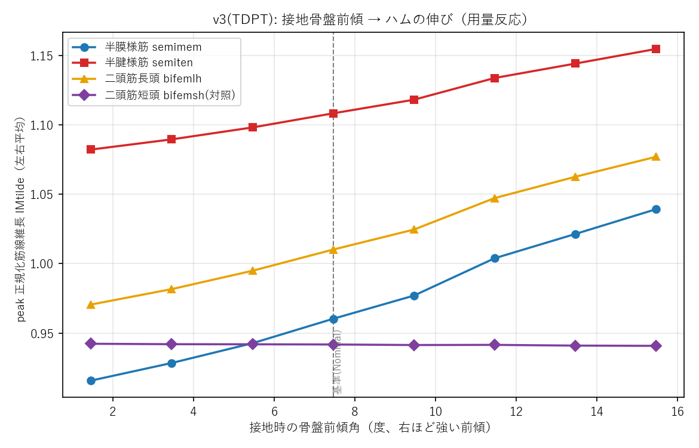
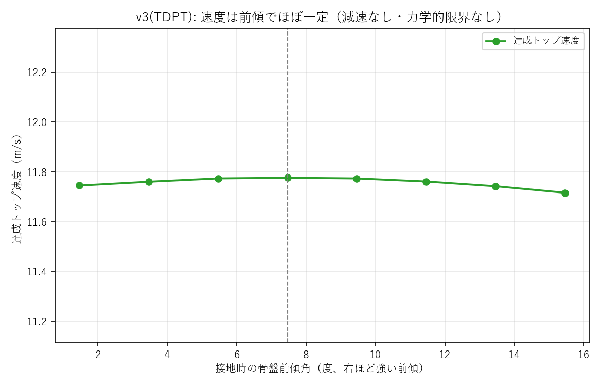
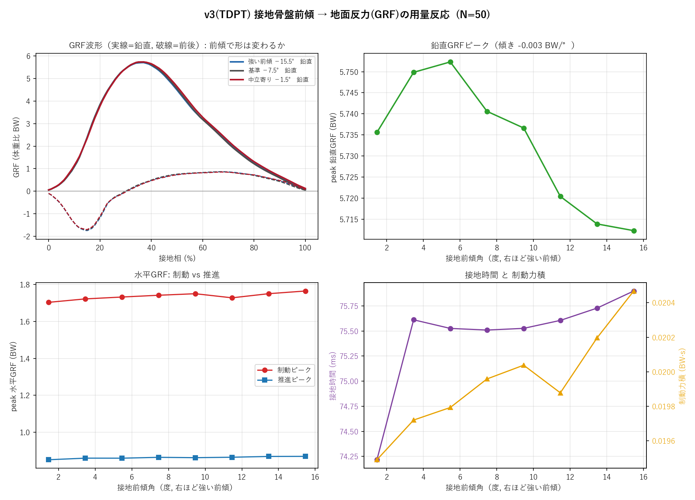
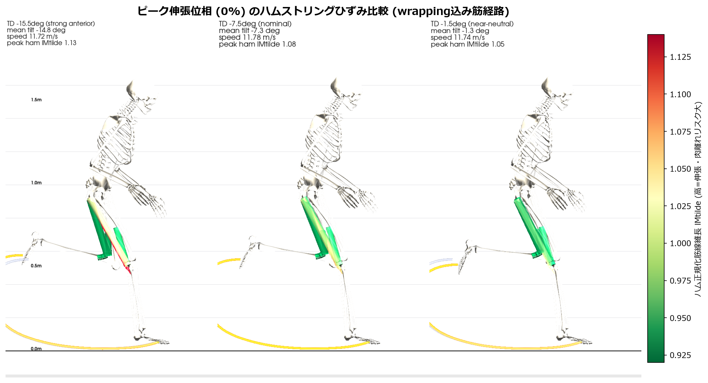
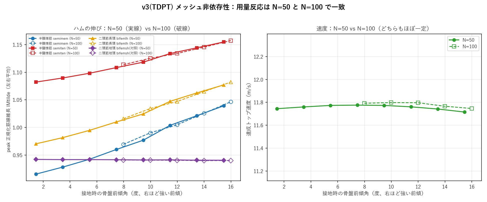

# 骨盤の傾きと「速さ・ケガ」— v3 かんたんガイド（手法をクリーンにやり直した版）

作成日: 2026-06-24
対象: はじめてこの研究を見る人（専門知識ゼロでもOK）
このファイルだけで、**v3 で何を・なぜ変えたか／今わかっていること**が分かります。
※ 厳密な手法・全数値は同じフォルダの [REPORT.md](REPORT.md) に、v2 の解説は
[../PelvicShift_Study/かんたんガイド.md](../PelvicShift_Study/かんたんガイド.md) にあります。

> **状態（2026-06-24 時点）**: v3 の手法は実装・検証ずみ。**用量反応を全8条件（N=50）で完成**。
> 当初「強い前傾は成立しない」と見えたのは**モデルの天井（座標バウンド）という人工物**で、
> それを外すと**接地角 −15.5°まで全条件が成立**し、速度も落ちません（§8 で詳説）。
> 下に訂正後の用量反応の表とグラフを掲載。**N=100（メッシュを2倍）でも同じ結論が再現**（§10）、
> 厳密な手法・全数値は [REPORT.md](REPORT.md) に整理しました。

---

## もくじ

1. [30秒でわかるまとめ](#30秒でわかるまとめ)
2. [v3 とは？なぜ作り直したか](#1-v3-とはなぜ作り直したか)
3. [用語ミニ辞典](#2-用語ミニ辞典)
4. [v2 の気になっていた点](#3-v2-の気になっていた点)
5. [v3 のやり方（最小操作）](#4-v3-のやり方最小操作)
6. [しくみのたとえ](#5-しくみのたとえ)
7. [結果（用量反応：全8条件）](#6-結果用量反応全8条件)
8. [動作データの可視化（実際の走りで見る）](#7-動作データの可視化実際の走りで見る)
9. [大きな発見：「前傾の限界」はモデルの天井だった（重要な訂正）](#8-大きな発見前傾の限界はモデルの天井だった重要な訂正)
10. [v2 と v3 のちがい](#9-v2-と-v3-のちがい)
11. [いまの進捗と今後](#10-いまの進捗と今後)
12. [限界と注意](#11-限界と注意)

---

## 30秒でわかるまとめ

> **v3 のねらい**: 「骨盤の傾き**だけ**を操作して、走り全体は**自然に成り立たせる**」を、
> 元論文とまったく同じ“最小操作”のやり方で実現すること。
>
> - v2 は骨盤の傾きを**全タイミングで固定**し、しかも**股関節・腰の初期値もいじって**いた
>   → 「骨盤以外も操作している」気がかりがあった。
> - v3 は **接地（足が地面に着く一瞬）の骨盤角を1つだけ指定**し、**あとは全部、走りが
>   自然に再最適化**される。骨盤以外には一切触れない。
>
> **わかったこと（全8条件・N=50 完了）**:
>
> - **前傾を強めるほど、もも裏（二関節筋）の伸びが大きくなる**（＝肉離れリスク↑）。
>   股関節をまたがない短頭は不変（対照）。**接地角 −1.5°〜−15.5°まできれいな一直線**の用量反応。
> - **速度は前傾でほぼ一定**（11.7〜11.8 m/s、減速なし）。前傾は“速さの代償”ではなく
>   **純粋なケガのリスク要因**。
> - 当初「強い前傾（約−10°より前）は成立しない」と見えたが、これは**モデルの天井
>   （骨盤角の座標バウンド）という人工物**だった。**外したら −15.5°まで全部成立**し、
>   速度も落ちない＝**本物の力学的限界ではなかった**（§8 に検証の経緯）。
> - これらは**接地の骨盤角だけを操作**し、股関節などは**補正なしで自然に適応**した結果。
>
> 📺 **実際の走りの比較**（骨格＋もも裏ひずみの動画・スチル）は **§7 動作データの可視化** に。

---

## 1. v3 とは？なぜ作り直したか

この研究は「スプリント中の**骨盤の前後傾**が、**もも裏（ハムストリング）の肉離れリスク**を
変えるか」を、コンピュータの予測シミュレーションで**因果的に**調べるものです。

- **v1** … 骨盤角に広い“許容範囲”を与える方式 → 最適化が同じ角度に落ち着き失敗。
- **v2** … 骨盤角の**波形全体**を固定＋股関節・腰の初期値を補正 → 用量反応は作れたが、
  「骨盤以外もいじっている＝不自然では？」という懸念が残った。
- **v3（本版）** … 元論文（Haralabidis ら 2025, *MSSE*）の **HTD/IKTD と同じ“最小操作”**に
  そろえた。**接地の骨盤角を1点だけ**指定し、ほかは全部自然に再最適化。**最も厳密で
  クリーンな因果デザイン**で、論文化に耐える形にした。

---

## 2. 用語ミニ辞典

| 言葉 | やさしい意味 | たとえ |
| --- | --- | --- |
| **予測シミュレーション** | 物理法則から「いちばん速い走り方」を計算で求める方法（実測ではない）。 | 「最速で走るには？」を計算で解く |
| **接地（タッチダウン）** | 走行中に足が地面に着く瞬間。もも裏が最も伸ばされる時期に近い。 | 一歩の“着地の瞬間” |
| **骨盤の前傾／後傾** | 骨盤が前に倒れる／後ろに起きること。 | お椀を前/後ろに傾ける |
| **最小操作** | 狙いの1つだけを拘束し、残りは全部自由に最適化させること。 | 1か所だけ固定して他は自由に動かす |
| **再最適化** | 1か所を変えたうえで、走り全体を“また一から”最適に解き直すこと。 | 条件を変えて解き直す |
| **成立する/しない（feasible/infeasible）** | その条件で物理的につじつまの合う走りが存在するか否か。 | 解が「ある／ない」 |
| **正規化筋線維長 lMtilde** | もも裏がどれだけ伸びているか（大きいほど伸張＝肉離れリスク↑）。 | ゴムの伸びメーター |
| **用量反応** | 原因を増やすほど結果も比例して変わる関係（因果の証拠）。 | 量を増やすほど効く |

---

## 3. v2 の気になっていた点

v2 は骨盤を操作するとき、次の2つを行っていました。

1. **骨盤角を全タイミングで固定**（波形そのものを強制）。
2. 接地が崩れないよう、**股関節と腰（腰椎）の初期値を逆向きに補正**。

2 は「初期値（出発点）」であって最終解では再最適化されますが、

- 「骨盤**だけ**を操作した」という主張が**あいまい**になる、
- 骨盤角の**形まで強制**するので動きが**不自然**になりうる、

という懸念がありました。これは「あくまで操作は骨盤のみで、運動は自然に成立させたい」という
要望と合いません。**v3 はこの点をクリーンに解決します。**

---

## 4. v3 のやり方（最小操作）

元論文の HTD/IKTD（接地の距離変数を1つ指定して走りを再最適化）と**まったく同じ型**です。

- **接地ノードに、たった1本の等式**を追加するだけ:

  `接地時の骨盤前傾角 ＝ 基準（Nominal）の接地時の値 ＋ オフセット`

  （オフセット＝条件ごとのずらし量。−が前傾、+が後傾。例: +6°, −6°）
- **これ以外は一切触れない**:
  - 接地以外のタイミングの骨盤角は**自由**、
  - 股関節・腰・他の全関節・筋・地面反力・タイミングも**全部自由に再最適化**、
  - 初期値の補正は**しない**、解き方（厳密公差）は基準と同じ。

つまり「**接地の骨盤角だけを指定 → 走り全体が自然に成立**」。これが v3 です。

基準（Nominal）の接地骨盤角は、計算結果から自動抽出: **N=50 で −7.46°**、**N=100 で −7.99°**
（この値＋オフセットが各条件の狙い）。

### もう一歩くわしく：モデルと最適化の中身（論文レベル）

「予測シミュレーション」が具体的に何をしているかを、用語をかみくだいて説明します
（厳密な式・全数値は [REPORT.md](REPORT.md) に英語でまとめてあります）。

- **① 体のモデル**: 3次元の全身筋骨格モデル（Hamner 系スプリントモデル）。**37個の関節自由度**、
  **92本の筋（腱つき Hill 型）**、足と地面の接触はばね的な接触モデル。腕は理想トルクで駆動。
  動きは「片足の接地〜反対足の接地」までの**半歩を左右対称**で解き、1歩に展開します。
- **② “最速の走り”を物理法則の下で解く（最適制御）**: 全身の運動方程式・筋収縮・接触を
  **すべての時刻で満たしながら**、トップスピードが最大になる関節の動かし方を求めます。
  時間軸は**直接コロケーション法**（区間 **N=50**、Radau 次数3）で離散化し、約9万個の変数を
  非線形最適化ソルバ **IPOPT**（厳密公差 1e-5）で解きます。
- **③ 目的は「速さ最大」**: 目的関数は**平均速度の最大化**（重み最大）＋ごくわずかな省エネ
  正則化（筋活動・関節加速度など）。**実測の角度をなぞる項はゼロ**＝実走をマネせず、
  物理的に最速の走りを**ゼロから予測**します（だから因果を見られる）。
- **④ 何を固定し、何を自由にするか**:
  - 固定するのは**接地の骨盤前傾角ただ1つ（等式1本）**。
  - **自由**＝接地以外の骨盤角・全関節角・筋の興奮・地面反力・歩行の所要時間…**ほぼ全部**。
  - 出発姿勢は実測の接地姿勢の**±15°以内**に収める（生体力学的に妥当な範囲に保つ窓）。
- **⑤ もも裏の“伸び”をどう測るか**: 中心指標は**正規化筋線維長 lMtilde**（筋線維が自然長の
  何倍に伸びているか。1.0 が至適、超えると受動的に張力が立ち上がる）。これに加え
  **MTU長（腱込みの全長）**と**受動張力**でも確認。さらに**股関節をまたがない単関節筋
  （大腿二頭筋短頭）を“対照”**に使い、「股関節をまたぐ二関節ハムだけが伸びる」ことを担保します。
- **⑥ 解の信頼性**: 各条件は基準解から**ウォームスタート**し、**N=50 と N=100（メッシュ2倍）で
  結論が一致**（§10）＝数値離散化に依存しないことを確認済み。

---

## 5. しくみのたとえ

> 走りという「オーケストラ」の中で、**指揮者は“接地の瞬間の骨盤の角度”だけ**に指示を出します。
> 残りの全楽器（股関節・膝・足首・腰・腕…）は、その1つの指示のもとで**自分たちで最も速く
> 走れるように演奏し直します**。
>
> v2 は指揮者が骨盤の全パートに加えて股関節・腰にも口を出していました。
> v3 は**接地の骨盤だけ**。だから出てくる動きは“その制約のもとで自然に最適”なものになります。

---

## 6. 結果（用量反応：全8条件）

全8条件（N=50）が**すべて成立**しました。接地骨盤角 **−1.5°〜−15.5°** の全域で、
**接地の骨盤を前傾させるほど、もも裏（二関節筋）の伸びが一直線に増加**します。
股関節をまたがない**短頭（対照）は不変**。そして**速度はほぼ一定**（前傾しても減速しません）。

> ※ 最も前傾側の5点（−7.5°〜−15.5°）は、骨盤角の“天井”（座標バウンド）を外した
> クリーン版（`PelvisTDwide`）の結果です。理由は §8 を参照。後傾側3点はもともと天井に
> 触れないので標準版のままです。**全8点が一貫して「天井に張り付かない」条件**です。

| 接地骨盤角 | 前傾角 | 状態 | 接地股関節屈曲 | 速度 | 半膜様筋 | 半腱様筋 | 二頭長頭 | 短頭(対照) |
| ---: | ---: | --- | ---: | ---: | ---: | ---: | ---: | ---: |
| −15.46° | 15.5° | 成立 | 41.8° | 11.72 | 1.039 | 1.155 | 1.077 | 0.941 |
| −13.46° | 13.5° | 成立 | 39.6° | 11.74 | 1.021 | 1.144 | 1.063 | 0.941 |
| −11.46° | 11.5° | 成立 | 37.4° | 11.76 | 1.004 | 1.134 | 1.047 | 0.942 |
| −9.46° | 9.5° | 成立 | 35.0° | 11.77 | 0.977 | 1.118 | 1.025 | 0.941 |
| **−7.46°(基準)** | 7.5° | 成立 | 32.9° | 11.78 | 0.960 | 1.108 | 1.010 | 0.942 |
| −5.46° | 5.5° | 成立 | 30.7° | 11.77 | 0.943 | 1.098 | 0.995 | 0.942 |
| −3.46° | 3.5° | 成立 | 28.6° | 11.76 | 0.928 | 1.090 | 0.982 | 0.942 |
| −1.46° | 1.5° | 成立 | 26.4° | 11.74 | 0.916 | 1.082 | 0.971 | 0.942 |

*筋の列は peak 正規化筋線維長 lMtilde（左右平均）。大きいほど伸張＝肉離れリスク高。*
*「前傾角」＝接地骨盤角の前傾の大きさ（＝−接地骨盤角）。右の行ほど強い前傾。*

**読み取れること:**

- **操作は正確**: 全条件で接地骨盤角＝狙い通り（−15.46〜−1.46°、2°刻み）。
- **きれいな用量反応**（前傾1°あたりの増加、全8条件の傾き）:
  - 半膜様筋 **+0.0091/°**、二頭筋長頭 **+0.0079/°**、半腱様筋 **+0.0053/°**。
  - **短頭（対照）≈ −0.0001/°**（不変）→「股関節をまたぐ二関節筋だけが伸びる」証拠。
  - 用量反応は**筋線維長・MTU長・受動張力の3指標で一致**（§複数指標、`td_fig3`）。
- **メカニズム（すべて自然に創発）**: 前傾を強めるほど**接地時の股関節屈曲が増え**
  （26.4°→41.8°）、それがもも裏（股関節をまたぐ二関節筋）を伸ばす。補正は一切していません。
- **速度はほぼ一定**（11.72〜11.78 m/s、変動 約0.6%）。基準付近がわずかに最速で、
  前傾・後傾どちらにずらしても**ごくわずかに遅くなるだけで、崩壊はしません**。
  → **前傾は速さを犠牲にしない＝純粋なケガのリスク要因**。

### 地面反力（GRF）はどう変わる？ → ほぼ変わらない

「前傾でハムの伸びは増える」とわかりましたが、**地面からの負荷（地面反力 GRF）**はどうでしょう。
接地脚（右足）の GRF を全8条件で解析しました。

- **鉛直GRFピークはほぼ一定**（5.7〜5.8 体重比、変動 ±0.7%）。力積（体にかかる総量）も一定。
- **接地時間もほぼ一定**（約74〜76 ms）。推進もほぼ不変。
- 変わるのは**制動（ブレーキ）がわずかに増える**（前傾を強めると +4〜5%）。N=100 でも同じ。

> **重要**: 前傾で**地面からの負荷の大きさは増えていません**。つまり肉離れリスクの増加は
> 「地面反力が大きくなるから」ではなく、**股関節が曲がってハム（二関節筋）が引き伸ばされる
> “筋・関節レベル”の現象**です。前傾は負荷を増やすのではなく、**同じ地面反力でもハムを
> より不利な（伸ばされた）状態にさらす**のが本質だとわかります（副作用として制動がわずかに増加）。

---

## 7. 動作データの可視化（実際の走りを3D筋骨格モデルで見る）

数値だけでなく、**最適化が出した「走りそのもの」**を見てみましょう。各条件の最適解
（37自由度の関節角の時間軌道）で、**実際の OpenSim 骨メッシュ**をポーズさせ、
**wrapping（骨に巻きつく）込みの筋経路**を pyvista で3D描画しました。
**もも裏（ハムストリング）の筋は、最適化が出した正規化筋線維長 lMtilde で着色**しています
（緑＝余裕、赤＝伸びている＝肉離れリスク大）。他の筋は薄く沈めてハムを際立たせています。

**この1枚でわかること**（左＝強い前傾 TD −15.5° … 右＝中立寄り TD −1.5°）:

- **前傾を強めるほど、接地時のもも裏（二関節ハム）の伸びが大きい** → 筋の色が
  **緑→黄→赤**へ（各パネル右上の peak ham lMtilde: **1.13 → 1.08 → 1.05**）。
- 体幹も前傾ほど前に倒れ、**接地で股関節がより曲がる**のが骨格から見て取れる。
- 速度はどれも約 11.7〜11.8 m/s で**ほぼ同じ**（各パネルのタイトル）。
- 右のカラーバー＝ハム lMtilde、足元の弧＝足先の軌跡、横線＝高さ定規（姿勢の高さを横断比較）。

### 比較ビデオ（動きで見る・3D）

**① 横並び** — 3条件を並べ、1歩（ハーフストライド）を通して骨格＋もも裏ひずみの色変化を再生:

→ 高画質版（MP4）: [pelvic_td_musculoskeletal_sidebyside.mp4](pelvic_td_musculoskeletal_sidebyside.mp4)

**② 重ね合わせ** — 骨盤を揃えて3条件の骨格を半透明で重ね、**姿勢の違い**を直接比較:

→ 高画質版（MP4）: [pelvic_td_musculoskeletal_overlay.mp4](pelvic_td_musculoskeletal_overlay.mp4)

> 上のアニメは軽量GIF（自動ループ）で、ページ内にそのまま表示されます。
> なめらかな高解像版が見たいときは各MP4リンクを開いてください。

> **読み方のコツ**: この3Dモデルは実測の映像ではなく、**物理シミュレーションの最適解を可視化**した
> ものです。骨は実際の OpenSim 骨メッシュ、筋経路は wrapping（骨への巻きつき）込みで厳密に計算し、
> もも裏の色は同じ最適化が出した筋線維長そのものです。だから「前傾で股関節が曲がり、もも裏が
> 伸びる」という因果が、**数値（§6）と動き（ここ）の両方で一致**して見えます。
>
> 注: 単一ハーフストライド（右足接地→反対足接地）を位相 [0,1] で正規化して比較。もも裏の色は
> 二関節ハム（半膜・半腱・二頭長頭）の lMtilde です。生成は OpenSim 対応 env で
> `compute_osim_muscle_paths_td.py`（筋経路キャッシュ）→ base env で
> `visualize_pelvic_td_musculoskeletal.py`（pyvista 描画）の2段階。埋め込みGIFは
> `make_gifs.py` が MP4 から生成します。

---

## 8. 大きな発見：「前傾の限界」はモデルの天井だった（重要な訂正）

最初の標準設定では、**前傾を強めた条件（−4°・−6°）が解けず（不成立）**、しかも
**接地角 −9.9° 付近で頭打ち**になり、速度も 9〜9.6 m/s まで落ちて見えました。
当初これを「**強い前傾は最速スプリントでは生体力学的に無理**」という発見だと考えました。
**しかし、検証を重ねた結果、これは間違いで、原因はモデルの“天井”でした。** 経緯を残します
（手法の透明性のため）。

**検証ステップ（仮説→反証→真因）:**

1. **仮説A：「初期姿勢を±15°内にそろえる窓」が原因では？**
   接地のスタート姿勢を実測±15°に収める制約が前傾を妨げているのでは、と考え、
   この窓を±25°に緩めて再実行。
   → **それでも −9.9° で頭打ち・不成立のまま**。窓は原因ではない（反証）。
2. **軌跡をよく見ると：成立していた条件も“天井”に張り付いていた**。
   解けていた条件（−2°）も、そして窓を緩めても解けない条件も、骨盤角が遊脚中に
   **同じ −9.92° でピタッと平らに張り付いて**いました。さらに**基準（Nominal）自身**も
   一歩の一部で −9.92° に触れていた。これは制約の話ではなく、**変数そのものの上限**＝
   **骨盤角の「座標バウンド」**（実測レンジ＋余裕で自動生成される変数の動ける範囲）でした。
3. **真因の確定：座標バウンドも外して再実行**。
   窓と座標バウンドの**両方**を±25°まで広げたところ、
   **−4°・−6°・−8°（接地角 −11.5°/−13.5°/−15.5°）がすべて満点で成立**。
   狙いの角度を**正確に達成**し、**速度は 11.7 m/s を維持**（崩壊なし）、もも裏の伸びは
   **単調に増加し続けました**。

**結論:**

- 「強い前傾＝不成立／−10°が限界／速度崩壊」は、**すべて骨盤角の座標バウンド
  （モデルの天井）に当たっていただけ**でした。**本物の力学的限界ではありません。**
- 天井を外すと、**少なくとも接地角 −15.5° まで、トップスピード（約11.7 m/s）で成立**します。
  テストした範囲に**前傾の力学的な上限は現れませんでした**。
- これにより、用量反応は**前傾側に大きく拡張**され（§6 の8点）、しかも**速度の代償なし**で
  もも裏の伸びが単調に増えることが、よりはっきりしました。
  → **「前傾は速さを落とさずケガのリスクだけを上げる」**という、より強く明快な主張になります。

> **なぜ最初の天井が悪さをしたのか（やさしく）**: 最適化では各関節角に「動ける範囲」を
> 与えます。骨盤角の範囲は“実測の動き＋余裕”で自動的に決めていたため、**実測より大きく
> 前傾する解を最初から締め出して**いました。基準の走りはこの天井のすぐ内側だったので、
> 普段は問題が見えず、強い前傾を要求したときに初めて「解けない」として表面化したのです。
> 操作したい量（接地の骨盤角）の天井は、操作レンジに合わせて広げるのが正解でした。

> **おまけ：計算時間の「17.4時間」も見かけでした（環境要因・実証済み）**: −6° の最初の実行は
> 夜間で約17.4時間かかりましたが、これは**マシンが夜間に省電力／スリープでCPUを絞っていた**ための
> 見かけです。**同じ −6° を日中に再実行したら 18.5分**。関数評価1回が **夜間197秒→日中1.1秒
> （約180倍）**。安全網として1条件90分の上限は入れていますが、公差は厳密なまま（精度は不変）。

---

## 9. v2 と v3 のちがい

| 観点 | v2（PelvisShift） | **v3（PelvisTD）** |
| --- | --- | --- |
| 操作の対象 | 骨盤角の**全タイミング** | **接地の1点だけ** |
| 操作の形 | 全節点を範囲で固定 | **等式1本** |
| 他の関節 | 初期値を**補正**（股関節・腰） | **一切触れない**（自然に再最適化） |
| 解き方 | 反復・許容を緩めて打ち切り | **基準と同じ厳密公差**（時間だけ上限） |
| 元論文との整合 | 独自の重い操作 | **HTD/IKTD と同型（最小操作）** |
| 自然さ・因果の明快さ | やや弱い | **強い（最小介入＋完全再最適化）** |

**結論**: v3 は「骨盤だけを操作し、運動は自然に成立させる」というあなたの要望と、
論文化に必要な**厳密さ・透明性・因果の明快さ**を同時に満たします。

---

## 10. いまの進捗と今後

- [完了] v3 手法の実装・検証（最小操作：接地の骨盤角だけを拘束）。
- [完了] **全8条件（N=50）の最適化**。接地角 −1.5°〜−15.5° の全域で成立。
- [完了] **「前傾の限界」がモデルの天井（座標バウンド）の人工物だと特定**し、外して再検証
  （窓→反証、座標バウンド→真因確定）。天井を外すと −15.5° まで全成立・減速なし。
- [完了] **複数指標での頑健性確認**（筋線維長・MTU長・受動張力で用量反応が一致：
  `td_fig3_multiproxy.png`）。
- [完了] **N=100（メッシュ2倍）での再現性確認**。全8条件が厳密収束（`Solve_Succeeded`）し、
  用量反応の傾き・単調性・速度ほぼ一定がすべて N=50 と一致＝**結論はメッシュ非依存**。
- [完了] 集計（`pelvic_td_summary.csv` / `_N100`）と用量反応グラフ（`td_fig1`〜`td_fig4`）、
  論文用の厳密な手法記述（`REPORT.md`）。
- [完了] **動作データの3D筋骨格可視化**（§7）。実 OpenSim 骨メッシュを最適解の関節角で
  ポーズさせ、wrapping 込みの筋経路を描画してもも裏をひずみ色で示す比較動画
  （横並び・重ね合わせ）＋スチルを作成。

- [予定] v2 との数値比較、さらなる感度解析（必要に応じて）。

---

## 11. 限界と注意

- **前傾の上限は本研究のテスト範囲（接地角 −15.5°まで）には現れませんでした**。さらに強い
  前傾でいずれ限界が来るかは未検証で、別途確認が必要です。
- もも裏の数値は、**メッシュ（N=50/100）をそろえて**比較する必要があります（p0 が基準）。
  本研究では **N=50 と N=100 の両方で同じ結論**を確認ずみ（§10、`td_fig4_mesh_compare.png`）。
- 評価は**伸び・受動張力中心**で、筋の詳細な損傷モデルまでは見ていません。伸張性負荷の指標
  （`peakEccLoad`）は他の3指標よりばらつきが大きく、補助的に扱います。
- 本結果は**シミュレーション上の因果**であり、個人差・実走条件は別途検証が必要です。
  単一被験者・左右対称・疲労なしのモデル前提です。

---

### もっと詳しく

- 厳密な手法・全数値 → [REPORT.md](REPORT.md)
- 3D動作比較ビデオ → [横並び sidebyside.mp4](pelvic_td_musculoskeletal_sidebyside.mp4) / [重ね合わせ overlay.mp4](pelvic_td_musculoskeletal_overlay.mp4) / [スチル hero.png](pelvic_td_musculoskeletal_hero.png)
- 3D可視化の生成 → `analysis/compute_osim_muscle_paths_td.py`（opensim env）→ `analysis/visualize_pelvic_td_musculoskeletal.py`（base env）
- v2 のやさしい解説 → [../PelvicShift_Study/かんたんガイド.md](../PelvicShift_Study/かんたんガイド.md)
- 元論文: Haralabidis, Eaton, Delp, Hicks, *Med Sci Sports Exerc* 2025 (PMC12893165)
