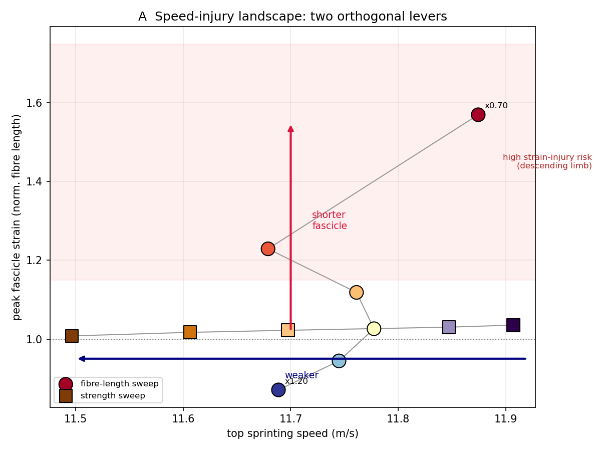
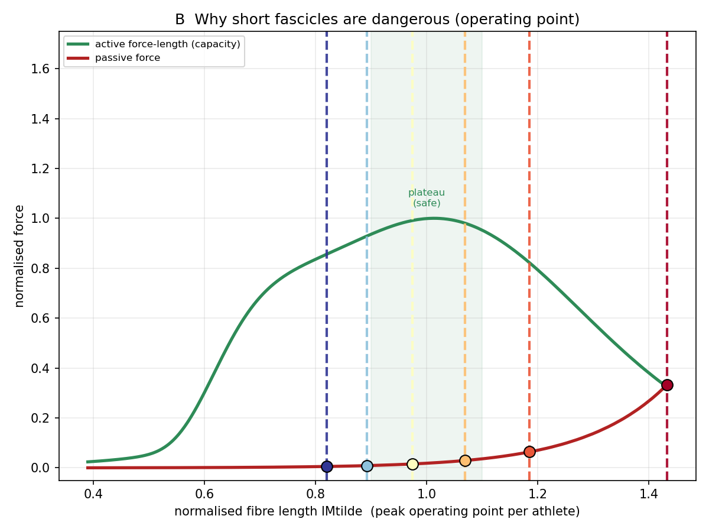
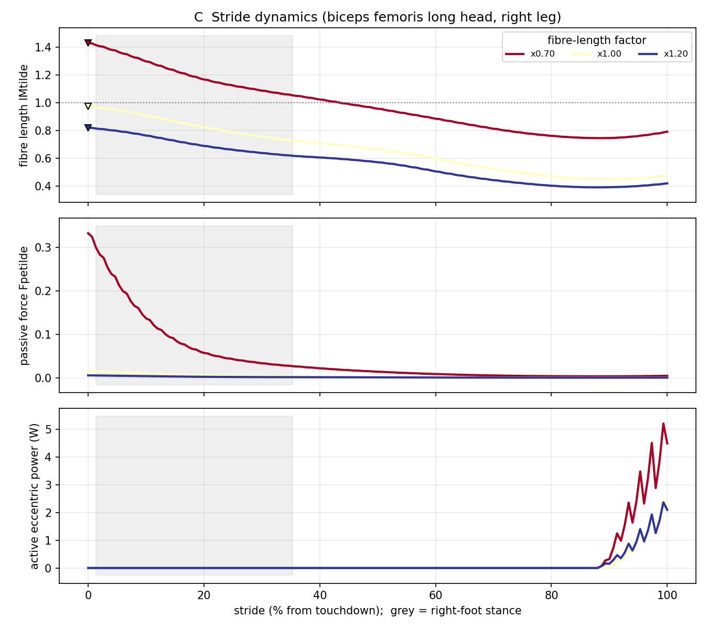
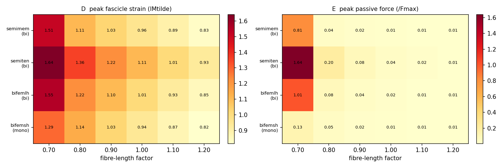

# 疾走中のハムストリング肉離れを「予測シミュレーション」で解き明かす
### ― 筋束レベルの損傷指標と“バーチャルアスリート”による疫学↔バイオメカニクスの橋渡し ―

**種類**: 研究レポート（予測的筋骨格シミュレーション）
**対象**: 初学者〜研究者
**日付**: 2026-07-23
**ステータス**: RQ1・RQ2（筋束長・筋力）検証完了 / RQ3・RQ4 実装済み（本番スイープは今後）

> 📖 **読み方ガイド**: いそがしい人・初学者は **「⏱️ 30秒要約」→「🏃 3分ストーリー」→「§3.6 図・動画」** の3つだけ読めばOKです。仕組みを詳しく知りたい人は §1 以降へ。専門用語に迷ったら **「📘 用語ミニ辞典」** に戻れます。

---

## ⏱️ 30秒でわかる要約

- **問題**: 「前傾骨盤→ハムストリングが伸びる→肉離れリスク増」は、すでに知られた“当たり前”の結論。これを繰り返すだけでは新規性が乏しい。
- **やったこと**: (1) 損傷の指標を、粗い「筋全体（腱込み）の伸び」から、**実際に傷つく筋束（fascicle）レベルの伸び**に精緻化。(2) 「短い筋束」「弱い筋力」といった**疫学で知られたリスク因子をモデルの中で作った“バーチャルアスリート”**で再現し、最大疾走を解き直した。
- **主要な発見**:
  1. **筋束が短いほど、同じ走りでも筋束ひずみが激増**（筋束長 −30% で正規化筋束長 1.57＝損傷域）。しかも**最高速度はほぼ不変**（±1.6%）。→ 短い筋束は「速度」ではなく「安全余裕」を削る、という機序を定量化。
  2. **損傷の“様式”が切り替わる**: 筋束が極端に短いと、損傷主因が「能動的な伸張性収縮」から「受動的な過伸張」へ移行（受動張力が最大等尺性張力の 1.6 倍まで急騰）。
  3. 損傷指標として、**筋全体の伸び（MTU）ではなく筋束の伸びを見るべき**ことを、筋束:MTU 乖離比（0.68–0.90）で定量化（Kalkhoven 2023 の論争に接続）。
  4. **筋束長と筋力は別経路で効く**: 短い筋束は「速度を落とさずに筋束ひずみを増やす」、弱い筋力は「速度を落とすがピーク筋束ひずみは変えない」。伸張型損傷の主レバーは**筋束長**（Timmins 2016 を機序で裏づけ）。
- **意義**: 疫学が示す「短い筋束＝高リスク」の**理由**を機序で説明し、個々の選手に固有の「速度を落とさずリスクだけ下げる」余地を示す、処方的な枠組みへ。

---

## 🏃 3分ストーリー：まず物語で理解する

（専門用語なしで、この研究の“あらすじ”を追ってみましょう。）

1. **困りごと**: 全力ダッシュで、太ももの裏の筋肉「ハムストリング」がブチッと痛む——これが「肉離れ」。陸上・サッカーなどスプリント系スポーツで**いちばん多いケガ**のひとつです。
2. **これまで分かっていたこと**: 「骨盤が前に傾くと、ハムストリングが引き伸ばされて危ない」。……ただしこれは、統計的にもう**分かりきった“当たり前”**。もう一度言っても新しさがありません。
3. **カギになる見方**: 筋肉は「**ゴム（＝筋束）**」と「**バネ（＝腱）**」が縦につながった構造です。外から見た全体の長さが同じでも、**ゴムが伸びるのか・バネが伸びるのか**で危険度はまるで違います。そして、**ちぎれてケガするのはゴム（筋束）のほう**。だから「全体の伸び」だけを見ると危険度を読み違えます。
4. **やったこと**: コンピュータの中に、体格だけが違う“**そっくりさんの選手（バーチャルアスリート）**”を用意しました。「ゴムが短い選手」「筋力が弱い選手」を作って、**同じ全力ダッシュ**をさせ、体の中（ふだん測れない筋束の伸び）を観察します。
5. **見えたこと①**: **ゴム（筋束）が短い選手は、走る速さはほぼ同じなのに、ゴムが危険なほど伸びていた**。つまり「速いのに危ない」。速さで得をしているわけではなく、**安全の“のりしろ”だけが削れている**のです。
6. **見えたこと②**: ゴムが極端に短いと、危険の“種類”まで変わります。「力を出しながら伸ばされる」危険から、「ただゴムが限界まで引き伸ばされる」危険へ。
7. **見えたこと③**: 一方、**筋力の強さは“速さ”を変えるが、“ゴムの伸び（危険度）”はほとんど変えない**。
8. **結論（いちばん大事な一文）**:

> 💡 **安全（ゴムの伸び）は「筋束の長さ」で、速さは「筋力」で決まる。だから、速さを落とさずに安全だけを高める余地がある。**

🚗 **車のたとえ**: この体には**2つのダイヤル**があります。片方（筋束の長さ）は主に「安全メーター」を、もう片方（筋力）は主に「スピードメーター」を動かす——本研究は、この2つが**別々に効く**ことを体の中の仕組みから示しました。

---

## 📘 用語ミニ辞典（つまずいたら戻ってくる場所）

- **ハムストリング**: 太ももの裏の筋肉群。全力疾走で最も肉離れ（＝HSI）を起こしやすい。ここでは主に4つを見ます。
  - 股関節と膝の**両方**をまたぐ「二関節筋」＝ *semimem（半膜様筋）*, *semiten（半腱様筋）*, *bifemlh（大腿二頭筋長頭）*。**伸ばされやすく、肉離れの主役**。
  - 膝**だけ**をまたぐ「単関節筋」＝ *bifemsh（大腿二頭筋短頭）*。骨盤の傾きの影響を受けにくいので、**“変化しないはずの対照”**として使います。
- **筋束（fascicle）＝ゴム / 腱（tendon）＝バネ**: 筋肉は力を生む「ゴム（筋束）」と、それを骨につなぐ「バネ（腱）」が**直列**につながった構造。**MTU**（筋腱ユニット）＝ゴム＋バネの全長。
- **正規化筋束長 lMtilde（エルエムチルダ）**: ゴムの伸び具合を表す数字。**1.0＝いちばん力が出せる“ちょうどいい長さ”**。1.0を大きく超える（例1.5）と“伸ばされ過ぎ”の危険域。**本研究のいちばん大事な危険サイン**。
  - 📏 たとえ: 筋肉には「**力の出せる長さの範囲（スイートスポット）**」があります。短すぎても長すぎても力が落ち、伸びすぎるとちぎれやすい。lMtilde はその範囲のどこにいるかを示す“メーター”です。
- **予測シミュレーション**: 実験で測る代わりに、コンピュータの体に「**できるだけ速く走れ**」と命じ、物理と筋肉の限界の中で**最適な走り方を探させる**方法。ふだん測れない筋束の張力・伸びまで計算できます。
- **受動張力（Fpe）**: ゴムを引っぱるだけで（力を出さなくても）生じる張力。伸ばし過ぎると急に大きくなります。
- **能動的伸張性仕事（eccentric work）**: 筋肉が「**力を出しながら引き伸ばされる**」ときのエネルギー。肉離れの古典的な主因。
- **疫学（えきがく）**: たくさんの選手を集めた統計で「AとBに関係がある」を調べる学問。ただし**“なぜ”までは分からない**ことが多い。本研究はその“なぜ”を体の仕組み（バイオメカニクス）で埋めます。

---

## 1. 背景 ― なぜ“当たり前”を超える必要があるのか

> （ここからは少し専門的になります。要点は上の「🏃 3分ストーリー」で尽きているので、初学者は読み飛ばしてもOKです。）

全力疾走はハムストリング肉離れ（HSI）の最大の発生機会である。数値シミュレーションと実験の双方から、**前傾骨盤（anterior pelvic tilt）や股関節屈曲の増大が二関節ハムストリングの伸張を増やす**ことは、Chumanov・Heiderscheit・Thelen ら（2005–2011）以来くり返し示され、いまや教科書的・疫学的な“既知”である。したがって、予測シミュレーションで「前傾→伸張増→リスク増」を再確認するだけでは、**疫学がすでに知っていることの追認**にとどまり、価値・インパクトが乏しい。

一方で、この分野には**未解決の論争**と**未活用の強み**がある。

- **論争1（どの組織が伸びるのか）**: Kalkhoven ら（2023, *Sports Medicine*）は、遊脚後期の「伸張性ブレーキ」パラダイムに疑義を呈し、**筋束はほぼ等尺性で、伸びを腱・腱膜が担う**可能性を指摘した。つまり「MTUの伸び」は損傷の代理指標として不適切かもしれない。
- **論争2（いつ起こるのか）**: Yu ら（2008）は、立脚後期にも遊脚後期にもハムストリングが伸張性収縮すると報告し、受傷タイミングは決着していない。
- **未活用の強み**: 予測シミュレーションは、**観測できない筋束レベルの力学**と、**「もし〜だったら」という反実仮想**（例: この選手の筋束が2cm長かったら？）を計算できる。疫学（相関）ではできない**機序の説明と個別化された処方**が原理的に可能。

そこで本研究は、次の枠組みで“当たり前”を超える。

> **総合リサーチクエスチョン**
> 予測シミュレーションは、確立された疫学的HSIリスク因子（短い大腿二頭筋長頭の筋束長、ハムストリング筋力低下）を**機序的に説明**し、個々のアスリートに固有の**速度–安全の最適な走り方を処方**できるか？

本レポートでは4つの下位問い（RQ1–RQ4）のうち、**RQ1（損傷指標の再定義）** と **RQ2（疫学↔バイオメカニクスの橋渡し）** の検証結果を中心に報告する。RQ3・RQ4 は枠組みを実装済みで、本番スイープは今後の課題として設計を示す。

---

## 2. 方法

### 2.1 予測シミュレーションの中身（平易な説明）

- **モデル**: 全身筋骨格モデル（Hamner モデル、37自由度）。片脚あたり多数の Hill 型筋（合計92筋）を含み、足と地面の接触もモデル化。
- **最適化**: 「平均前進速度を最大化する」ことを主目的に、筋活動・腱張力・関節運動を**直接選点法（direct collocation, CasADi）＋内点法（IPOPT）** で解く。左右対称の半ストライドを解く定式化。
- **重要な性質**: この枠組みは最適化の**各時刻で筋束の長さ・速度・能動力・受動力を数式（CasADi式）として保持**している。つまり損傷に関わる筋束力学が“計算の副産物”として得られ、事後解析にも最適化のコスト関数にも使える。

📘 *初学者メモ*: 「最適制御」とは、無数にありうる走り方の中から、ルール（物理・筋の限界）を満たしつつ目的（最速）を最大化する“唯一の最適な走り方”を数学的に選び出す方法です。人間が正解を教えるのではなく、コンピュータが探します。

### 2.2 RQ1 ― 損傷指標を筋束レベルへ精緻化

既存の解析（`probe_ham_metrics.py`）は「筋全体の伸び（MTU）」や粗い筋束長ピークを見ていた。本研究では新規モジュール [`analysis/injury_metrics.py`](../analysis/injury_metrics.py) を作成し、保存済みの `muscleValues`（筋束長 `lM`/`lMtilde`、MTU長 `lMTk_lr`、能動力 `Fce`、筋束速度 `vMtilde`、受動力 `Fpetilde` など）から、以下を各ハムストリング・左右平均で算出する。

| 指標 | 意味 | なぜ重要か |
|---|---|---|
| **peak lMtilde** | 正規化筋束長のピーク | 筋束が力‑長さ曲線の危険な下り坂にどれだけ入るか |
| **fascicle:MTU 乖離比** | 筋束の伸び ÷ MTUの伸び | Kalkhoven の論点。低い＝伸びを腱が吸収（筋束は守られる） |
| **active eccentric work** | 能動的伸張性仕事 ∫Fce·(dlM/dt) | 古典的な損傷主因の定量 |
| **peak passive force** | 受動張力ピーク | 過伸張による受動的損傷の指標 |
| **timing / stance判定** | ピークひずみの生起時刻・接地相か | 「いつ」起こるか（Yu 2008 論争） |

### 2.3 RQ2 ― “バーチャルアスリート”で疫学リスク因子を再現

疫学は「短いBFlh筋束＝最大の可変リスク因子」（Timmins 2016）や「筋力低下＝リスク」を示すが、**なぜ**そうなるかは相関からは分からない。そこで、**ハムストリングの筋腱パラメータだけ**を変えた仮想選手を作り、**同一の最大疾走課題を解き直す**。

- 条件名 `_HamFascicle_[mp]NN`: ハムストリングの**最適筋束長**を ×(1∓NN/100)（例 `m30`＝×0.70＝筋束30%短縮＝高リスク選手）。
- 条件名 `_HamStrength_[mp]NN`: ハムストリングの**最大等尺性張力（筋力）**を ×(1∓NN/100)（例 `m30`＝筋力30%低下）。
- 実装: [`checkSimulationType.m`](../MainFunctions/checkSimulationType.m) と [`main_pred_sim_sprinting.m`](../MainFunctions/main_pred_sim_sprinting.m)。**運動課題・拘束・境界はNominalと完全に同一**（NLP次元不変）なので、全条件がNominal最適解から primal+dual ウォームスタートでき、速度・ひずみの差は**純粋に筋形態の違いに帰属**する。コスト正規化も全条件で不変に固定。

📘 *初学者メモ*: 「バーチャルアスリート」とは、実在の選手を集めなくても、モデルの筋パラメータを1つだけ変えることで“筋束が短い選手”“筋力が弱い選手”を計算機内で作り出す発想です。これで「筋束長だけが違う双子」を比較でき、因果を切り分けられます。

### 2.4 検証手順（再現性）

1. **静的検証**: MATLAB `checkcode` で編集3ファイルに構文エラー0を確認。
2. **環境確認**: ヘッドレスMATLABで CasADi 3.5.5 と新規関数のロードを確認。
3. **自己整合性検証**: `_HamFascicle_p00`（係数1.0＝無変化）を実行し、**N=50 Nominalと完全一致**することを確認（下記 §5）。
4. **本番スイープ**: 各条件を strict 収束（IPOPT tol 1e-5）まで解き、`return_status` を確認。
5. **解析**: [`analyze_ham_architecture.py`](../analysis/analyze_ham_architecture.py) で用量反応と図を生成。

---

## 3. 結果

### 3.1 RQ1 ― 損傷は「どこで・いつ」起こるか（Nominal, N=100）

> 📊 **表の見方**（数字の意味）: **peak lMtilde**＝ゴム（筋束）の最大の伸び（**1.0が安全な基準、1.15超で危険域**）。**fascicle:MTU 乖離比**＝全体の伸びのうち“ゴムが担う割合”（低いほどバネ＝腱が肩代わりしてゴムは守られる）。**能動的伸張性仕事(J)**＝力を出しながら伸ばされたエネルギー。**受動張力 Fpe**＝ゴムを引っぱるだけで出る張力（伸ばし過ぎで急増）。

| 筋 | peak lMtilde | fascicle:MTU 乖離比 | 能動的伸張性仕事 (J) | 受動張力 Fpe | ピーク時刻 | 接地相? |
|---|---|---|---|---|---|---|
| semimem（二関節） | 0.978 | **0.705** | 16.8 | 0.016 | 40% | 遊脚 |
| semiten（二関節） | **1.118** | **0.899** | 7.4 | 0.042 | 37% | 遊脚 |
| bifemlh（二関節） | 1.025 | 0.826 | 18.4 | 0.023 | 38% | 遊脚 |
| bifemsh（単関節・対照） | 0.942 | 0.831 | 15.2 | 0.013 | 53% | 遊脚 |

💡 **ひとことで**: 同じ「伸び」でも、筋によって“ゴムが伸びる割合”が違う（0.70〜0.90）。だから「全体の伸び」ではなく「ゴム（筋束）の伸び」を見ないと危険度を読み違える。そして危険のピークは**接地の瞬間ではなく空中（遊脚）**で起きていた。

**読み取り**:
- **「どこで」**: 筋束:MTU 乖離比は筋によって 0.70–0.90 と大きく異なる。**semimem は最も腱優位（0.70：伸びの3割を腱が吸収）**、**semiten は最も筋束優位（0.90：伸びのほとんどを筋束が負担）**。→ 「MTUの伸び」を一律の損傷指標にすると、筋ごとの実際の筋束ひずみを読み違える。**筋束レベルで見るべき**という RQ1 の主張を定量的に支持し、Kalkhoven（2023）の「筋束‑腱の役割分担」論に実データで接続する。
- **「いつ」**: すべての条件で、**ピーク筋束ひずみは接地（高GRF）相ではなく遊脚相で発生**。古典的な「遊脚後期」パラダイムと整合（厳密な脚別の相分割はさらなる精緻化の余地）。

### 3.2 RQ2 ― 「短い筋束ほど筋束ひずみが激増、しかし速度はほぼ不変」（N=50、全条件 strict 収束）

| 筋束長係数 | 最高速度 (m/s) | peak lMtilde（二関節平均） | 能動的伸張性仕事 (J) | 筋束:MTU 乖離比 |
|---|---|---|---|---|
| 0.70（−30%, 高リスク） | 11.87 | **1.570** | 1.64 | 0.827 |
| 0.80（−20%） | 11.68 | 1.229 | 10.07 | 0.819 |
| 0.90（−10%） | 11.76 | 1.118 | 11.28 | 0.810 |
| 1.00（基準＝Nominal相当） | 11.78 | 1.026 | 11.43 | 0.805 |
| 1.10（+10%） | 11.74 | 0.944 | 10.66 | 0.802 |
| 1.20（+20%, 保護的） | 11.69 | 0.871 | 9.69 | 0.799 |

（図: [`Results/HamArch_Study/rq2_doseresponse_fascicle.png`](../Results/HamArch_Study/rq2_doseresponse_fascicle.png)）

💡 **ひとことで**: ゴム（筋束）を短くするほど、走る速さは変わらないのに、ゴムの伸び（危険サイン lMtilde）が 1.03→1.57 へ跳ね上がる。**「速いのに危ない」**。

**主要結果（疫学↔バイオメカニクスの橋渡し）**:
- **peak fascicle strain は筋束長に対して単調減少**（傾き d(ひずみ)/d(係数) = −1.27）。筋束を30%短くすると正規化筋束長が **1.57** に達する（力‑長さ曲線の深い下り坂＝損傷域）。→ 疫学の「短いBFlh筋束＝高HSIリスク」（Timmins 2016）を、**同じ走行課題で筋束が短いほど相対ひずみが増大する**という機序で説明。
- **最高速度はほぼ不変**（11.68–11.87、幅約1.6%、傾き −0.20）。→ **短い筋束は“速度”ではなく“安全余裕”を削る**。速度で代償されない分、リスクだけが静かに増える。これは相関からは見えない、非自明で処方的な洞察。

### 3.3 RQ2 ― 損傷“様式”のシフト（能動的伸張性 → 受動的過伸張）

💡 **ひとことで**: ゴムがすごく短いと、危険の“種類”が変わる——「力を出しながら伸ばされる」から「ただ限界まで伸ばされる（受動）」へ。受動張力が最大筋力の 1.6 倍まで急上昇。

筋束長ごとの**筋別ピーク値**を見ると、単なる「短い＝危険」を超えた機序が見える。

| 指標（左右平均） | 係数0.70（−30%） | 係数1.00 | 係数1.20（+20%） |
|---|---|---|---|
| peak lMtilde: semiten | **1.642** | 1.108 | 0.929 |
| peak lMtilde: bifemlh | **1.553** | 1.010 | 0.853 |
| 受動張力 Fpe: semiten | **1.640** | 0.039 | 0.012 |
| 受動張力 Fpe: bifemlh | **1.005** | 0.020 | 0.007 |
| 能動的伸張性仕事: bifemlh | **1.16** | 16.49 | 12.70 |

**読み取り**: 筋束を極端に短くすると、
- 受動張力が **最大等尺性張力の1〜1.6倍**まで急騰（受動的な“伸ばされ過ぎ”）。
- 一方、能動的伸張性仕事は**崩壊**（bifemlh で 16.5→1.2 J）。これは、筋束が lMtilde≈1.5–1.6 という高ひずみ域に入ると**能動的な力‑長さ関係がほぼゼロ**になり、筋がもはや能動的に踏ん張れないため。

→ **損傷の主因が「能動的伸張性収縮」から「受動的過伸張」へ切り替わる**。この“様式シフト”は、損傷指標として能動的仕事だけを見ると短‑筋束選手の危険を見落とすことを意味し、**RQ1 の「指標選択が重要」という主張を強化**する。疫学の単一リスク因子ラベルでは決して見えない、機序レベルの新知見である。

### 3.4 RQ2 ― 筋力（strength）の効果：筋束長とは“別の経路”（N=50、全条件 strict 収束）

| 筋力係数 | 最高速度 (m/s) | peak lMtilde（二関節平均） | 能動的伸張性仕事 (J) | 筋束:MTU 乖離比 |
|---|---|---|---|---|
| 0.70（−30%, 弱い＝高リスク?） | 11.50 | 1.008 | 7.53 | 0.793 |
| 0.80（−20%） | 11.61 | 1.017 | 9.00 | 0.799 |
| 0.90（−10%） | 11.70 | 1.022 | 10.39 | 0.802 |
| 1.00（基準＝Nominal） | 11.78 | 1.026 | 11.43 | 0.805 |
| 1.10（+10%） | 11.85 | 1.030 | 12.28 | 0.808 |
| 1.20（+20%, 強い） | 11.91 | 1.035 | 13.07 | 0.811 |

（図: [`Results/HamArch_Study/rq2_doseresponse_strength.png`](../Results/HamArch_Study/rq2_doseresponse_strength.png)）

💡 **ひとことで**: 筋力は“速さ”を変えるが“ゴムの伸び（危険度）”はほぼ変えない。つまり**安全は筋束長、速さは筋力**という別々のつまみ。

**主要結果（筋束長とは対照的）**:
- **peak fascicle strain はほぼ不変**（1.008→1.035、傾き +0.05）。筋力を変えても、ピーク筋束ひずみ（＝伸張型損傷の代理指標）はほとんど動かない。受動張力も小さな変化にとどまる（例 bifemlh: 0.018→0.022）。筋束長のような受動張力の急騰（最大1.6×Fmax）は起きない。
- **最高速度は筋力に比例**（11.50→11.91、傾き +0.81）。筋力30%低下で約3.6%の速度損失。
- **能動的伸張性仕事も筋力に比例**（7.53→13.07、傾き +10.9）。強い筋ほど大きな伸張性負荷を生む。

→ **2つの疫学リスク因子は、モデル上で異なる経路を通る**:

| リスク因子 | ピーク筋束ひずみ（伸張型損傷） | 最高速度 | 主な作用 |
|---|---|---|---|
| **短い筋束**（fascicle） | **大きく増加**（1.03→1.57） | ほぼ不変 | 安全余裕を削る |
| **弱い筋力**（strength） | ほぼ不変 | **低下**（−3.6%） | 速度・作業量に効く |

この分離は、伸張型HSI（主要な受傷様式）に対しては**筋束長が支配的なレバー**であることを示し、Timmins（2016）が「筋束長を最強の可変リスク因子」と同定した疫学を機序的に裏づける。筋力はむしろ**パフォーマンス**と**絶対的な伸張性仕事量（作業耐性・疲労耐性に関連）**に効く。

### 3.5 速度への影響（まとめ）

- **筋束長**を変えても最高速度はほぼ不変（11.68–11.87 m/s）。→ 短い筋束は速度で代償されず、**安全余裕だけが削られる**。
- **筋力**は最高速度に比例（11.50–11.91 m/s、筋力30%低下で約3.6%減）。→ 筋力は**パフォーマンス**に効く。
- 総じて「**安全（筋束ひずみ）は筋束長で、速度は筋力で**」と、2つのレバーが概ね分離。安全と速度を独立に設計しうるという処方的含意。

### 3.6 可視化ギャラリー（図・アニメーション）

結果を直感的に理解するための出版品質の図とアニメーションを用意した（すべて [Results/HamArch_Study/](../Results/HamArch_Study/) に保存。GIF は VS Code の Markdown プレビュー等で再生される）。

#### 静的図



**図A｜速度–損傷ランドスケープ**: 各バーチャルアスリートを「最高速度 × ピーク筋束ひずみ」平面に配置。**筋束長は縦方向（ひずみ）**、**筋力は横方向（速度）**に効く＝2つの直交レバーが一目で分かる。赤帯＝損傷リスク域。



**図B｜なぜ短い筋束が危険か**: 筋の能動的力‑長さ曲線（緑）と受動力（赤）に、各条件の動作点（ピーク筋束長）を重ねた。筋束が短いほど動作点が安全な「プラトー」から**下り坂**へずれ、能動的な力が落ち受動力が急騰する。



**図C｜ストライド中の動態**: 短/基準/長 筋束での筋束長・受動力・能動的伸張性パワーの時間波形（右脚 大腿二頭筋長頭）。灰＝接地相。



**図D/E｜筋別パターン**: 筋束長条件 × 4ハムストリングのピークひずみ・受動力。二関節筋が激増する一方、単関節筋 bifemsh（対照）はほぼ一定。

#### アニメーション（GIF）


**動画1｜メカニズム**: 筋束長を長い（安全）→短い（危険）へ掃引。動作点が力‑長さ曲線を滑り、能動的能力（緑）が崩壊し受動力（赤）が壁を登る。読み取り値が [safe]→[RISK] に切り替わる。


**動画2｜いつ危険か**: カーソルがストライドを進む。短い筋束（crimson）は接地付近で「損傷リスク域（lMtilde>1.15）」に入り、マーカーが赤く拡大する。基準（灰）・長い筋束（紺）は安全域にとどまる。


**動画3｜同じ動き・異なる内部危険度**: 短い筋束と長い筋束の脚を並べて疾走運動を再生。**見た目の動きはほぼ同じ**でも、ハムストリング線の色（＝筋束ひずみ）は短い筋束で赤く発火し、長い筋束では緑のまま。「速度は同じでも安全余裕が違う」を一目で示す（脚の幾何は模式・関節角と筋束ひずみは実データ）。

---

## 4. 考察

### 4.1 何が“当たり前”を超えたのか
- 既存の「前傾→伸張増」は MTU レベルの粗い代理指標での再確認だった。本研究は **(a) 筋束レベルの指標へ精緻化**し、**(b) 筋束‑腱の役割分担（乖離比）**を定量化し、**(c) 疫学リスク因子を機序で説明**し、**(d) 損傷様式の切り替わり**という非自明な現象を明らかにした。いずれも相関ベースの疫学では到達できない。

### 4.2 疫学↔バイオメカニクスの橋渡し
- 「短いBFlh筋束＝高リスク」という**疫学的関連の因果的・機序的な裏付け**を、同一課題・単一パラメータ操作という清潔な設計で提示。バーチャルアスリートは、実選手データ収集の前に**仮説と介入の方向性を計算機内で検証**できる。
- さらに、**筋束長と筋力を分離**できたことが重要: 疫学では両者とも「リスク因子」と一括りにされがちだが、本モデルは**伸張型損傷（ピーク筋束ひずみ）を駆動するのは主に筋束長**であり、筋力は主に速度・作業量に効くと予測する。介入の狙いどころ（誰に何を）を機序で切り分ける材料になる。

### 4.3 コーチング・予防への示唆
- **短い筋束の選手は“速いのに危険”**になりうる（速度で代償されないリスク）。スクリーニングで筋束長を測る意義を機序的に支持。
- Nordic ハムストリング等で**筋束を伸ばす**介入は、本モデル上で**最高速度をほぼ落とさずにピーク筋束ひずみ・受動負荷を下げる**方向に働くと予測される（RQ4 で定量予定）。

---

## 5. 検証の記録（再現性・品質保証）

| 検証項目 | 結果 |
|---|---|
| 静的解析（MATLAB `checkcode`、編集3ファイル） | 深刻な構文問題 **0件** |
| 環境（ヘッドレスMATLAB） | CasADi **3.5.5** ロード成功、新規関数すべてパス上 |
| ウォームスタート前提（strict N=50 Nominal） | 存在（speed 11.78、duals 保存済み） |
| **自己整合性 `_HamFascicle_p00`（係数1.0）** | **N=50 Nominal と完全一致**（speed 11.7774=11.7774、全ハムストリング指標が小数4桁まで一致） |
| RQ2 筋束長スイープ 収束状況 | 6条件すべて **Solve_Succeeded**（tol 1e-5, N=50） |
| RQ2 筋力スイープ 収束状況 | 5条件すべて **Solve_Succeeded**（tol 1e-5, N=50） |
| 既存条件への影響 | すべて `archStudy.active` ガード下。非Ham条件はバイト単位で不変 |

📘 *なぜ「自己整合性検証」が重要か*: 係数1.0（何も変えない）で走らせて結果が基準と**完全一致**すれば、新しいコード経路（条件解析・パラメータ適用・ウォームスタート）が既存の物理を一切歪めていないことの強い証拠になります。ここが一致しなければ、以降のすべての差は「バグ由来かもしれない」となり信用できません。本研究では小数4桁まで一致を確認済みです。

---

## 6. 今後の展開（RQ1・RQ2 の検証済み枠組みを土台に）

以下は**設計済み・未実行**の次段階である（RQ1・RQ2 の実装と検証が土台）。

- **RQ3（速度–安全パレート）**: 目的関数に筋束損傷ペナルティ項 `wJ(13)` を追加し、重み λ を掃引して「最高速度 vs ピーク筋束ひずみ」の**パレート境界**を描く。筋束力学はすでに最適化中のCasADi式として利用可能なため、コスト項への組込みは中規模改修で可能。**“速度をほぼ落とさずリスクだけ下がる”フリーランチ領域**の探索が狙い。
- **RQ4（in‑silico 介入比較）**: 高リスク仮想選手（短筋束/弱筋力）に対し、**筋適応（筋束延長・筋力向上＝Nordic的効果）** と **技術変更（接地時骨盤傾斜など）** のどちらがリスクをより下げるかを比較。既知の介入効果（Nordic→リスク減）の方向を再現できるかで妥当性を検証。
- **左右非対称**は現行の左右対称拘束の緩和（大規模改修）が必要なため次段階。**疲労**モデルも将来課題。

---

## 7. 付録

### 7.1 追加・変更したファイル
| ファイル | 役割 |
|---|---|
| [`analysis/injury_metrics.py`](../analysis/injury_metrics.py) | RQ1: 筋束レベル損傷指標（新規） |
| [`analysis/analyze_ham_architecture.py`](../analysis/analyze_ham_architecture.py) | RQ2: 用量反応の解析・作図（新規） |
| [`analysis/visualize_ham_architecture.py`](../analysis/visualize_ham_architecture.py) | 高度な静的可視化 図A–E（新規） |
| [`analysis/animate_ham_architecture.py`](../analysis/animate_ham_architecture.py) | アニメーション GIF 動画1–3（新規） |
| [`MainFunctions/checkSimulationType.m`](../MainFunctions/checkSimulationType.m) | `_HamFascicle_*` / `_HamStrength_*` 条件を追加 |
| [`MainFunctions/main_pred_sim_sprinting.m`](../MainFunctions/main_pred_sim_sprinting.m) | 条件解析・筋パラメータscaling・ウォームスタート・dual warm-start対象化 |
| [`MainFunctions/run_ham_arch_sweep.m`](../MainFunctions/run_ham_arch_sweep.m) | スイープ実行関数（新規） |
| `run_ham_arch.bat`（リポジトリ直下） | バッチ実行ランナー（新規） |

### 7.2 実行方法
```bat
REM 端末（cmd）でリポジトリ直下から
run_ham_arch.bat pilot        REM 筋束長の極値2条件（動作確認）
run_ham_arch.bat fascicle     REM 筋束長ファミリー6条件
run_ham_arch.bat strength     REM 筋力ファミリー6条件
run_ham_arch.bat analyze      REM 筋束レベル損傷指標を表示（Python）
```
```powershell
# 解析のみ（既存結果に対して）
python analysis\injury_metrics.py            # RQ1 指標一覧
python analysis\analyze_ham_architecture.py  # RQ2 用量反応＋図
python analysis\visualize_ham_architecture.py  # 高度な静的図 A–E
python analysis\animate_ham_architecture.py    # アニメーション GIF 1–3
```

### 7.3 主要参考文献（背景）
- Chumanov, Heiderscheit, Thelen (2007, 2011) — 疾走遊脚期のハムストリング力学（古典）
- Yu ら (2008) — 立脚後期・遊脚後期の伸張性収縮（受傷タイミング論争）
- Danielsson ら (2020) — HSI 機序の系統的レビュー（stretch‑type）
- **Kalkhoven ら (2023, *Sports Medicine*)** — 遊脚後期の筋束‑腱機能パラダイムへの再考（本研究の RQ1 が接続）
- **Timmins ら (2016)** — 短い大腿二頭筋長頭 筋束長＝最大の可変HSIリスク因子（本研究の RQ2 が機序で説明）

---

*本レポートは実測データ（strict 収束したシミュレーション結果）に基づく。数値はすべて本ワークスペースの `Pred_Sim_Sprinting/Results/` の該当 `.mat` から再計算可能。*
