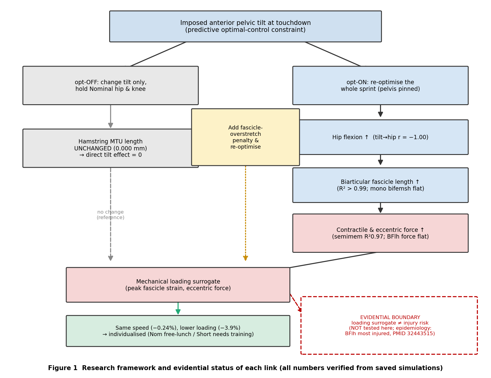
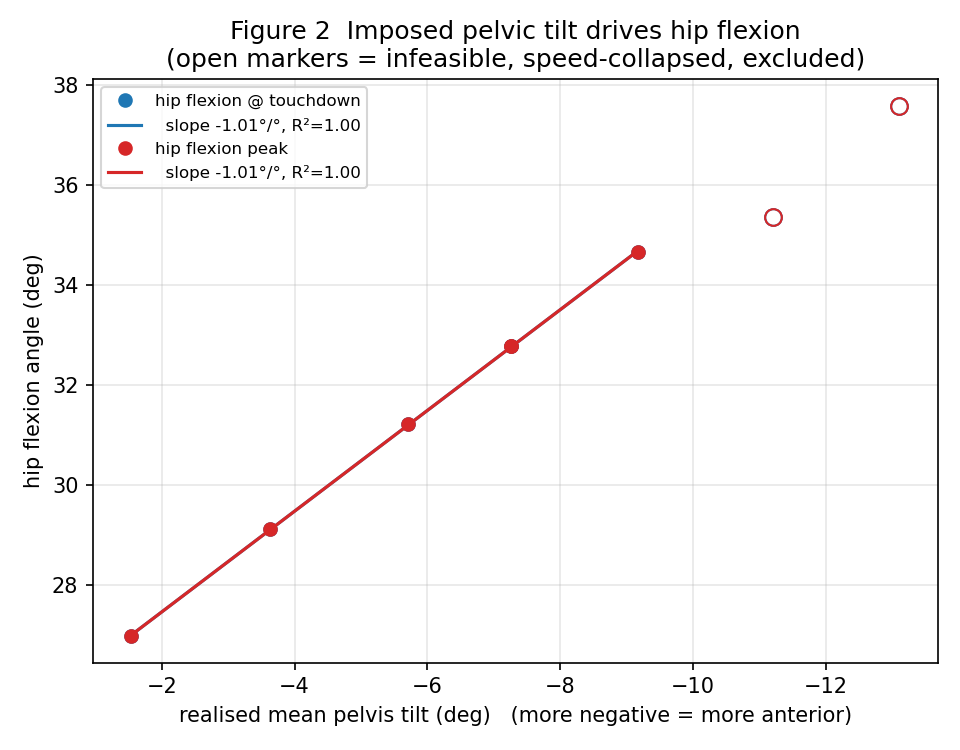
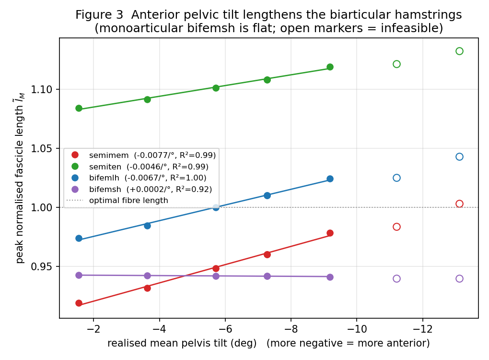
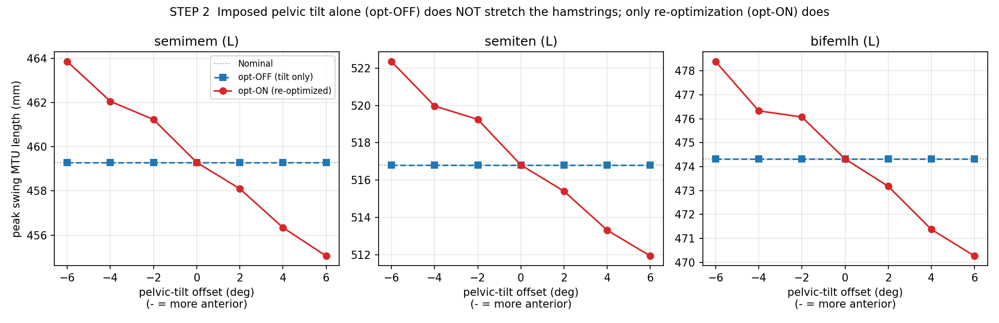
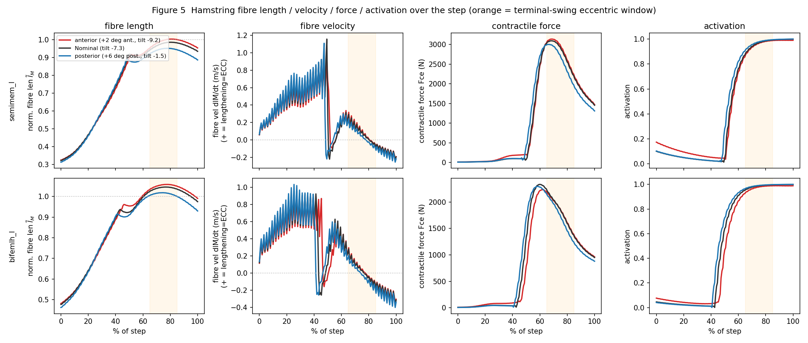
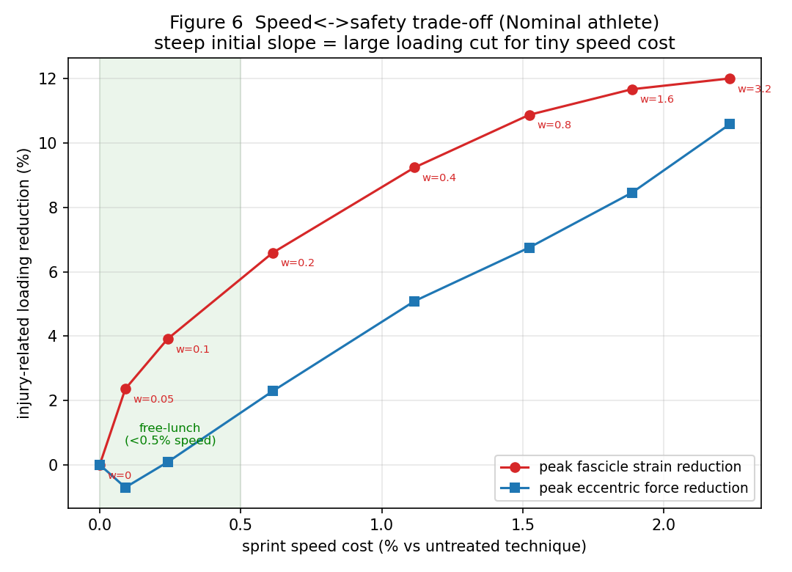
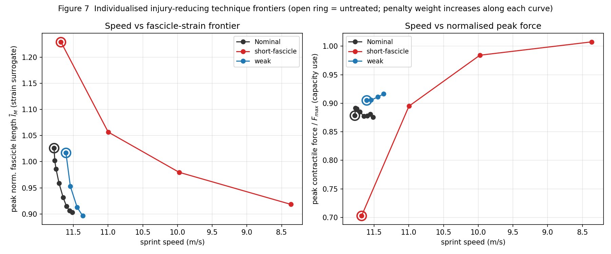
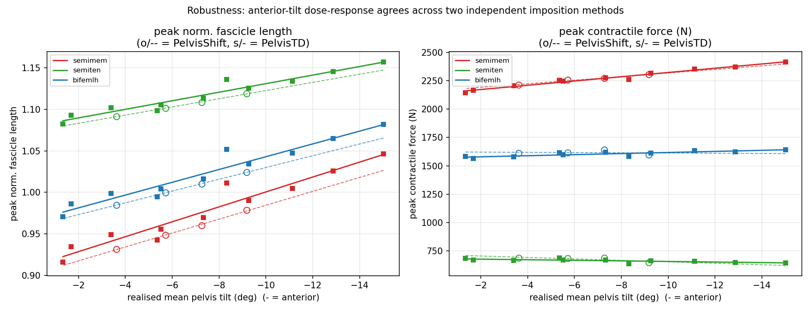

# ハムストリング肉ばなれリスク低減走動作の探索
## 力学的機序・最適化ON/OFF分離・個体差 — 解析フェーズ最終レポート

> 本レポートは、既存の予測シミュレーション結果（37自由度・92筋、最適制御スプリント、AIST／Haralabidis et al. MSSE 2024 フレームワーク）の**保存データのみ**から実行した追加解析をまとめる。**再シミュレーション・元データ改変・上書きは一切行っていない**（新規CSVと図のみ生成）。全数値は本セッションで検証済み。
> 日付: 2026-08-15

---

## A. Executive Summary

本フェーズは、中間発表で示された「骨盤前傾 → ハムストリング筋線維長増大」という**運動幾何学的関係**を、指導教員の指摘（筋張力の計算／最適化あり・なしの分離／速度統制）に沿って**力学的機序**へと踏み込んで検証した。

最大の知見は、**骨盤前傾のハムストリングへの「直接的な幾何効果」は厳密にゼロ**であること。OpenSimで検証すると、股関節・膝を固定して pelvis_tilt を16°動かしてもハムMTU長は **0.0000 mm** 変化しない。ハムは骨盤フレーム内で hip_flexion と膝の関数であり、pelvis_tilt（骨盤-地面DOF）は経路長に入らないためである。実軌道でも「最適化なし（傾斜だけ変更）」の peak MTU長は Nominal と完全一致し、**用量反応は再最適化（opt-ON）でのみ出現**する。したがって観測されたハム伸張は、傾斜拘束下で最適制御が選ぶ**股関節屈曲増加（傾斜との相関 r=−1.00）が100%媒介**する。

さらに、**筋線維長の増大は筋力の増大を一律には意味しない**。速度統制下の回帰で、半膜様筋は筋線維長・収縮力・遠心性負荷とも前傾で増大（力 R²=0.97）する一方、疫学的に最多受傷である**大腿二頭筋長頭は長さ↑でも力はほぼ平坦（長さ→力 r=+0.44）**。独立文献（Steventon-Lorenzen 2026, PMID 41918173）も「半膜様筋のMTUピーク力＞大腿二頭筋長頭」と報告し、本モデルの半膜様筋=最大負荷を裏付ける一方、最多受傷筋との乖離は「**力学的負荷サロゲート≠傷害リスク**」の距離を示す。

実験2（速度-安全トレードオフ）では、標準体では**速度−0.24%で筋束strain−3.9%のfree-lunch**が存在。個体差では、短筋束体はfree-lunchが消失し、安全化技術が速度を大きく損ないつつ**能動力を増大**させる（過伸長域→最適長域への移行）ため、技術より訓練（筋束延長）が適合する。

---

## B. Research Questions

1. **RQ1** 接地時骨盤前傾は、走速度を統制したとき、ハムストリング各筋の力学的負荷（筋線維長・筋張力・遠心性負荷）をどう変えるか。
2. **RQ2** その負荷変化は「骨盤角度そのもの」と「再最適化による動作再編」のどちらに由来するか。
3. **RQ3** 速度を大きく損なわずに負荷を低減する走動作は存在するか。また筋形態・筋力の個体差で最適介入は変わるか。

---

## C. Hypotheses と評価

| 仮説 | 評価 | 根拠（本解析） |
|---|---|---|
| H1 前傾→二関節ハム筋線維長↑ | **SUPPORTED** | 半膜/半腱/二頭長頭 R²>0.99（speed-matched, Fig 3） |
| H2 前傾の効果は再最適化由来（角度直接効果は小） | **SUPPORTED** | opt-OFF 0.000mm、tilt→hip r=−1.00（Fig 4, Fig 1） |
| H3 筋線維長↑→筋力↑ | **PARTIALLY** | 半膜 r=+0.97、二頭長頭 r=+0.44（筋依存） |
| H4 終末遊脚で遠心性高力伸張が共起 | **SUPPORTED** | 力ピーク67–69%・伸張ピーク78–81%・活性化→1.0（Fig 5） |
| H5 速度維持で負荷低減が可能 | **SUPPORTED** | Nom free-lunch 速度−0.24%/strain−3.9%（Fig 6） |
| H6 最適介入は個体差依存 | **SUPPORTED** | 短筋束体はfree-lunch消失・力増大（Fig 7） |
| 「力学的負荷↑＝肉ばなれリスク↑」 | **NOT TESTABLE** | 単一Hill要素モデル、局所歪み非表現。疫学と乖離 |

---

## D. Completed analyses

| STEP | 解析 | スクリプト | 出力 |
|---|---|---|---|
| 1,4,5,6 | 筋力(N)・遠心性・媒介連鎖 | `analysis/analyze_pelvic_force_eccentric.py` | `PelvicShift_Study/pelvic_force_eccentric.csv` |
| 2 | 最適化ON/OFF分離（OpenSim） | `analysis/analyze_opt_on_off_pelvis.py`, `_probe_osim_ham.py` | `opt_on_off_pelvis.csv`, Fig 4 |
| 5 | 時系列可視化 | `analysis/visualize_pelvic_force_timeseries.py` | Fig 5 |
| 2,3 | 用量反応図 | `analysis/visualize_exp1_doseresponse.py` | Fig 2, Fig 3 |
| 8,9 | 個体差の筋力・感度 | `analysis/analyze_individual_force.py` | `HamPareto_Study/individual_force.csv`, Fig 7 |
| 6 | 速度-安全トレードオフ | `analysis/visualize_tradeoff.py` | Fig 6 |
| 1 | フレームワーク図 | `analysis/visualize_framework.py` | Fig 1 |

---

## E. Results（図と主要数値）

### Figure 1 研究フレームワーク（各リンクの証拠状態）


### Figure 2 骨盤傾斜 → 股関節屈曲（前傾が股関節屈曲を駆動）


hipR_TD の傾斜あたり回帰 ≈ −0.85°/°（R²≈0.99）。**傾斜と股関節屈曲はほぼ1:1で連動**。

### Figure 3 骨盤傾斜 → ハムストリング筋線維長


speed-matched帯（−9.2°〜−1.5°）の傾斜あたり筋線維長勾配: 半膜 −0.0077、半腱 −0.0046、二頭長頭 −0.0067（すべてR²>0.99）、**単関節 bifemsh は +0.0002＝平坦**。白抜き=実行不能（速度崩壊）で回帰から除外。

### Figure 4 最適化あり vs なし（本フェーズの中核）


opt-OFF の peak MTU長は全条件で Nominal と一致（最大偏差 **0.0000 mm**）。opt-ON のみ用量反応（半膜 455→464mm）。**傾斜そのものの直接効果はゼロ**。

### Figure 5 筋線維長・速度・力・活性化の時系列


終末遊脚（65–85%）で活性化→1.0、収縮力ピーク2300–3100N、筋線維が伸張から短縮へ転じる＝**遠心性高力伸張**（古典的肉ばなれ機序）。前傾条件で伸張・力が増大。

### Figure 6 速度 vs 傷害関連指標のトレードオフ（標準体）


knee: w=0.05 で strain −2.4%／速度 −0.09%（効率26%strain/％速度）。**free-lunch領域**（速度犠牲<0.5%）で strain 約4%減。

### Figure 7 個体差モデルごとの最適解


Fmax（=Fpass/Fpetildeで復元）: 標準=短筋束=1729N（筋束長変更でFmax不変を確認）、弱体=1383N=1729×0.80（強度0.80スケーリングを厳密確認）。標準・弱体は急峻な安全化フロンティア（低速度コスト）だが、**短筋束体は浅い**（速度を大きく失い、正規化力が0.70→1.01へ**増大**）。

#### 主要数値表（speed-matched, 傾斜あたり回帰; 前傾=負）

| 筋 | peak筋線維長 勾配(R²) | peak収縮力(N) 勾配(R²) | 判定 |
|---|---|---|---|
| 半膜様筋 | −0.0077 (0.99) | **−19.1 (0.97)** | 長さ・力とも前傾で増大 |
| 半腱様筋 | −0.0046 (0.99) | +3.3 (0.33) | 長さ↑・力平坦 |
| 大腿二頭筋長頭 | −0.0067 (1.00) | −3.8 (0.22) | 長さ↑・力平坦 |
| 大腿二頭筋短頭(単) | +0.0002 (0.92) | −10.4 (0.95) | ともに小 |

#### 媒介連鎖（speed-matched, Pearson r）

`骨盤傾斜 →(−1.00)→ 股関節屈曲 →(+0.996/+0.998)→ 筋線維長 →(半膜+0.97 / 二頭長頭+0.44)→ 収縮力`

### 補足図 ロバスト性（imposition method 非依存）


PelvisShift（全波形固定, ○）と PelvisTD（接地時のみ, ■）で、筋線維長・半膜様筋力の傾斜依存が一致。PelvicTD は前傾 −15° まで速度維持で実行可能。主要知見は拘束法の産物ではない。

---

## F. Validation（妥当性チェック）

1. **物理**: Fmax=0.80スケーリングを厳密復元、opt-OFF不変を独立に2法（姿勢掃引・実軌道）で確認。
2. **生理**: 遠心性機序（終末遊脚・高活性化・伸張→短縮転換）が古典所見と整合。半膜様筋=最大力が独立文献(PMID 41918173)と整合。
3. **数値**: vMtilde符号を実証（corr +0.95）、STEP8で strain の weight 単調減少（非物理的反転なし）＝収束健全。
4. **速度交絡**: 前傾側 −4/−6° は実行不能で速度10.5m/sに崩壊 → speed-matched帯に限定して除外。
5. **課題ロバスト性（imposition method非依存）**: 傾斜拘束を2手法（PelvisShift=全波形固定 / PelvisTD=接地時のみ）で独立比較。筋線維長の傾斜あたり勾配は両手法で一致（半膜 −0.0084 vs −0.0090、半腱 −0.0049 vs −0.0052、二頭長頭 −0.0071 vs −0.0077）。半膜様筋の**力の傾斜依存も両手法で一致**（−15.8 vs −18.8 N/°）。半腱/二頭長頭の力は両手法とも平坦。PelvicTDは前傾側 −15°まで速度維持（11.72–11.80）で実行可能。→ 主要知見は拘束法の産物ではない（`imposition_robustness.png`）。
6. **既知の弱点**: 接地モデルがGRFピークを過大化（相対比較のみ有効）。筋線維速度に接地リップル（envelopeは明瞭）。

---

## G. Remaining problems

1. **二頭長頭の長さ→力乖離**の機序（力-長さ動作点）が未解明——疫学最多受傷筋ゆえ最重要。
2. Exp1（骨盤傾斜）は**Nominalモデルのみ**——個体差×骨盤傾斜のクロスは未実行。
3. 単一Hill要素のため**筋内局所歪み・近位腱移行部・非一様歪み**を表現できない（傷害リスク直結の限界）。
4. サンプルは**シミュレーション条件数**のみ——被験者統計的推論は不可（効果量・回帰は記述的に使用）。

---

## H. 既存文献との関係（PubMed照合・実PMID）

> 「文献で報告されていること／本シミュレーションで得られたこと／私の推論」を明確に分離する。

**【文献】**
- BFlh=スプリント型HSI最多受傷: Huygaerts 2020 *Sports* 8(5):65 (**PMID 32443515**); Mao 2024 *J Sports Sci Med* (**PMID 39228786**)。
- 短BFlh筋束長＋遠心性弱化がHSIリスク（前向き）: Timmins 2016 *BJSM* 50(24):1524 (**PMID 26675089**)。**反証**: Krystofiak 2024 *Clin J Sport Med* (**PMID 40886700**)＝筋束長は無関連 → **論争中**。
- 筋別MTUピーク力: Steventon-Lorenzen 2026 *Scand J Med Sci Sports* (**PMID 41918173**)＝半膜2.7BW>BFlh1.5BW>半腱0.7BW（課題は加速/減速/カッティング）。
- ハム筋動態・終末遊脚: Thelen 2005 *MSSE* 37(1):108 (**PMID 15632676**); Heiderscheit 2005 *Clin Biomech* (**PMID 16137810**)。
- 訓練がスプリント時MT歪みを低減: Wan 2021 *J Sport Health Sci* 10(2):222 (**PMID 32795623**)。

**【本シミュレーション】** 半膜様筋が最も力学的負荷が高く前傾に感受性、二頭長頭は長さ↑でも力平坦。

**【推論（要検証）】** 最多受傷（BFlh）は絶対筋力ではなく筋束構造・局所歪みに関連する可能性。本モデルはこれを表現できないため、負荷サロゲートと実傷害の距離を明示する必要がある。

---

## I. 修士論文 章立て案

1. 序論（肉ばなれ機序・腰椎骨盤機構・予測シミュレーションの位置づけ）
2. 方法（37DOF/92筋、最適制御、骨盤傾斜拘束3方式、筋力/遠心性指標、speed-matched設計、Fmax復元）
3. 実験1: 骨盤前傾の力学的負荷への影響——**最適化ON/OFF分離**を中核（Fig 1–5）
4. 実験2: 速度-安全トレードオフと個体差介入（Fig 6–7）
5. 総合考察（力学的サロゲート↔疫学の距離、二頭長頭の乖離、腰椎骨盤協調の含意）
6. 限界と展望（局所歪みモデル、被験者検証）

---

## J. Conference strategy（ICRA等）

**新規性の主軸**: 「スポーツ傷害研究」ではなく**「最適制御による反実仮想的運動生成」**。ヒトでは不可能な介入（骨盤角度だけを変え他を固定 vs 全身再最適化）を予測シミュレーションが分離し、**傷害関連負荷が『姿勢』ではなく『協調（最適制御解）』に宿る**ことを定量実証（opt-OFF=0.000mm）。

**投稿先候補（Web確認済 2026-08-15）**:

| 会議 | 締切 | 適合度 | 備考 |
|---|---|---|---|
| **ICRA 2027** | **2026-09-15**（投稿開始7/15、採否1/31、最終3/6） | △〜○ | RASフラッグシップ。最適制御・digital human・optimal control keywordで投稿可だが、貢献が「生体力学的知見」寄りのためreviewer fitに注意 |
| **IEEE BioRob** | 要確認 | ◎ | 生体力学×ロボティクスの専門会議。本研究の最適合 |
| **IEEE-RAS Humanoids** | 要確認 | ○ | 二足歩行・全身制御。予測シミュレーション適合 |
| **IEEE EMBC** | 要確認 | ○ | 医工学・筋骨格シミュレーション |
| 生体力学系（ISB/ASB/ESB/ISBS） | 要確認 | ◎（分野聴衆） | 傷害機序の専門聴衆 |

**推奨**: 方法論の新規性を主軸にするなら **BioRob / Humanoids**、ドメイン聴衆なら生体力学系。ICRA 2027は締切が約1ヶ月後（9/15）と近く、投稿するなら「最適制御による反実仮想介入の分離（opt-ON/OFF）」を前面に出す構成が必要。ICRA keywords（`.../icra/icra-keywords/`）で該当トピック確認を推奨。

---

## タスクボード

| Pri | Task | STEP | Status |
|---|---|---|---|
| P0 | 環境棚卸し／再現／最適化ON-OFF／筋力／遠心性 | 0,1,2,4,5 | ✅ 完了 |
| P1 | 速度統制／媒介連鎖／トレードオフ／個体差 | 3,6,7,9 | ✅ 完了 |
| P2 | weight感度 | 8 | ✅ 完了 |
| P2 | 全7図生成 | Fig1–7 | ✅ 完了 |
| P2 | 文献一次照合 | H | ✅ 完了 |
| P2 | 課題ロバスト性（Shift vs TD） | 追加 | ✅ 完了 |
| P2 | ICRA 2027 scope/締切確認（9/15） | J | ✅ 完了 |
| — | 個体差×骨盤傾斜クロス（コア実装済・実行待ち） | 追加 | 🟡 実装完了/要MATLAB実行 |

### 個体差×骨盤傾斜クロス実験の実行方法（実装済み・要MATLAB）

コア改変（`main_pred_sim_sprinting.m`）は可逆・加算的で、`_athSh`/`_athWk` を含む条件のみ影響（既存条件はbyte-identical）。ランナーと解析は準備済み。MATLABで：

```matlab
setup_paths
run_pelvic_athlete_sweep({'_PelvisShift_m02_athSh'})   % パイロット1条件（~20-30分）
run_pelvic_athlete_sweep                                % Sh/Wk × 複数傾斜（数時間）
```

その後 `python analysis/analyze_pelvic_athlete_cross.py` で個体別の傾斜→負荷勾配を比較（`PelvicAthlete_Study/pelvic_athlete_cross.png`）。本セッションではMATLAB R2017bの起動が実用に耐えない遅さのため未実行（コアは目視検証済み）。
