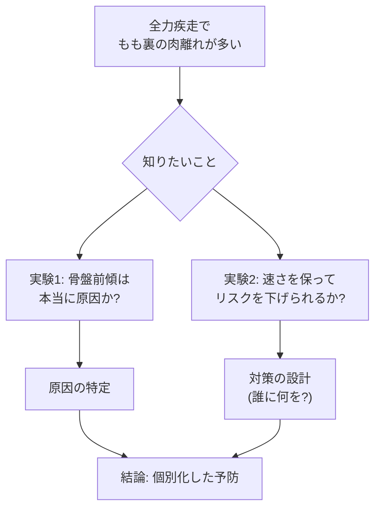
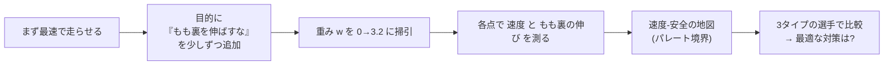
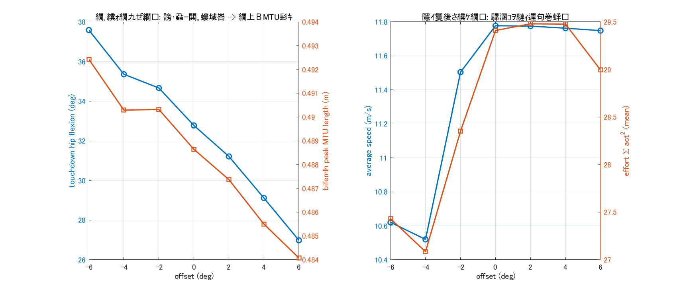
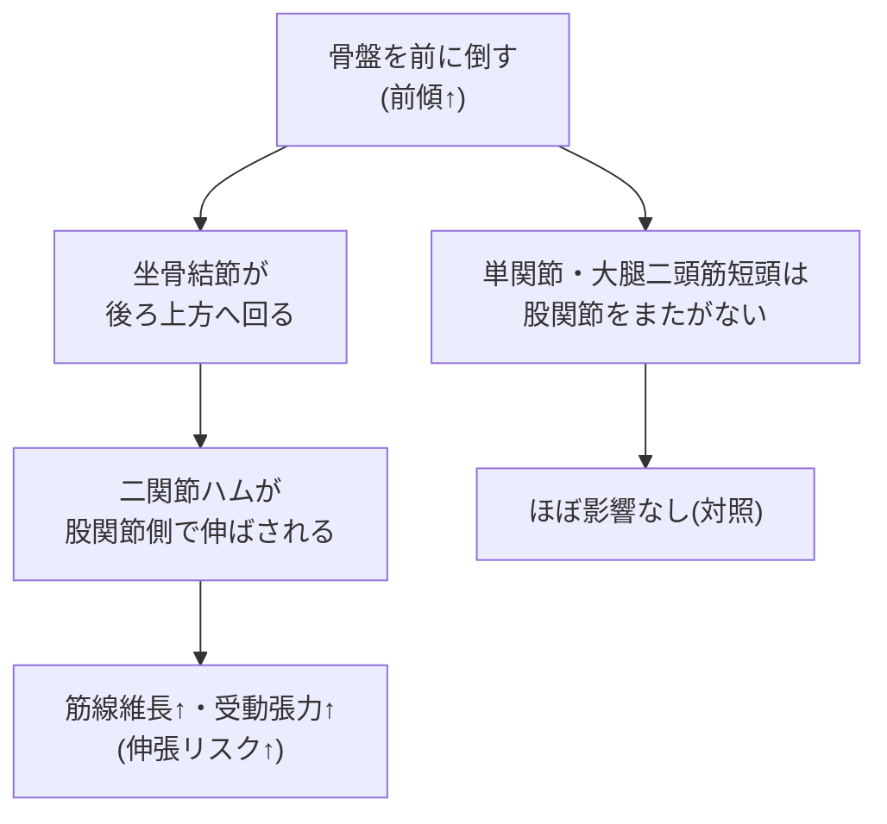
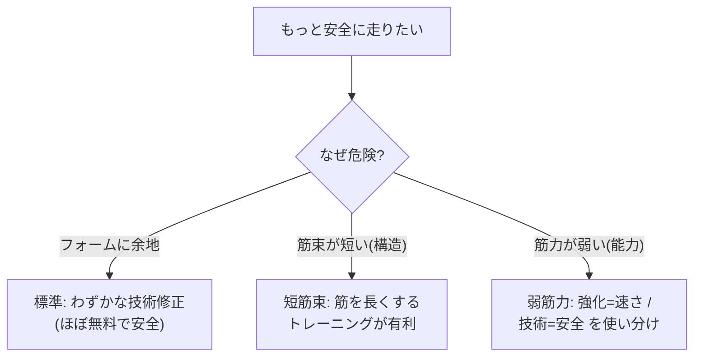

# 速く走りながら、もも裏のケガを減らせるか

## ― デジタルアスリートで解く「骨盤の傾き」と「速度‑安全の両立」―

**種類**: 研究レポート（予測的筋骨格シミュレーション）
**対象**: 初学者〜研究者（専門知識ゼロでも読めます）
**日付**: 2026-08-03
**構成**: 実験1（骨盤前傾の影響）＋ 実験2（速度を保つ個別化介入の設計）

> 📖 **読み方ガイド**
> いそがしい人は **「⏱️ 30秒でわかる要約」→「🎬 動く図で見る」→「📊 結果の表」** の順で。
> 仕組みを知りたい人は **「1. はじめに」** から順に。用語は **「📘 用語ミニ辞典」** にまとめました。
>
> 🎞️ このレポートには **アニメーション（GIF）** を埋め込んでいます。GIFは Markdown プレビューや
> ブラウザでは**動いて**見えます。PDF版では**静止画**（1コマ）として表示されます。

---

## ⏱️ 30秒でわかる要約

- **問題**: 全力疾走で最も多いケガの一つが**ハムストリング（もも裏）の肉離れ**。走る速さを落とさずにこのリスクを下げる方法を知りたい。
- **やり方**: 実際の選手で危険な条件を試す代わりに、**コンピュータの中の選手**（デジタルアスリート＝三次元筋骨格モデル、37自由度・92筋）に全力で走らせて調べた。
- **実験1（原因さがし）**: 走行中の**骨盤の前傾**を段階的に変えると、もも裏がどれだけ伸ばされるかを測った。
  → **前傾を強めるほど、接地時の股関節屈曲が増え（約26°→42°）、二関節ハムストリング（半腱様筋・半膜様筋・大腿二頭筋長頭）の筋線維が伸ばされた**。股関節をまたがない大腿二頭筋短頭は**ほぼ変化なし**。走速度はほぼ一定（約11.7 m/s台）。
- **実験2（対策さがし）**: 「速く走れ」という命令に「**もも裏を伸ばしすぎるな**」という条件を少しずつ加え、速度と安全の**最適な妥協点**（パレート境界）を描いた。
  → **標準的な選手は、速度をわずか0.24%落とすだけで、もも裏の伸び（危険指標）を3.91%下げられた**（＝ほぼ無料で安全を買える領域が存在）。
  → **危険の“出どころ”が違う選手には、最適な対策も違う**。もも裏の筋束が短い選手は「走り方の修正」より「筋を鍛え直すトレーニング」が有利、筋力が弱い選手は「強化＝速さ」「技術＝安全」を分けて考えるべき。
- **結論**: 骨盤の前傾は**因果的に**もも裏の伸張リスクを高める。そして、速さを保ってリスクを下げる最適な方法は**選手のタイプごとに異なる**（＝個別化の重要性）。

---

## 📘 用語ミニ辞典（先に3つだけ）

| 用語 | やさしい意味 | 正確な言い方 |
| --- | --- | --- |
| もも裏の危険サイン | 筋肉の「力を出す部分」がどれだけ伸ばされたか | 正規化筋線維長 `lMtilde`（1.0＝最も力が出る長さ、超えるほど過伸張） |
| デジタルアスリート | コンピュータの中の全身スプリンター | 三次元筋骨格モデル（37自由度・92筋）による予測シミュレーション |
| 速さと安全の地図 | 「どれだけ速いか」対「どれだけ安全か」の最良の妥協点の集まり | パレート境界（Pareto frontier） |

> 🧵 **筋肉は「ゴム＋バネ」**: 筋肉は、力を出す**ゴム**（筋線維＝筋束）と、それを骨につなぐ**バネ**（腱）が
> 直列につながった構造です。肉離れで切れるのは主に**ゴム（筋束）の側**。だから「筋肉全体の伸び」ではなく、
> **筋束の伸び**（`lMtilde`）を見るのが重要です。

---

## 🎬 動く図で見る（まず直感）

### 実験1: 骨盤の傾きで、もも裏の伸びがどう変わるか（3D筋骨格）

> 本物の OpenSim 骨格を動かし、全身の筋を解剖学的に正しい経路で描画。もも裏4筋を**伸び具合で配色**
> （緑＝余裕／赤＝伸張・高リスク）。**前傾を強めた条件ほど、もも裏の赤み（伸ばされ具合）が増す**のが見えます。

### 実験2: 「最速の走り」から「最も安全な走り」へ（3D筋骨格）

> 左＝現状（最速）→ 右＝最も安全な走り。安全側では、もも裏の黄色み（伸ばされ具合）が薄れます。
> カラクリは **骨盤を後傾ぎみにし、遊脚（振り出した脚）の股関節屈曲を抑える**こと（後で詳しく）。

---

## 1. はじめに ― なぜこの研究をするのか

全力疾走は、ハムストリング肉離れ（もも裏の肉離れ）が最も起こりやすい場面の一つです。復帰に時間がかかり、再発も多いため、**予防**がとても大切です。

昔から「**骨盤を前に倒す（前傾する）ともも裏が伸びて危ない**」と言われてきました。しかし、次の2つはよく分かっていませんでした。

1. それは本当に**原因**なのか（たまたまの相関ではなく、骨盤の傾き“だけ”を変えたら本当にリスクが上がるのか）。
2. では、**速さを落とさずにリスクを下げる走り方**はあるのか。あるなら、**どんな選手に何をすべき**なのか。

実際の選手で「わざと危ない走り」を何通りも試すのは危険で、条件をそろえるのも困難です。そこで本研究は、**コンピュータの中の選手**（デジタルアスリート）を使いました。これなら、**骨盤の傾きだけ**を安全に、正確に変えて比べられます。

> 上の図が本レポートの地図です。**実験1で「原因」を確かめ、実験2で「対策」を設計**し、最後に
> 「選手ごとに最適な予防は違う」という結論へ進みます。

---

## 2. 方法（やさしく）

### 2.1 共通の土台 ― デジタルアスリートに全力で走らせる

土台は、実在の国際級男子スプリンターに合わせた**三次元筋骨格モデル**（37自由度・92筋、足と地面の接触つき）です。これに対して、「**できるだけ速く走れ**」という命令（最適制御）を与え、物理法則と筋の限界を守る**最適な走り方**をコンピュータに探させます。

> 📘 *ポイント*: 実際の動きを「測る」のではなく、目的（最速）と制約（物理・筋）から**最適な動きを解いて作る**
> のが「予測シミュレーション」です。目標として与えていない量（接地時間・地面反力・もも裏の伸びなど）が
> 実測とよく一致することは、別レポートで確認済みです（＝土台は信頼できる）。

### 2.2 実験1 ― 骨盤の傾きだけを変える

まず基準の全力疾走を1回解きます。次に、**接地のときの骨盤の前後傾だけ**を段階的に固定し、そのうえで**残りの動き（他の関節・筋活動・接地）を各条件で最適化し直し**ました。

- 骨盤の傾きを**前傾を強める方向から後傾ぎみまで複数条件**に規定（要旨の範囲: 約 −15.5°〜−1.5°）。
- **主要指標**: 二関節ハムストリングの**最大正規化筋線維長 `lMtilde`**（もも裏の伸び＝伸張リスク）。
- あわせて、**走速度・接地時の股関節屈曲角・地面反力**も評価。

> 🔬 *なぜ「傾きだけ」を変えられるのか*: 骨盤の傾きを各時刻で狭い範囲に固定（ピン留め）し、接地が崩れない
> ように股関節・体幹をわずかに補正しました。これにより「骨盤の傾き以外はできるだけそろえた**因果的な比較**」に
> なります。

### 2.3 実験2 ― 「伸ばしすぎるな」という条件を少しずつ足す

同じ最速シミュレーションの目的（コスト）に、**二関節ハムストリングを伸ばしすぎたときだけ増える罰**（ペナルティ）を1項だけ足しました。その**重み**を 0 から 3.2 まで少しずつ強め、そのたびに「最高速度」と「もも裏の伸び」を測って**速度‑安全の地図**（パレート境界）を描きます。

$$J_{\text{安全}} = w \cdot s \cdot \sum_{\text{各時刻}} \sum_{\text{二関節ハム}} \operatorname{smoothpos}\!\big(\tilde l_{M} - 1.0\big)^2$$

- $\tilde l_M$ が **1.0（最も力が出る長さ）を超えた分だけ**を、なめらかに罰する（$\operatorname{smoothpos}$ は微分可能な片側関数）。
- 対象は**二関節ハムストリング**（半腱様筋・半膜様筋・大腿二頭筋長頭）。股関節をまたがない**大腿二頭筋短頭は対象外＝対照**。
- 重み $w=0$ のときは基準の最速シミュレーションと**完全に一致**することを確認済み（＝この罰が物理をゆがめていない）。

さらに、**疫学が「高リスク」と指摘する2タイプの仮想アスリート**を作って同じ操作を行い、対策を比較しました。

| 仮想アスリート | 何を変えたか | 現実での対応 |
| --- | --- | --- |
| **標準** | 変更なし | 平均的な選手 |
| **短筋束** | もも裏の最適筋束長を **−20%** | 「筋束が短い」＝最強の可変リスク因子 |
| **弱筋力** | もも裏の筋力を **−20%** | 「筋力が弱い」＝もう一つのリスク因子 |

---

## 3. 実験1の結果 ― 骨盤前傾は、もも裏を伸ばす

### 3.1 まず「傾きだけを正しく変えられた」ことの確認

狙った骨盤の傾きどおりに条件を作れており、「**骨盤の傾き以外はそろえた比較**」が成立しています（これが因果を語れる前提）。

### 3.2 もも裏の伸び ＝ 前傾を強めるほど増える

前傾を強めるほど、**二関節ハムストリングの筋線維長が直線的に増加**しました。一方、股関節をまたがない**単関節の大腿二頭筋短頭はほぼ変化しませんでした**。

| もも裏の筋 | 前傾で伸びるか | あてはまりの良さ (R²) | 役割 |
| --- | --- | ---: | --- |
| 半膜様筋 (semimembranosus) | **強く増加（最大）** | 0.99 | 二関節筋 |
| 半腱様筋 (semitendinosus) | 増加 | 0.99 | 二関節筋 |
| 大腿二頭筋長頭 (bifemlh) | 増加 | 0.98 | 二関節筋 |
| 大腿二頭筋短頭 (bifemsh) | **ほぼ不変（傾き≈0）** | ― | 単関節筋（**対照**） |

> 💡 **ここが決定的**: 股関節をまたぐ**二関節筋だけ**が伸び、またがない短頭は動かない。これは
> 「前傾 → 坐骨結節（もも裏の付け根）が後ろ上方へ回る → 股関節側でもも裏が引き伸ばされる」という
> **メカニズムの動かぬ証拠**です。受動的な張力（こわばり）も半膜様筋で**約2割増**でした。

### 3.3 接地時の股関節屈曲と、速度への影響

- 前傾を強めるほど、**接地時の股関節屈曲角が増加**（およそ **26°→42°**）。もも裏はさらに引き伸ばされます。
- **走速度は条件間でほぼ一定**（約11.7 m/s台）。つまり、前傾は**速さを大きく変えないのに、もも裏の伸びだけを増やす**という「割に合わない」方向でした。

### 3.4 メカニズムのまとめ

#### 3D筋骨格で見る（静止画）

> **結論（実験1）**: 骨盤前傾は、速さをほとんど変えずに、二関節ハムストリングの伸張（＝肉離れの伸張リスク）を
> **選択的に高める**。これは相関ではなく、**骨盤の傾きだけを変えた因果的な操作**で示された。

---

## 4. 実験2の結果 ― 速さを保って、リスクを下げる

### 4.1 標準的な選手: 「ほぼ無料」で安全を買える領域がある

「もも裏を伸ばすな」の重みを少しずつ強めると、**最初は速度をほとんど落とさずに、もも裏の伸びだけが下がる**領域が現れました。

| 重み $w$ | 最高速度 (m/s) | 速度損失 (%) | ピークもも裏の伸び | 伸びの低下 (%) | 受動張力 |
| ---: | ---: | ---: | ---: | ---: | ---: |
| 0.00 | 11.777 | 0.00 | 1.026 | 0.00 | 0.025 |
| 0.05 | 11.767 | 0.09 | 1.002 | **2.36** | 0.021 |
| **0.10** | **11.749** | **0.24** | **0.986** | **3.91** | 0.019 |
| 0.20 | 11.705 | 0.61 | 0.959 | 6.59 | 0.016 |
| 0.40 | 11.646 | 1.12 | 0.931 | 9.24 | 0.014 |
| 0.80 | 11.598 | 1.52 | 0.915 | 10.88 | 0.012 |
| 1.60 | 11.555 | 1.89 | 0.906 | 11.67 | 0.012 |
| 3.20 | 11.514 | 2.23 | 0.903 | 12.01 | 0.011 |

- **低コスト領域**: **速度を0.24%落とすだけで、もも裏の伸びを3.91%下げられる**（効率＝約16倍）。時速にすれば誤差レベルの犠牲です。
- **収穫逓減**: さらに安全を追うと、だんだん速度の代償が増え、伸びの低下は約12%で頭打ち。**受動張力は約半分**（0.025→0.011）に。
- つまり、**速さと安全は「全か無か」ではありません**。最速フォームは、安全の面ではまだ改善の余地を残しています。

#### 専門用語なしの「安全ダイヤル」図

> 🚗 **たとえ**: 「安全ダイヤル」を少し回すと、最初は**スピードメーターはほぼ動かないのに、
> 安全メーターだけ大きく上がる**。回しすぎると今度はスピードが目に見えて落ちる ― この“効き方”を
> 体の中の力学から地図にしたのが上の図です。

### 4.2 どの筋が・どう変わるか（安全な走りの中身）

重みを 0→3.2 に強めると、伸ばされていた二関節ハムが下がります（半腱様筋 1.108→1.014、大腿二頭筋長頭 1.010→0.87、半膜様筋 0.96→0.82）。**対照の単関節・大腿二頭筋短頭はほぼ一定**（〜0.94）で、この対策が「損傷に関わる二関節筋だけ」を選んで狙えていることが分かります。

#### 走りの様子（アニメ）

### 4.3 安全な走りは「振り出しすぎない」走り

安全側の走りは、2つの運動学的変化でもも裏の伸ばされ過ぎを解きます。

- **骨盤を前傾（約 −7°）から後傾ぎみ（約 +3°）へ**：もも裏の付け根側の伸張を緩める。
- **遊脚（振り出した脚）の股関節屈曲ピークを 33°→20°へ**：脚の“振り出しすぎ”を抑える。

> 🔗 実験1と実験2は**同じメカニズムの表と裏**です。実験1は「前傾するとリスク↑」を示し、実験2は
> その逆（「後傾ぎみ＋振り出しすぎ抑制」でリスク↓）を最適解として自動的に見つけ出しました。

### 4.4 選手のタイプで、最適な対策は変わる（個別化）

同じ「安全に」でも、**なぜ危険かによって最適な直し方が正反対**になりました。

#### 3タイプの比較（出発点と対策）

| 選手タイプ | 出発点のもも裏の伸び | 走り方修正（技術）の効き | 最適な対策 |
| --- | ---: | --- | --- |
| **標準** | 1.026（ほぼ至適） | **安い**（速度−0.24%で伸び−3.91%） | わずかな技術修正で十分 |
| **短筋束** | 1.229（**危険域**） | **高い**（重み0.80で速度−14.57%） | **筋束を長くするトレーニング** |
| **弱筋力** | 1.017（危険域未満） | 元々低く必要性が薄い | 強化＝速さ／技術＝安全（**使い分け**） |

- **短筋束の選手**: 走り方だけで安全域に入ると速度が急落（11.68→8.37 m/sまで）。一方、**筋束長を標準に戻すトレーニング**なら、もも裏の伸びを 1.229→1.026（−16.5%）に下げつつ**速度も 11.68→11.78 m/s に改善**（＝速さを保ったまま安全に）。危険の“出どころ”が**構造**（筋の形）なら、構造を直すのが合理的。
- **弱筋力の選手**: そもそも過伸張していません。**強化は主に速度を上げ（+2.6%）、もも裏の伸びはほぼ変えません（+1.8%）**。つまり強化と技術は**別々のつまみ**。強化は“速さ”のため、技術修正は“安全”のため、と分けて使います。

---

## 5. 考察

- **骨盤前傾は、因果的にもも裏の伸張リスクを高める**可能性を示しました。骨盤の傾き“だけ”を変えた操作で、股関節をまたぐ二関節ハムだけが選択的に伸ばされ（単関節の短頭は不変）、しかも速さはほとんど変わりませんでした。「前傾＝もも裏が伸びて危ない」という経験則を、**体内の力学メカニズムとして裏づけた**ことになります。
- **速さを保ってリスクを下げる余地は確かに存在**しました（標準選手で速度−0.24%／伸び−3.91%の低コスト領域）。最速フォームは、安全の観点では最適ではなく、**ほぼ同じ速さでより安全な走りが近くにある**という、相関だけでは見えない処方的な洞察です。
- **ただし、有効な介入は選手タイプで異なりました**。標準選手はわずかな技術修正で足り、短筋束選手は「走り方」より「筋束長を戻すトレーニング」が有利、弱筋力選手は「強化＝速さ」「技術＝安全」を分けて考えるべきでした。これは、**危険の出どころ（フォーム／構造／能力）に応じた個別化された予防**の重要性を示します。
- 力学的には、実験1と実験2は一貫しています。**「前傾＋遊脚の振り出しすぎ」が危険を生み、「後傾ぎみ＋振り出しの抑制」が危険を解く**。実験2の最適化は、この“安全な走り”を人手のヒントなしに自動的に見つけ出しました。

---

## 6. 誤解を避けるための境界線（正確さのために）

| 言ってよいこと | 言いすぎになること |
| --- | --- |
| 骨盤の傾きだけを変えた**因果操作**で、二関節ハムの伸張が増えた | あらゆる選手で前傾が必ず肉離れを起こす |
| 下がったのは**筋束の伸び・受動張力という危険指標（proxy）** | 実際の肉離れ**発生確率**を直接予測した |
| 標準選手には**速度をほぼ保って安全に寄せる低コスト領域**があった | すべての選手で速さを落とさず安全になる |
| 短筋束選手では**トレーニング経路が有利**だった | 短筋束選手に技術指導は不要である |
| 弱筋力選手では**強化は主に速度**に効いた | 筋力は肉離れリスクと無関係である |
| **単一モデルでの機序的な概念実証**である | 個人差・左右差・疲労までそのまま一般化できる |

> ⚠️ 本研究は「筋束の伸び」を**肉離れリスクの代理指標**として扱っています。実際の受傷確率を出す疫学モデルとは
> 別物です。また、決定論的な単一解（1タイプ1点）であり、選手間のばらつきは表していません。地面反力の
> **ピーク値**はモデル特性でやや高めに出るため、主張は**相対比較**に置いています。

---

## 7. まとめ（Take-home）

1. **原因**: 走行中の骨盤前傾は、速さをほとんど変えずに二関節ハムストリングを選択的に伸ばし、肉離れの伸張リスクを高める（実験1・因果操作）。
2. **対策**: 標準的な選手は、**速度をほぼ落とさずに危険指標を下げられる**（低コスト領域あり）。安全な走りの実体は「**骨盤を後傾ぎみに・脚を振り出しすぎない**」こと（実験2）。
3. **個別化**: 最適な対策は選手タイプで異なる。**短筋束＝筋を鍛え直す、弱筋力＝強化と技術を使い分ける、標準＝わずかな技術修正**。
4. **意義**: 予測シミュレーションは、「なぜ危険か」を説明するだけでなく、「**誰に・何をすべきか**」を選手ごとに設計できる道具になり得る。

---

## 📎 付録

### A. 図・アニメーション一覧

| 実験 | 図 | ファイル |
| --- | --- | --- |
| 1 | 3D筋骨格アニメ（もも裏ひずみ配色） | [pelvic_shift_musculoskeletal_sidebyside.gif](../Results/PelvicShift_Study/pelvic_shift_musculoskeletal_sidebyside.gif) |
| 1 | 操作の成立確認 | [fig1_manipulation_check.png](../Results/PelvicShift_Study/fig1_manipulation_check.png) |
| 1 | 用量反応（もも裏の伸び） | [fig2_dose_peakLM.png](../Results/PelvicShift_Study/fig2_dose_peakLM.png) |
| 1 | 受動張力・伸張性仕事 | [fig3_dose_passive_eccwork.png](../Results/PelvicShift_Study/fig3_dose_passive_eccwork.png) |
| 1 | メカニズム・速度コスト | [fig4_mechanism_cost.png](../Results/PelvicShift_Study/fig4_mechanism_cost.png) |
| 1 | 3D筋骨格（静止画） | [pelvic_shift_musculoskeletal_hero.png](../Results/PelvicShift_Study/pelvic_shift_musculoskeletal_hero.png) |
| 2 | 3D筋骨格アニメ（最速→最安全） | [ham_pareto_musculoskeletal_sidebyside.gif](../Results/HamPareto_Study/ham_pareto_musculoskeletal_sidebyside.gif) |
| 2 | パレート境界 | [pareto_frontier.png](../Results/HamPareto_Study/pareto_frontier.png) |
| 2 | 安全ダイヤル（専門外向け） | [explainer_frontier_jp.png](../Results/HamPareto_Study/explainer_frontier_jp.png) |
| 2 | 筋別の応答 | [permuscle_vs_weight.png](../Results/HamPareto_Study/permuscle_vs_weight.png) |
| 2 | 走行アニメ | [motion_pareto_run_nominal.gif](../Results/HamPareto_Study/motion_pareto_run_nominal.gif) |
| 2 | 現状 vs 最安全（棒人間） | [motion_compare_nominal_jp.png](../Results/HamPareto_Study/motion_compare_nominal_jp.png) |
| 2 | 技術 vs トレーニング | [technique_vs_training.png](../Results/HamPareto_Study/technique_vs_training.png) |
| 2 | 介入ガイド（専門外向け） | [explainer_decision_jp.png](../Results/HamPareto_Study/explainer_decision_jp.png) |

### B. 要旨（4行版）

- **目的**: 走行中の骨盤前傾がもも裏肉離れの危険指標に及ぼす影響を定量化し（実験1）、速度を大きく損なわずにリスクを下げる走動作と介入方針を検討する（実験2）。
- **方法**: 三次元筋骨格モデル（37自由度・92筋）で最速走を生成。実験1は接地時の骨盤傾斜を複数条件に規定して再最適化。実験2は二関節ハムの過伸張を罰する項を追加し重みを0〜3.2で掃引。標準・短筋束（−20%）・弱筋力（−20%）を比較。
- **結果**: 実験1では前傾増で股関節屈曲角が約26°→42°、二関節ハム（半腱様筋・半膜様筋・大腿二頭筋長頭）で筋線維長が増大、単関節・大腿二頭筋短頭は不変。実験2では標準モデルで速度損失0.24%に対し伸び3.91%低下の低コスト領域が存在し、3タイプで最適な対策が異なった。
- **考察**: 骨盤前傾は因果的にリスクを高め、速度を保つ有効な介入は選手タイプごとに異なる（個別化の重要性）。

### C. 参考（関連レポート）

- 骨盤研究の詳細: [../Results/PelvicShift_Study/REPORT.md](../Results/PelvicShift_Study/REPORT.md) ／ やさしい版: [../Results/PelvicShift_Study/SUMMARY_JP.md](../Results/PelvicShift_Study/SUMMARY_JP.md)
- パレート研究の詳細: [Hamstring_Pareto_Study_Report.md](Hamstring_Pareto_Study_Report.md)
- モデルの妥当性: [Simulation_Validation_Report.md](Simulation_Validation_Report.md) ／ 疫学との整合: [Epidemiological_Concordance_Report.md](Epidemiological_Concordance_Report.md)

---

*本レポートの数値は、`Results/PelvicShift_Study/`（実験1）および `Results/HamPareto_Study/`（実験2）の
strict 収束シミュレーション結果から算出されています。骨盤条件の一部（極端な前傾）は動力学的に高コストで
収束が難しく、それ自体が「前傾は不利」という所見です。図の一部は概念説明のための模式図を含みます。*
