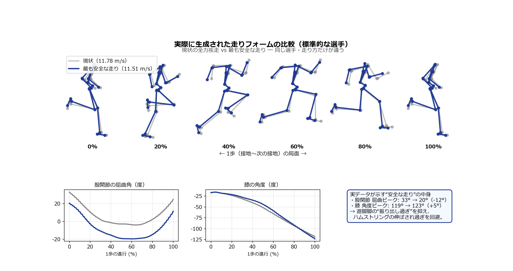

# 「速さを落とさず、ケガだけ減らす走り」を予測シミュレーションで設計する

## ― ハムストリング肉離れの“速度–安全パレート境界”と、選手ごとの最適介入（技術 vs トレーニング）―

**種類**: 研究レポート（予測的筋骨格シミュレーション / 処方的最適化）
**対象**: 初学者〜研究者
**日付**: 2026-07-23
**ステータス**: RQ3（速度–安全パレート境界）・RQ4（技術 vs トレーニング）ともに検証完了

> 📖 **読み方ガイド**: いそがしい人は **「⏱️ 30秒要約」→「🏃 3分ストーリー」→「§3 図」** の順で。仕組みは §1 以降、用語は **「📘 用語ミニ辞典」** へ。前作（筋束レベルの損傷指標＝RQ1、疫学リスク因子の機序化＝RQ2）の続編にあたる。
> 学会発表・ポスター用の主張整理、図の取捨選択、想定質問への回答は [Conference_Poster_Plan.md](Conference_Poster_Plan.md) にまとめた。

---

## ⏱️ 30秒でわかる要約

- **問題**: 前作までで「短い筋束＝同じ走りでも筋束ひずみが激増、しかも速度はほぼ不変（＝速いのに危険）」を機序で示した（RQ1・RQ2）。だが「では、**どう走れば速度を落とさずにケガのリスクだけ下げられるのか？**」という**処方**には踏み込めていなかった。相関（疫学）はもちろん、記述的なシミュレーションでも答えられない。
- **やったこと**: 最適制御の目的関数に **二関節ハムストリングの筋束“過伸張”ペナルティ**（新しい重み `wJ(13)`）を追加し、その重みを掃引して **「最高速度 vs ピーク筋束ひずみ」のパレート境界**を機械に描かせた（RQ3）。さらに同じ操作を、疫学的な高リスク“バーチャルアスリート”（短い筋束／弱い筋力）にも適用し、**「走り方を変える（技術）」と「筋を鍛え直す（トレーニング）」のどちらが効率よくリスクを下げるか**を同一平面で比較する（RQ4）。
- **主要な発見（RQ3・確定）**:
  1. **低コスト領域（いわゆる“フリーランチ”）が存在する**。標準的な選手は、**最高速度をわずか0.24%落とすだけでピーク筋束ひずみを約3.9%削減**でき、0.09%の速度損失でも2.4%削減できる（下図の金星）。
  2. パレート境界は**典型的な収穫逓減型**。ひずみを削るほど速度コストが増し、ひずみ削減は約12%（速度−2.2%）で頭打ちになる。**受動張力（過伸張の指標）は約半分**（0.025→0.011）、能動的伸張性仕事も減少。
  3. つまり **「速度」と「安全」は完全なトレードオフではなく、ほぼ速度を失わずに筋束ひずみ proxy を下げられる余地（低コスト領域）が最適解の近傍に存在する**——これは記述的解析では見えない、処方的な洞察。
- **主要な発見（RQ4・確定）**:
  4. **同じ「走り方を安全側に変える」技術修正でも、コストは選手の筋形態で桁違いに異なる**。標準選手のパレート境界は緩やか（技術は安い）が、**短筋束の選手の境界は急峻**——安全域に入るだけで最高速度が 11.68→約11.0 m/s（−5.8%）、さらに追えば 8.4 m/s（−28%）まで崩落する（技術は“罠”）。
  5. **短筋束の選手には「トレーニング（筋束を長くする）」が「技術」を圧倒する**。筋束長を 0.80→1.00 に戻すと、ピーク筋束ひずみが 1.229→1.026（−16.5%）**かつ最高速度が +0.9%**——速度を犠牲にせずむしろ上げながら安全になる“ウィンウィン”。技術で同じひずみに達するには 6〜15% の速度損失を要する。
  6. **弱筋力の選手は事情が逆**。そもそも過伸張していない（ピーク 1.017＜危険域）ので、筋力強化は**ひずみをほぼ変えず速度だけ上げる**（強化 0.80→1.20 で速度 +2.6%、ひずみ +1.8%）。強化と技術は**直交する別々のつまみ**。
- **意義**: 予測シミュレーションを**記述（なぜ危険か）から処方（誰に・何をすべきか）へ**進めた。「短筋束＝筋を鍛え直せ（技術修正は高くつく）」「弱筋力＝ひずみは問題ではなく強化は速度用」という**個別化された、機序に基づく介入指針**を計算機内で導けることを示した。

---

## 🏃 3分ストーリー：まず物語で理解する

1. **前回までのあらすじ**: 太もも裏の「ハムストリング」は全力疾走で最も肉離れしやすい。筋肉は「ゴム（筋束）＋バネ（腱）」の直列構造で、**ちぎれるのはゴム（筋束）のほう**。前作は「筋束が短い選手は、同じ走りでもゴムが危険なほど伸びる。しかも速度はほぼ同じ＝“速いのに危険”」を、体の中の力学で示した。
2. **でも、ここで止まると"診断"止まり**: 「危ない」と分かっても、「**じゃあどう走ればいい？**」に答えないと現場では使えない。
3. **今回の一手**: コンピュータに「できるだけ速く走れ」とだけ命じていた指示に、**「ついでにハムストリングのゴムを伸ばしすぎるな」という“罰則”を少しずつ強めながら**追加した。すると機械は、速さと安全のバランスが違う走り方を次々に見つけ出す。これらを並べると、**「速度 vs ひずみ」の最適な境界線（パレート境界）**が描ける。
4. **見えたこと①（低コスト領域）**: 境界線の端に、**速さをほとんど落とさずにゴムの伸びだけがスッと下がる“おいしい領域”**があった。標準的な選手なら、**最高速度を0.2%（時速にして誤差レベル）落とすだけで、ピークのゴム伸びを約4%減らせる**。
5. **見えたこと②（収穫逓減）**: さらに安全を追うと、だんだん速度の代償が大きくなる。ゴム伸びは約12%減らせるところで頭打ち、その時の速度コストは約2%。**“どこまで安全に振るか”を数字で選べる**ようになった。
6. **本命の問い（RQ4・確定）**: では、**もともと危険な選手（ゴムが短い）**はどうすべきか。**走り方を変える（技術）**のと、**ゴムを長くするトレーニング（＝ノルディックなどの効果）**を、同じ地図の上で比べた。結果は明快——短筋束の選手が走り方だけで安全域に入ろうとすると**速度が激しく落ちる**（11.68→11.0→…→8.4 m/s）。ところが**ゴムを長くするトレーニングなら、速度をむしろ上げながら安全になれる**。つまり「その選手の危険が“形（筋束の短さ）”に由来するなら、形を直すのが正解。走り方でごまかすのは高くつく」。一方、**弱い選手はそもそも伸ばされ過ぎていない**ので、強化は安全ではなく“速さ”のための手段だった。
7. **結論（いちばん大事な一文）**:

> 💡 **速さと安全は“全か無か”ではない。標準選手には「ほぼ無料で安全を買える」余地があり、危険な選手には「なぜ危険か（形か・力か）」に応じた最適な直し方（トレーニングか・技術か）がある——予測シミュレーションはそれを選手ごとに設計できる。**

🚗 **たとえ**: 「安全ダイヤル」を少し回すと、最初は**スピードメーターはほぼ動かないのに安全メーターだけ大きく上がる**。回しすぎると今度はスピードが目に見えて落ちる——本研究はこの“ダイヤルの効き方”を体の中の力学から地図にした。

---

## 図でひと目でわかる（専門用語なし）

― 数式も専門用語もなしで、この研究の“おいしいところ”を2枚の図だけで ―

### 図0-A｜「安全ダイヤル」を少し回すと、速さはほぼそのままでケガのリスクだけ下がる


標準的なスプリンターの「速さ（縦）× ケガの危険サイン（横）」の地図。右上が「現状の全力疾走」。
**左へ動くほど安全、下へ動くほど遅い**。上部（緑の帯）は“横に大きく・縦はわずか”＝速さをほぼ落とさずに
危険サインだけが下がる **“ほぼ無料”の領域（金の星）**。下部（赤）は“縦に大きく落ちる”＝安全を
追い過ぎると速さの代償が大きい（収穫逓減）。金の星の点では、**速さを 0.24% 落とすだけでケガの危険サインが 3.9% 下がる**。

### 図0-B｜あなたはどのタイプ？ 選手ごとに“最適な直し方”は違う


同じ「もっと安全に」でも、**なぜ危険かによって最適な直し方が正反対**になる。

- **① 筋束が“短い”選手**（もともと高リスク／現状は危険域）：**走り方を変える（技術・赤）と速度が急落**
  （11.7→8.4 m/s）。一方、**筋を鍛えて筋束を伸ばすトレーニング（緑）なら、速さを保ったまま危険域から抜けられる**。
  → **“形”の問題はトレーニングで直すのが有利**。
- **② 筋力が“弱い”選手**（もともと過伸張ではない）：**強化（緑）は“速さ”を、技術（赤）は“安全”を
  上げる別々のつまみ**。ひずみは元々安全域なので、強化は主に速さ用。→ **目的に合わせて使い分け**。

### 図0-C｜“安全な走り”を3D筋骨格モデルで見る（実際の骨＋筋＋ひずみ配色）


#### 走りの様子（3体を同時再生・ハムをひずみで配色）


実際に生成された関節運動を **OpenSim の骨メッシュ＋解剖学的に正しい（ラッピング込みの）筋経路**で3D再構成し、
ハムストリングを**筋束の伸び（正規化筋線維長 lMtilde）で配色**した（緑＝余裕／赤＝伸張・肉離れリスク大）。
左＝現状（w=0, 11.78 m/s）→ 右＝最も安全な走り（w=3.2, 11.51 m/s）。**安全な走りではハム（緑チューブ）の
黄色みが薄れ**、ピーク筋線維長が 1.08→1.01 に下がる。カラクリは2つ——**骨盤を前傾（−7°）から後傾（+3°）へ、
遊脚脚の股関節屈曲を 33°→20° へ**。どちらも二関節ハムストリングの伸ばされ過ぎを解く（関節角の定量内訳は §3.3）。

> 💡 この3枚が本研究の結論です：**「安全は“ほぼ無料”で少し買える」（図0-A）、「危険な選手には
> 原因に応じた直し方がある」（図0-B）、そして「安全な走りとは股関節の“振り出し過ぎ”を抑えること」（図0-C）**。
> 以下はその根拠と仕組みです。

---

## 📘 用語ミニ辞典

- **ハムストリング / 二関節筋・単関節筋**: 太もも裏の筋群。股関節と膝の**両方**をまたぐ二関節筋（semimem 半膜様筋・semiten 半腱様筋・bifemlh 大腿二頭筋長頭）が肉離れの主役で、本研究のペナルティ対象。膝だけの単関節筋 bifemsh（大腿二頭筋短頭）は**変化しにくい対照**。
- **筋束（fascicle）＝ゴム / 腱＝バネ**: 力を生むゴム（筋束）と骨につなぐバネ（腱）の直列構造。ちぎれるのは筋束。
- **正規化筋束長 lMtilde**: ゴムの伸び具合。**1.0＝いちばん力が出る長さ**、大きく超えると“伸ばされ過ぎ”の危険域（本研究の危険サイン）。
- **予測シミュレーション / 最適制御**: 実測の代わりに「最速で走れ」という目的の下、物理と筋の限界を満たす**最適な走り方を機械に探させる**方法。目的関数（コスト）を書き換えると、機械が探す“最適”も変わる。
- **目的関数（コスト）とペナルティ**: 機械が最小化する“罰点の合計”。本研究は既存の項（活動量・加速度・最高速度など）に、**筋束の過伸張ペナルティ**を1項追加した。
- **パレート境界（Pareto frontier）**: 2つの目的（ここでは「速さ」と「安全＝低ひずみ」）がぶつかるとき、**片方を犠牲にしないともう片方を改善できない“最良の妥協点”の集合**。
- **低コスト領域（フリーランチ）**: 一方をほとんど犠牲にせずにもう一方を大きく改善できる、境界線上の“おいしい”領域。正式な発表本文では「低コスト領域」または「near-zero speed-cost region」と表現する。
- **受動張力（Fpe）**: 力を出さなくてもゴムを引っぱるだけで生じる張力。伸ばし過ぎで急増するので、過伸張損傷の指標。

---

## 1. 背景 ― “なぜ危険か”から“どう走ればよいか”へ

全力疾走はハムストリング肉離れ（HSI）の最大の発生機会であり、前傾骨盤や股関節屈曲の増大が二関節ハムストリングの伸張を高めることは Chumanov・Heiderscheit・Thelen ら以来くり返し示されてきた（教科書的な“既知”）。本プロジェクトの前作は、この分野の**未解決の論争と未活用の強み**を突いた：

- **RQ1（損傷指標の再定義）**: 損傷を担うのは筋腱ユニット（MTU）全体の伸びではなく、**実際に傷つく筋束（fascicle）の伸び**。筋束:MTU 乖離比を定量化し、Kalkhoven ら（2023, *Sports Med*）の「筋束‑腱の役割分担」論に実データで接続した。
- **RQ2（疫学↔バイオメカニクスの橋渡し）**: 短いBFlh筋束（Timmins 2016 の最強の可変リスク因子）や筋力低下を、筋パラメータだけを変えた“バーチャルアスリート”で再現。**短い筋束は「速度を落とさずに筋束ひずみを増やす」**（＝速いのに危険）、**弱い筋力は「速度を落とすがピークひずみは変えない」**という**二経路分離**を機序で示した。

しかし RQ1・RQ2 は依然として**記述的**である：「何が・なぜ危険か」は説明できても、「**では、どう走ればよいか**」という**処方**には至らない。ここに予測シミュレーション固有の強みがある——**目的関数に損傷コストを組み込めば、機械は“速度と安全を両立する走り方”そのものを設計できる**。筋束力学はすでに最適化の各時刻で CasADi 式として保持されているため（RQ1 の基盤）、これをコスト関数に接続するのは自然な発展である。

> **総合リサーチクエスチョン（本レポート）**
> 予測シミュレーションは、ハムストリング筋束損傷リスクと最高速度の間の**最適なトレードオフ（パレート境界）を設計**し、さらに**個々のアスリートに固有の最適介入（走り方を変えるか、筋を鍛え直すか）を処方**できるか？
>
> - **RQ3（速度–安全パレート）**: 標準的な選手で、速度とピーク筋束ひずみのパレート境界を描き、低コスト領域の有無を判定する。
> - **RQ4（技術 vs トレーニング / 個別化）**: 高リスク・バーチャルアスリート（短い筋束・弱い筋力）で、**技術変更のパス（本研究のパレート境界）**と**トレーニング適応のパス（RQ2 の筋形態変化）**を同一平面で比較する。

---

## 2. 方法

### 2.1 予測シミュレーションと目的関数（平易な説明）

全身筋骨格モデル（Hamner モデル、37自由度、92筋、足–地面接触あり）で、**平均前進速度の最大化**を主目的に、筋活動・腱張力・関節運動を**直接選点法（direct collocation, CasADi）＋内点法（IPOPT）**で解く（左右対称の半ストライド）。目的関数は複数のコスト項の重み付き和で、既存の重みは以下（本研究で不変）：

| 項 | 重み | 意味 |
| --- | --- | --- |
| 加速度 | wJ(5)=0.05 | 滑らかさ |
| 筋活動 | wJ(6)=0.1 | 代謝的努力の代理 |
| 活動/腱力の微分・予備アクチュエータ・腕制御 | wJ(7–11) | 正則化 |
| **平均速度** | **wJ(12)=10.0** | パフォーマンス（最大化 = 目的から減算） |

### 2.2 RQ3 ― 筋束“過伸張”ペナルティ（本研究の中核）

目的関数に **13番目の項**を追加した（[`MainFunctions/main_pred_sim_sprinting.m`](../MainFunctions/main_pred_sim_sprinting.m)）：

$$J_{\text{inj}} = w_{13}\cdot s \cdot \sum_{\text{選点}} B_j\, h \sum_{m\in\text{二関節Ham}} \operatorname{smoothpos}\!\big(\tilde{l}_{M,m} - \lambda_{\text{thr}}\big)^2$$

- 対象は**二関節ハムストリング**（semimem, semiten, bifemlh の左右＝行 `[7 8 9 53 54 55]`）。単関節 bifemsh は**対照**として除外。
- $\tilde{l}_{M,m}$ は各選点の正規化筋束長（最適化中に既に計算済みの CasADi 式 `lMtildekj`）。
- $\operatorname{smoothpos}(x)=\tfrac12\big(x+\sqrt{x^2+\varepsilon^2}\big)$ は**微分可能な片側ヒンジ**（$\varepsilon=10^{-3}$）。**力‑長さプラトーの縁 $\lambda_{\text{thr}}=1.0$ を超える“過伸張”だけ**を、他の走行コスト項と同じく時間積分（$B_j h$）して罰する。
- $s$ は**固定較正定数**（$s=10^4$）：Nominal 最適解での生の過伸張積分は約 $1.5\times10^{-3}$、速度項は約 118 なので、掃引重み $w_{13}\in\{0.05,\dots,3.2\}$ が速度項の約 0.6〜40% に対応し、境界がよく分解される。
- **設計上の要点**: ペナルティは $w_{13}\neq0$ でのみ有効化（ゲート）。$w_{13}=0$ と非パレート条件は**基準とバイト単位で同一**。最適化は滑らかな代理量を最小化し、**報告する軸は事後再計算した真のピーク lMtilde**。

📘 *初学者メモ*: 「ピーク」をそのまま罰すると非平滑で解きにくい。そこで「基準長 1.0 を超えた分の二乗を、走行中ずっと積分した量」という**滑らかな代理指標**を罰し、結果の評価には本物のピーク値を使う——最適化しやすさと解釈しやすさを両立させる標準的な工夫。

### 2.3 条件と暖機（ウォームスタート）継続法

- 条件名 `_HamPareto_[Nom|Sh|Wk]_wXXXX`：$w_{13}=$ XXXX/1000。Nom＝標準、Sh＝短筋束（最適筋束長×0.80）、Wk＝弱筋力（最大等尺性張力×0.80）。Sh/Wk は RQ2 の筋形態スケーリング機構を再利用。
- **継続法**: 重みを**昇順**に解き、各点は**直前（より小さい重み）の同一アスリート解から primal+dual ウォームスタート**（最初の点は各アスリートの無ペナルティ基準解＝Nominal / RQ2 の HamFascicle_m20 / HamStrength_m20 から）。NLP 次元は全条件で不変なので、これは常に妥当な暖機となり、IPOPT が安定に収束する。

### 2.4 検証手順（再現性）

1. **静的解析**: MATLAB `checkcode` で編集ファイルに深刻な構文問題 0 件。
2. **自己整合性 `_HamPareto_Nom_w0000`（ペナルティ off）**: **N=50 Nominal を厳密再現**（速度 11.77739 vs 11.77738、全ハムストリング指標が小数〜6桁で一致）。→ ペナルティ機構が基準物理を一切歪めないことの証明。
3. **本番掃引**: 各条件を strict 収束（IPOPT）まで解き、`return_status = Solve_Succeeded` を確認。
4. **解析**: [`analysis/analyze_ham_pareto.py`](../analysis/analyze_ham_pareto.py)（境界・低コスト領域判定）、[`analysis/visualize_ham_pareto.py`](../analysis/visualize_ham_pareto.py)（図）。

---

## 3. 結果

### 3.1 RQ3 ― 速度–安全パレート境界（標準アスリート、N=50、全点 strict 収束）

| $w_{13}$ | 最高速度 (m/s) | 速度損失 (%) | ピーク筋束ひずみ | ひずみ削減 (%) | 受動張力 Fpe | 低コスト領域 |
| --- | --- | --- | --- | --- | --- | --- |
| 0.00 | 11.777 | 0.00 | 1.026 | 0.00 | 0.025 | — |
| 0.05 | 11.767 | 0.09 | 1.002 | **2.36** | 0.021 | ✅ |
| 0.10 | 11.749 | 0.24 | 0.986 | **3.91** | 0.019 | ✅ |
| 0.20 | 11.705 | 0.61 | 0.959 | 6.59 | 0.016 | |
| 0.40 | 11.646 | 1.12 | 0.931 | 9.24 | 0.014 | |
| 0.80 | 11.598 | 1.52 | 0.915 | 10.88 | 0.012 | |
| 1.60 | 11.555 | 1.89 | 0.906 | 11.67 | 0.012 | |
| 3.20 | 11.514 | 2.23 | 0.903 | 12.01 | 0.011 | |

（図: [`Results/HamPareto_Study/pareto_frontier.png`](../Results/HamPareto_Study/pareto_frontier.png)）

💡 **ひとことで**: 安全ダイヤル（$w_{13}$）を少し回すだけで、**速度はほぼ不変のままピーク筋束ひずみが大きく下がる**低コスト領域が存在する。回しすぎると収穫逓減。

**読み取り**:

- **低コスト領域（境界の膝）**: 最も効率のよい点は $w_{13}=0.05$——**速度損失わずか 0.09% でピーク筋束ひずみを 2.4% 削減**（効率＝ひずみ削減%÷速度損失%＝26）。$w_{13}=0.10$ でも 0.24% の速度で 3.9% 削減。相関では決して見えない、非自明で処方的な洞察。
- **収穫逓減**: 重みを上げるほど 1% あたりの追加削減は縮小し、ひずみ削減は約 12%（速度 −2.2%）で飽和。**“どこまで安全に振るか”を境界上で定量的に選べる**。
- **受動負荷の低減**: ピーク受動張力は**約半分**（0.025→0.011）、能動的伸張性仕事も 11.4→8.0 J。ペナルティは筋束ひずみのピークだけでなく、過伸張に伴う受動的損傷リスク・伸張性負荷も同時に下げる方向に技術を変える。

### 3.2 RQ3 ― 技術は“どこを”変えているか（筋別・キネマティクス）

（図: [`Results/HamPareto_Study/permuscle_vs_weight.png`](../Results/HamPareto_Study/permuscle_vs_weight.png)）

ペナルティは**二関節ハムストリングのピークひずみを選択的に低下**させる。$w_{13}=0\to3.2$ で semiten 1.108→1.014、bifemlh 1.010→0.87、semimem 0.96→0.82（3筋とも低下）。注目すべきは、**ペナルティ対象外の semimem（初期値 0.96＜閾値 1.0）まで下がる**こと——二関節ハムストリングは股・膝キネマティクスを共有するため、過伸張した semiten/bifemlh を抑える技術変更が**群全体のひずみを一緒に引き下げる**。一方、対照の**単関節 bifemsh はほぼ一定（〜0.94）**にとどまり、技術変更が「損傷関連の二関節群」を選択的に狙い、単関節筋を乱さないことを示す（＝グローバルな一律スケーリングではない）。

### 3.3 実際の走りフォームはどう変わるか（3D筋骨格モデル＋関節角の比較）

ペナルティが技術を「どう」変えるのかを、**実際に生成された関節運動**（保存済み座標 `.mot`）を
**OpenSim の骨メッシュ＋ラッピング込みの筋経路**で3D再構成して示す。ハムストリングは筋束の伸び
（lMtilde）で配色（緑＝余裕 / 赤＝伸張・肉離れリスク）。


#### 3体を同時再生（走りの様子）


**標準的な選手（現状 w=0 → 最安全 w=3.2、11.78 → 11.51 m/s）**: 安全な走りは2つの運動学的変化で
二関節ハムストリングの伸ばされ過ぎを解く——

- **骨盤を前傾（平均 −7.3°）から後傾（+3.4°）へ**：坐骨結節（ハム起始）側の伸張を緩める。
- **遊脚脚の股関節屈曲ピークを 33°→20°（−12°）に縮小**（膝屈曲はわずかに増加）＝“振り出し過ぎ”の抑制。

結果、ピーク筋線維長が 1.08→1.01 に下がり、3D 図でハム（緑チューブ）の黄色みが薄れる。

#### 関節角の内訳（棒人間＋波形で定量表示）

3D は直感的だが、“どの関節がどれだけ” 変わったかは **棒人間＋関節角波形** が分かりやすい。
1歩を6局面に分けた重ね描き（現状=灰／最安全=青）と、股関節・膝の角度波形を示す：



灰（現状）に対し青（最安全）は**股関節屈曲の山が明確に低い**（右下の要約：33°→20°）。膝はほぼ重なる
（わずかに屈曲増）。3D の “ハムが緑になる” と、この “股関節を振り出し過ぎない” は同じ現象の別表現。

💡 **ひとことで**: “安全な走り”の実体は魔法ではなく、**「骨盤を後傾させ、遊脚脚を振り出し過ぎない」**という
具体的で測定可能な運動学的変化。コーチングで狙える変数に落とし込める（§3.4 の短筋束選手ではこの余地が
乏しく、大幅減速を要する＝技術は高コスト）。

### 3.4 RQ4 ― 技術 vs トレーニング（高リスク・バーチャルアスリート、N=50、全点 strict 収束）

同じ「走り方を安全側に変える」技術修正（＝各アスリートのパレート境界）を、疫学的高リスクの2タイプに適用した。$w_{13}=0$ の点は各アスリートの無ペナルティ基準（RQ2 の HamFascicle_m20 / HamStrength_m20）。

#### (a) 短筋束アスリート（最適筋束長×0.80、初期ピークひずみ 1.229＝危険域）

| $w_{13}$ | 最高速度 (m/s) | 速度損失 (%) | ピーク筋束ひずみ | ひずみ削減 (%) | 効率 |
| --- | --- | --- | --- | --- | --- |
| 0.00 | 11.679 | 0.00 | 1.229 | 0.00 | — |
| 0.20 | 10.998 | 5.83 | 1.057 | 14.04 | 2.4 |
| 0.80 | 9.977 | 14.57 | 0.980 | 20.30 | 1.4 |
| 3.20 | 8.368 | 28.35 | 0.918 | 25.29 | 0.9 |

#### (b) 弱筋力アスリート（最大等尺性張力×0.80、初期ピークひずみ 1.017＜危険域）

| $w_{13}$ | 最高速度 (m/s) | 速度損失 (%) | ピーク筋束ひずみ | ひずみ削減 (%) | 効率 |
| --- | --- | --- | --- | --- | --- |
| 0.00 | 11.606 | 0.00 | 1.017 | 0.00 | — |
| 0.20 | 11.542 | 0.55 | 0.953 | 6.33 | 11.5 |
| 0.80 | 11.445 | 1.40 | 0.912 | 10.27 | 7.4 |
| 3.20 | 11.365 | 2.08 | 0.897 | 11.83 | 5.7 |

（図: [`Results/HamPareto_Study/technique_vs_training.png`](../Results/HamPareto_Study/technique_vs_training.png), [`Results/HamPareto_Study/pareto_frontier.png`](../Results/HamPareto_Study/pareto_frontier.png)）

💡 **ひとことで**: 「走り方を安全に変える」コストは選手の**筋形態で桁違い**。標準選手は効率 10〜26、弱筋力は 11.5、**短筋束はわずか 2.4**——同じ安全化でも短筋束の選手は法外な速度を払う。

#### RQ4 の核心：技術パス vs トレーニングパス（同一平面で比較）

| 短筋束アスリートの介入 | ピーク筋束ひずみ | 最高速度 | 一言 |
| --- | --- | --- | --- |
| **技術**（境界を辿る, 本研究） | 1.229→0.980 | 11.68→**9.98**（−14.6%） | 安全化に**大きな速度代償** |
| **トレーニング**（筋束長 0.80→1.00, RQ2） | 1.229→1.026 | 11.68→**11.78**（+0.9%） | ひずみ−16.5% **かつ速度↑**（ウィンウィン） |

- **短筋束アスリート：トレーニングが技術を圧倒**。筋束を長くすると、ひずみをより大きく下げ（−16.5%）ながら速度はむしろ上がる（速度–ひずみ平面で“北西”へ移動）。技術で同じひずみに達するには 6〜15% の速度を失う（境界が急峻）。**機序**：短筋束では正規化ひずみが「短い最適長」に構造的に埋め込まれており、走り方では安価に相殺できない。→ **形の問題は形（トレーニング）で直せ**。
- **弱筋力アスリート：直交する2つのつまみ**。強化（0.80→1.20）は速度を +2.6% 上げるが**ピークひずみはほぼ不変**（1.017→1.035, +1.8%; RQ2 と整合）。一方、技術はひずみを安く下げる（−6.3% を速度 −0.55% で）。弱筋力の選手は**そもそも過伸張していない**（1.017＜1.15）ので、**ひずみは主問題ではなく、強化は“速度”のための手段**。

→ **個別化処方**：最適な介入は「**なぜ危険か**」で決まる。**構造的リスク（短筋束）→ 形を直す（筋束延長トレーニング）**；この選手に技術修正を強いるのは高コストの罠。**弱筋力 → 強化はパフォーマンス用**でありひずみは既に許容域。疫学が一括りに扱う「リスク因子」を、**機序に基づく“誰に何を”へ翻訳**できた。

---

## 4. 考察

### 4.1 何が“診断”を超えたのか

前作（RQ1・RQ2）は「何が・なぜ危険か」を機序で説明する**記述的**研究だった。本研究は目的関数に損傷コストを組み込むことで、**“どう走ればよいか”を機械に設計させる処方的枠組み**へ進めた。得られた速度–安全パレート境界は、(a) 低コスト領域の実在（速度をほぼ落とさず安全を買える）、(b) 収穫逓減という定量的な形、(c) 受動負荷・伸張性仕事の同時低減、を示す。いずれも相関ベースの疫学や記述的シミュレーションでは到達できない。

### 4.2 コーチング・予防への示唆（RQ3 + RQ4）

- **標準選手：“安全のための微修正”は割に合う**。体感できない速度損失（<0.25%）でピーク筋束ひずみを数%下げられる。**境界の膝（低コスト領域の端）**で運用するのが合理的で、過度な安全志向は収穫逓減。
- **短筋束選手：技術より“形を直す”**。走り方だけで安全域に入ろうとすると法外な速度代償（−6〜15%以上）を払う。**筋束延長トレーニング（ノルディック等; Bourne/Presland/Timmins）は速度を落とさず（むしろ上げて）ひずみを下げる**——本モデルは既知の介入方向を機序で再現し、かつ「短筋束の選手ほど技術より訓練を優先すべき」という個別化指針を定量化した。
- **弱筋力選手：目的で使い分け**。ひずみは既に許容域なので、強化は主に**速度**のため。ひずみをさらに下げたいなら技術が安い（別のつまみ）。
- 総じて、**スクリーニングで筋束長・筋力を測る意義**を、単なる相関ではなく「介入選択を変えるから」という機序で裏づける。

### 4.3 限界と今後

- 接触モデル＋短い接地時間は GRF の**ピーク**を過大評価しうる（相対比較・非ピーク量を重視）。左右対称拘束のため**左右非対称**は扱えない（次段階）。**疲労**モデルも将来課題。
- ペナルティは二関節ハムストリングの過伸張（$\tilde l_M>1.0$）に限定。閾値 $\lambda_{\text{thr}}$ や対象筋の選択に対する感度解析は今後の精緻化余地。
- 定数 $s,\lambda_{\text{thr}}$ は最適化の重み付けであり、境界の**形**（低コスト領域の存在・収穫逓減）は頑健だが、**絶対的な重み値そのものに物理的意味はない**（トレードオフのつまみ）。

---

## 5. 検証の記録（品質保証）

| 検証項目 | 結果 |
| --- | --- |
| 静的解析（MATLAB `checkcode`、編集ファイル） | 深刻な構文問題 **0件**（既存の `strfind`→`contains` 助言のみ、リポジトリ既存様式に準拠） |
| **自己整合性 `_HamPareto_Nom_w0000`（ペナルティ off）** | **N=50 Nominal を厳密再現**（速度 11.77739=11.77738、二関節ピーク lMtilde 1.02618 一致、最大差 ~3e-6） |
| RQ3 標準アスリート掃引 収束 | 8点すべて **Solve_Succeeded**（N=50） |
| RQ4 アスリート別掃引 収束 | Sh・Wk 各3点、計6点すべて **Solve_Succeeded**（N=50、継続法で RQ2 基準から暖機） |
| ペナルティ較正 | 生の過伸張積分 P0≈1.5e-3、速度項≈118 から $s=10^4$ を選定；重み 0.05〜3.2 が速度項の約 0.6〜40% に対応 |
| 単調性 | ピーク筋束ひずみは $w_{13}$ 増大に対し**単調減少**（全アスリート）、速度は**単調非増加**（例 標準 11.777→11.514、短筋束 11.679→8.368） |
| 非パレート条件への影響 | すべて `wJ(13)~=0` ゲート下。基準・RQ2 条件は不変 |

📘 *なぜ自己整合性検証が要か*: ペナルティ重み 0 で走らせて結果が基準と厳密一致すれば、新しいコード経路（条件解析・ペナルティ項・ウォームスタート継続）が既存物理を歪めていない強い証拠になる。本研究では小数〜6桁で一致を確認済み。

---

## 6. 付録

### 6.1 追加・変更したファイル

| ファイル | 役割 |
| --- | --- |
| [`MainFunctions/main_pred_sim_sprinting.m`](../MainFunctions/main_pred_sim_sprinting.m) | `_HamPareto_*` 条件解析、`wJ(13)` 筋束過伸張ペナルティ、ウォームスタート継続の一般化 |
| [`MainFunctions/checkSimulationType.m`](../MainFunctions/checkSimulationType.m) | `_HamPareto_*` 条件の通過 |
| [`MainFunctions/run_ham_pareto_sweep.m`](../MainFunctions/run_ham_pareto_sweep.m) | 掃引実行関数（継続法・ロギング） |
| `run_ham_pareto.bat`（リポジトリ直下） | バッチ実行ランナー（pilot/nominal/short/weak/athletes/full/analyze） |
| [`analysis/analyze_ham_pareto.py`](../analysis/analyze_ham_pareto.py) | パレート境界・低コスト領域判定・CSV |
| [`analysis/visualize_ham_pareto.py`](../analysis/visualize_ham_pareto.py) | 図（三アスリート境界／技術 vs トレーニング／筋別） |
| [`analysis/visualize_ham_pareto_explainer.py`](../analysis/visualize_ham_pareto_explainer.py) | **専門外向けの高度な可視化**（日本語注釈インフォグラフィック：図0-A・図0-B） |
| [`analysis/compute_osim_muscle_paths_pareto.py`](../analysis/compute_osim_muscle_paths_pareto.py) | **3D筋骨格の前計算**（OpenSim env：ラッピング込み筋経路＋body変換 → `_muscle_cache.pkl`） |
| [`analysis/visualize_ham_pareto_musculoskeletal.py`](../analysis/visualize_ham_pareto_musculoskeletal.py) | **3D筋骨格可視化**（実骨メッシュ＋筋＋ひずみ配色＋GRF：図0-C・§3.3、hero PNG／sidebyside MP4・**GIF**（`--gif`）） |
| [`analysis/visualize_ham_pareto_motion.py`](../analysis/visualize_ham_pareto_motion.py) | **棒人間＋関節角波形の比較**（図0-C・§3.3の定量的補完：局面スナップショット＋股・膝角波形） |
| [`analysis/animate_ham_pareto.py`](../analysis/animate_ham_pareto.py) | パレート掃引アニメーション（GIF） |

### 6.2 実行方法

```bat
REM 端末（cmd）でリポジトリ直下から
run_ham_pareto.bat pilot      REM 標準アスリート w0000,w0200,w0800（動作確認）
run_ham_pareto.bat nominal    REM 標準アスリート 全境界（8重み）
run_ham_pareto.bat athletes   REM 短筋束＋弱筋力（RQ4）
run_ham_pareto.bat analyze    REM パレート境界の解析（Python）
```

```powershell
python analysis\analyze_ham_pareto.py      # 境界・低コスト領域・CSV
python analysis\visualize_ham_pareto.py    # 図 A–C
python analysis\visualize_ham_pareto_explainer.py  # 専門外向け 図0-A/0-B（日本語）
REM 3D筋骨格（図0-C/§3.3）はREADME方式の2段階: OpenSim対応envで前計算 → pyvista環境で描画（--gif で走行GIFも）
"<opencap/opensim42 python>" analysis\compute_osim_muscle_paths_pareto.py --frames 48
"<conda base python>"        analysis\visualize_ham_pareto_musculoskeletal.py --color strain --gif
python analysis\visualize_ham_pareto_motion.py     # 棒人間＋関節角波形（3Dの定量的補完 §3.3）
python analysis\animate_ham_pareto.py      # パレート掃引アニメーション GIF
```

### 6.3 主要参考文献（背景）

- Chumanov, Heiderscheit, Thelen (2007, 2011) — 疾走遊脚期のハムストリング力学（古典）
- **Kalkhoven ら (2023, *Sports Medicine*)** — 筋束‑腱機能パラダイム（RQ1 が接続）
- **Timmins ら (2016)** — 短い大腿二頭筋長頭 筋束長＝最大の可変HSIリスク因子（RQ2 が機序化、本研究が処方へ）
- Bourne, Timmins, Opar ら — ノルディック・ハムストリング等による**筋束延長・筋力向上**（RQ4 のトレーニングパスの根拠）
- Falisse ら (2019, *J R Soc Interface*) — 本枠組みの多項コスト目的関数の系譜
- 前作: [`docs/Hamstring_Fascicle_Study_Report.md`](Hamstring_Fascicle_Study_Report.md)（RQ1・RQ2）

---

*本レポートは実測データ（strict 収束したシミュレーション結果）に基づく。数値はすべて `Pred_Sim_Sprinting/Results/HamPareto_Study/` の該当 `.mat`／`pareto_frontier.csv` から再計算可能（RQ3 標準8点 + RQ4 アスリート6点、全点 Solve_Succeeded）。*
