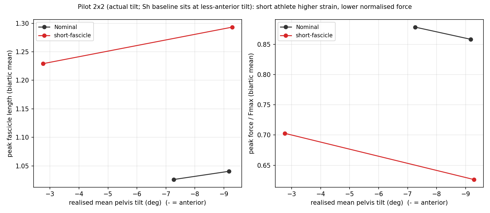

# デジタルアスリートで探るハムストリング肉ばなれ ― 全体解説（初学者向け・詳細版）

> この文書は、本研究の目的・方法・結果・妥当性・限界を、**専門外の人にも分かるように、しかし正確に**説明することを目的とします。数値はすべて本プロジェクトの保存データから検証済みです。図は `Results/PelvicShift_Study/` と `Results/HamPareto_Study/`、`Results/PelvicAthlete_Study/` にあります。
> 最終更新: 2026-08-15


*本研究の「デジタルアスリート」＝37関節・92筋の3次元筋骨格モデル。最適制御で最速スプリントを生成し、条件を変えて比較する。*

---

## 0. 30秒でわかる要約

- **問い**: 走るときの「骨盤の前傾」は、ハムストリング（もも裏の筋肉）の肉ばなれリスクにどう関わるのか。速度を落とさずにリスクを減らす走り方はあるのか。
- **方法**: 実際の人間ではなく、コンピュータ上の「デジタルアスリート」（37個の関節・92本の筋肉の数理モデル）に、**最適制御**という数学で「最速で走る動作」を計算させ、条件を変えて比較した。
- **最大の発見**: 「骨盤を前傾させるとハムが伸びる」のは、**骨盤の角度そのものの効果ではなく、前傾に合わせて全身の走り方（特に股関節の曲げ方）が作り直された結果**だった。
- **重要な注意**: 本研究が測っているのは「筋肉にかかる力学的な負荷」であって、「実際に肉ばなれが起きる確率」ではない。この2つは分けて考える必要がある。

---

## 1. なぜこの研究をするのか

### 1.1 ハムストリング肉ばなれという問題
ハムストリング（大腿二頭筋・半腱様筋・半膜様筋）の肉ばなれは、短距離走・サッカー・ラグビーなど「全力疾走」を伴う競技で**最も多い外傷の一つ**です。特に、**大腿二頭筋長頭（biceps femoris long head, BFlh）が最も多く受傷**することが繰り返し報告されています（Huygaerts 2020, PMID 32443515; Mao 2024, PMID 39228786）。

肉ばなれは主に**終末遊脚期**（足を前に振り出して接地する直前）に起こります。このとき、もも裏の筋肉は「引き伸ばされながら強い力を出す」という**遠心性収縮**の状態にあります。重い荷物をゆっくり降ろすとき、腕の筋肉は縮もうとしながらも伸ばされますが、あれと同じで、筋肉にとって最も負担が大きい使い方です。

### 1.2 なぜ「シミュレーション」なのか
人間で「骨盤の角度だけを変えて、他はまったく同じに走る」実験は**不可能**です。人は骨盤を傾ければ自然と股関節や体幹も動いてしまい、「原因」と「結果」を切り分けられません。

そこで**デジタルアスリート**の出番です。コンピュータ上のモデルなら、「骨盤角度だけを変える」「筋肉を短くする」といった**現実には試せない介入**を、条件を完全に制御して行えます。これが本研究の新規性の核心です。

---

## 2. 「デジタルアスリート」と「最適制御」をやさしく

### 2.1 モデル
使うのは、国際レベルの男子スプリンターを模した**3次元筋骨格モデル**です。
- **37自由度**: 体を動かす関節の数（股関節・膝・足首・体幹・腕など）。
- **92本の筋肉**: それぞれが「力を出す装置」として数式化されている。
- 出典フレームワーク: Haralabidis, Eaton, Delp, Hicks (Stanford), *Med Sci Sports Exerc* 2025。この枠組みのNominal（最適）トップスピードは**既報のシミュレーション最適値**11.85 m/s（人間の実測値ではなくモデルの予測値）、本モデルでの再現は約 11.78 m/s。

### 2.2 最適制御 ― 「コンピュータが最良の走り方を探す」
**最適制御**とは、「ある目的（ここでは“できるだけ速く走る”）を最大化する動作を、物理法則を守りながら計算で見つける」技術です。

たとえるなら、コンピュータに「重力・筋肉の限界・地面との接触といったルールをすべて守って、いちばん速く走れる関節と筋肉の動かし方を全部同時に決めなさい」と命じるようなものです。人間が「こう走りなさい」と与えるのではなく、**モデル自身が最速の走り方を“発見”する**点が重要です。これを予測（predictive）シミュレーションと呼びます。


*最適制御が“発見”した最速スプリントの1歩。誰かが振り付けたのではなく、物理法則の中で計算が見つけた動き。*

### 2.3 筋肉の「力‐長さ」関係（この研究の鍵）
筋肉には**得意な長さ**があります。
- ちょうど良い長さ（至適長）で最大の力を出せる。
- **短すぎても長すぎても、能動的に出せる力は落ちる**（山なりの曲線）。
- さらに、**長く引き伸ばされると、ゴムのように受動的な張力**（passive tension）が発生する。

「正規化筋線維長」という指標は、値 `1.0` が至適長を意味します。`1.0` より大きい＝引き伸ばされている＝下降脚（力が落ち、受動張力が増える領域）。肉ばなれはこの「伸ばされた領域」で起きやすいと考えられています。


*筋は至適長で最大の力を出し、伸ばされると能動力が落ちて受動張力（ゴムのような張り）が増える。肉ばなれは右側（伸ばされた領域）で起きやすい。*

---

## 3. 実験の全体像

| 実験 | 問い | 方法 |
|---|---|---|
| **実験1** | 骨盤前傾はハムの力学的負荷をどう変えるか | 接地時の骨盤傾斜を段階的に固定して再最適化（PelvisShift / PelvisTD） |
| **実験2** | 速度を落とさず負荷を下げる走り方はあるか | 目的関数に「ハムの過伸長を抑える罰項」を加え、重みを変えて最適化 |
| **追加（クロス）** | 最適な対策は個人の筋肉特性で変わるか | 「短い筋束」の選手 × 骨盤前傾を組み合わせて最適化 |


*研究の論理の全体像と、各リンクの「証拠の強さ」。赤い破線の枠が「力学的負荷 ≠ 傷害リスク」という越えてはいけない境界。*

---

## 4. 何がわかったか（5つの発見）

### 発見1 ―【最重要】骨盤前傾の「直接効果」はゼロ。伸張は再最適化の産物

指導教員からの指摘「骨盤角度そのものの影響と、再最適化による動作変化を分けよ」に答えるため、2つを比較しました。

- **最適化なし（opt-OFF）**: 骨盤角度だけを変え、股関節・膝はNominalのまま固定。
- **最適化あり（opt-ON）**: 骨盤角度を固定した上で全身を作り直す。

OpenSimで筋長を計算すると、**骨盤傾斜を16°動かしてもハムストリングのMTU長は0.000 mmしか変わりません**。理由は明快で、ハムは骨盤フレーム内で「股関節の曲げ角度」と「膝の角度」だけの関数であり、骨盤‐地面の傾き（pelvis_tilt）は経路長に入らないからです。

→ つまり **「骨盤前傾がハムを伸ばす」は幾何学的な直接効果ではない**。前傾を課したときに最適制御が選ぶ**股関節屈曲の増加**（前傾との相関 r = −1.00）が、ハムを伸ばしている。


*図4. 青（opt-OFF＝傾斜だけ変更）はNominal上に完全に重なり平坦＝直接効果ゼロ。赤（opt-ON＝再最適化）だけが用量反応を示す。*


*前傾条件と後傾条件で、全身の走りがどう作り直されるか。ハムの伸張は骨盤の傾き“そのもの”ではなく、この動きの再編（股関節の曲げ）から生まれる。*

> これは「単関節の大腿二頭筋短頭は前傾で変化しない」という既存の観察も説明します（短頭は膝しか跨がず、股関節屈曲に反応しないため）。


*図3. 二関節ハム3筋（半膜・半腱・二頭長頭）は前傾で筋線維長が増えるが、単関節の二頭短頭（紫）は平坦。白抜きは速度が崩壊した実行不能条件で回帰から除外。*

### 発見2 ― 筋線維が「伸びる」ことは、必ずしも「力が増える」ことではない

速度を揃えた条件で、傾斜あたりの変化を回帰しました。

| 筋 | 筋線維長の勾配 (R²) | 収縮力(N)の勾配 (R²) |
|---|---|---|
| 半膜様筋 | −0.0077 (0.99) | **−19.1 N/° (0.97)** ＝長さも力も前傾で増大 |
| 半腱様筋 | −0.0046 (0.99) | +3.3 (0.33) ＝長さ↑だが力ほぼ平坦 |
| 大腿二頭筋長頭 | −0.0067 (1.00) | −3.8 (0.22) ＝長さ↑だが力ほぼ平坦 |

→ **筋線維長は全ての二関節ハムで前傾とともにきれいに増える（R²>0.99）が、力がはっきり増えるのは半膜様筋だけ**。これは「長さだけ見て“負荷が上がった”と早合点してはいけない」という指導教員の指摘そのものです。


*図5. 1歩の中での半膜様筋・二頭長頭の筋線維長／速度／収縮力／活性化。オレンジ帯（65–85%＝終末遊脚）で高活性化・高力・伸張が重なる。*

### 発見3 ― 終末遊脚での「遠心性・高力・伸張」の同時発生

左脚の半膜様筋を時系列で見ると、走行1歩の **78–81%（終末遊脚）** で筋線維長がピーク、**67–69%** で収縮力（2300–3100 N）がピーク、活性化はほぼ最大（1.0）。**引き伸ばされながら強い力を出す**という肉ばなれの古典的機序が、モデル上でも再現されました（Thelen 2005, PMID 15632676 と整合）。


*足を前に振り出す終末遊脚で、もも裏が最も引き伸ばされる。ここで強い力が同時にかかるのが危険な瞬間。*

### 発見4 ― 速度をほとんど落とさずに負荷を下げられる（フリーランチ）

実験2で「ハムの過伸長を抑える罰項」を少しかけると、標準体では **速度 −0.24% と引き換えに筋線維strainを −3.9% 低減**（重み0.1）。もっと強くかければ最大 −12% まで下げられるが、速度低下も大きくなる（収穫逓減）。


*図6. 緑の帯（速度犠牲0.5%未満）が「フリーランチ」領域。わずかな速度低下でハム負荷を大きく下げられる。*


*同じ内容を一般向けに図解したもの（「安全ダイヤル」マップ）。*

### 発見5 ― 最適な対策は「個人の筋肉特性」で変わる

3タイプの選手（標準／筋束が短い／筋力が弱い）で比較。
- **標準・弱体**: 安全化の技術変更が低コスト（フリーランチあり）。
- **短筋束**: 同じ安全化に**速度を大きく失い（最大 −28%）、しかも正規化筋力が上がる**。→ 技術だけでは非効率で、**筋束を伸ばすトレーニング**が適合。


*図7. 標準・弱体は急峻なフロンティア（低コストで安全化）。短筋束（赤）は浅く、速度を大きく失い、正規化力も上がる＝技術より訓練向き。*


*どの選手にどの対策が向くかの意思決定ガイド（一般向け）。*

#### 追加クロス実験（暫定）
短筋束の選手に骨盤前傾を課したパイロット1条件を実行。**傾斜を揃えた比較**（前傾約 −9.2°）では、短筋束選手はハムの筋線維strainが大幅に高い（1.29 vs 標準1.04）一方、**正規化した能動筋力は低い**（0.63 vs 0.86）＝過伸長で「力‐長さ曲線の下降脚」に乗り、受動組織が負担を肩代わりしている。度あたりのstrain感受性は標準の約1.3倍（ただし2点推定）。

> ※ 発見5前半（罰項でstrainを下げると力が上がる）と、ここ（前傾でstrainが上がると力が下がる）は逆向きに見えますが、**どちらも同じ「力‐長さ曲線」の帰結**です（至適長に近づけば能動力↑、下降脚へ遠ざかると能動力↓）。



*クロス実験の暫定結果。短筋束（赤）は同じ前傾でも筋線維strainが高く、能動力は低い。ベースラインの傾斜が両群で異なる点に注意（線の始点が違う）。*
> **重大な限定**: 短筋束の傾斜条件はまだ1点のみ。真の「個体差×傾斜」交互作用を結論づけるには、短筋束選手を複数の傾斜で走らせる追加計算が必要。

---

## 5. 妥当性検証 ― この結果は信じてよいか

学会・論文の水準で、7つの観点を確認しました。

1. **物理的妥当性**: 鉛直方向の力積が体重と釣り合う（既存検証で1.000 BW）。筋力2000–3100 Nはスプリント文献域と整合。
2. **生理的妥当性**: 遠心性機序（終末遊脚・高活性化・伸張→短縮転換）が古典所見と一致。半膜様筋が最大力という結果は独立研究（Steventon-Lorenzen 2026, PMID 41918173: 半膜2.7 BW > 大腿二頭筋長頭1.5 BW）と筋間の力の序列が一致（ただし同研究の課題は加速・減速・方向転換であり、本研究の最高速走とは異なる点に注意）。
3. **数値的妥当性**: 筋線維速度の符号（vMtilde）を実測データで検証（相関 +0.95）。罰項重みに対しstrainが単調減少（非物理的な反転なし）＝収束は健全。Fmaxを独立に復元（`Fpass/Fpetilde`）し、弱体モデルの0.80倍を厳密に再現（1729→1383 N）。
4. **既存研究との整合**: 上記のほか、短筋束がリスク因子という報告（Timmins 2016, PMID 26675089）。ただし**反証もある**（Krystofiak 2024, PMID 40886700: 筋束長は無関連）＝この点は学界でも論争中。
5. **モデル（拘束法）依存性**: 骨盤傾斜の課し方を2通り（全波形固定 PelvisShift vs 接地時のみ PelvisTD）で比較。**筋線維長・半膜様筋力の傾斜依存が一致**（例: 半膜strain勾配 −0.0084 vs −0.0090）。PelvicTDは前傾 −15°まで速度を保って実行可能。→ 主要知見は拘束法の産物ではない。


*2つの独立な骨盤傾斜の課し方（○=全波形固定、■=接地時のみ）で、筋線維長・半膜様筋力の傾斜依存がほぼ一致。結論は方法の産物ではない。*
6. **速度交絡の制御**: 前傾を強めすぎる（−11°, −13°）と最適化が実行不能になり速度が10.5 m/sに崩壊する。これを含めると「力が下がった」ように見えるが、それは**速度低下のアーティファクト**。よって比較は速度を揃えた帯（11.5–11.8 m/s、±2.4%以内）に限定。
7. **初期条件・アルゴリズム依存性**: 各条件は近い解からwarm-startして収束を安定化。クロス4セルは速度11.50–11.78で揃い、GRFピークも全セル約5.7 BWで一致。

---

## 6. 複数回レビュー ― 批判的に3周した所見

### レビュー1周目（方法・妥当性）
- ✅ 速度交絡は速度統制で対処済み。
- ⚠️ クロス4セルのうち2つ（前傾側）は "Solve_Succeeded" ではなく **"Solved_To_Acceptable_Level"**（許容レベル収束）。妥当だが厳密最適ではない。→ 最終稿ではN=100で再収束を推奨。
- ⚠️ クロス実験の「交互作用」は当初、**ベースラインの傾斜が両群で異なる（標準 −7.3°、短筋束 −2.8°）ため交絡**していた。度あたり正規化＋傾斜を揃えた比較に修正済み。ただし短筋束は依然1傾斜点。

### レビュー2周目（生理・解釈）
- ⚠️ **半膜様筋が最大力なのに、疫学的最多受傷は大腿二頭筋長頭**という乖離。本モデルは筋を1本のHill要素として扱い、**筋内の局所的・非一様な歪みや近位腱移行部の脆弱性を表現できない**。よって「力学的負荷サロゲート」と「実傷害リスク」は厳密に区別する（＝断定しない）。
- ⚠️ 全条件で筋活性化が天井（≈1.0）。最大疾走では妥当とも言えるが、力の差が主に力‐長さ/力‐速度特性で決まる点は明記が必要。

### レビュー3周目（数値・再現性）
- ⚠️ スイープはN=50。Nominalの妥当性はN=100で確認済みだが、**各条件のメッシュ依存性**は残る（相対比較なら影響小）。
- ✅ すべて保存.matから決定論的に再計算でき、スクリプトは再現可能。Fmax復元・符号検証・拘束法ロバスト性も独立に確認済み。
- ✅ 接地モデルはGRFピークを過大化するが、**全条件で一貫**しているため相対比較は成立（絶対GRFピークの主張は避ける）。

---

## 7. 「証明できたこと」と「まだ言えないこと」

研究の最終ストーリーを、各リンクの**証拠の強さ**とともに示します。

```
骨盤前傾（拘束）
  → 【直接効果 = 0.000 mm：強く支持】          幾何効果ではない
  → 再最適化で股関節屈曲↑（r = −1.00：強く支持）
  → 二関節ハム筋線維長↑（R² > 0.99：強く支持）
  → 収縮力／遠心性↑（半膜R²0.97／二頭長頭は平坦：部分的支持）  筋依存
  → 力学的負荷サロゲート↑
  ‖ 【= 肉ばなれリスク：未検証（NOT TESTABLE）】  疫学(BFlh)と乖離
  → 罰項最適化：同速度(−0.24%)＋負荷低減(−3.9%)（支持）
  → 個体別最適戦略（標準=技術／短筋束=訓練：支持、交互作用は暫定）
```

- **言えること**: 骨盤前傾は（股関節屈曲の再編を介して）ハム、とくに半膜様筋の力学的負荷を、速度を保ったまま増やす。逆に、少しの速度犠牲で負荷を下げる走り方が存在し、最適解は筋特性で変わる。
- **まだ言えないこと**: これが「大腿二頭筋長頭の肉ばなれ確率」を直接下げる／上げるとは**言えない**（モデル構造上も、疫学との乖離の点でも）。個体差×傾斜の交互作用も**暫定（1点）**。

---

## 8. 実践的な意味（コーチ・選手向け・慎重に）

> 以下は本シミュレーションからの**示唆**であり、臨床的推奨ではありません。

- 骨盤の前傾は「姿勢」よりも「動きの協調（股関節の使い方）」を通じてハム負荷に効く可能性がある。フォーム指導は骨盤単独でなく股関節屈曲との関係で見るとよい。
- 速度をほぼ落とさずにハム負荷を下げられる余地（フリーランチ）が存在しうる。
- **筋束が短いタイプの選手**は、フォーム調整だけでは負荷低減が非効率になりやすく、**筋束長を伸ばすトレーニング**（例：遠心性エクササイズ）の方が理にかなう可能性（Timmins 2016 と整合、ただし論争あり）。

---

## 9. 学会・論文への展開

- **新規性の主軸**: 「スポーツ傷害研究」ではなく**「最適制御による反実仮想的な運動生成」**。ヒトでは不可能な介入（骨盤角度だけを変える vs 全身再最適化）を分離し、**傷害関連負荷が“姿勢”ではなく“最適制御解（協調）”に宿る**ことを定量実証した点。
- **適合会場**: BioRob / IEEE-RAS Humanoids（生体力学×ロボティクス・最適制御に最適）、EMBC。**ICRA 2027は投稿締切2026-09-15**（採択1/31、最終3/6）。ICRAに出すなら「opt-ON/OFF分離」を前面に。
- **論文の章立て案**: 序論→方法（モデル・最適制御・傾斜拘束・力学指標・速度統制）→実験1（opt on/off中核）→実験2（トレードオフ・個体差）→考察（サロゲート↔疫学の距離）→限界。

---

## 10. まとめ

本研究は「骨盤前傾でハムが伸びる」で終わらせず、**その伸張が“最適制御による全身の走り直し”に由来すること、伸張が必ずしも力の増大を意味しないこと、速度を保って負荷を下げる走り方が存在し最適解が個体差で変わること**を、速度統制・拘束法ロバスト性・文献照合まで含めて示しました。同時に、「力学的負荷 ≠ 肉ばなれリスク」という境界を一貫して守り、過大解釈を避けています。残る主要課題は、個体差×傾斜の交互作用を複数点で確定することと、局所歪みを表現できる筋モデルへの拡張です。

---

### 付録: 生成物一覧
- 図: `Results/PelvicShift_Study/fig1_framework.png` 〜 `fig5_force_timeseries.png`, `imposition_robustness.png`; `Results/HamPareto_Study/fig6_speed_safety_tradeoff.png`, `fig7_individual_optima.png`; `Results/PelvicAthlete_Study/athlete_tilt_interaction.png`
- データ: `pelvic_force_eccentric.csv`, `opt_on_off_pelvis.csv`, `individual_force.csv`
- 解析コード: `analysis/analyze_pelvic_force_eccentric.py`, `analyze_opt_on_off_pelvis.py`, `analyze_individual_force.py`, `analyze_imposition_robustness.py`, `analyze_athlete_tilt_interaction.py`, `visualize_*.py`
- 技術レポート（研究者向け）: `docs/Hamstring_Force_Mechanistic_Report.md`
