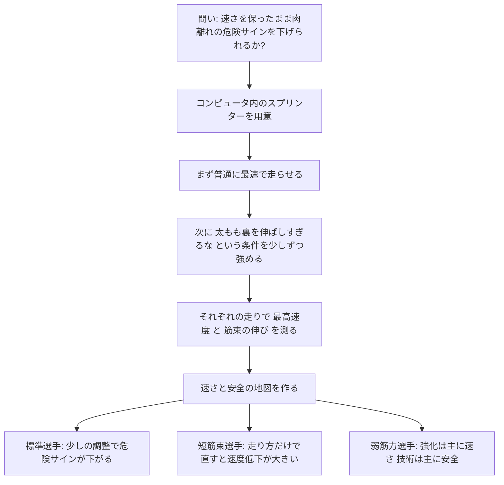
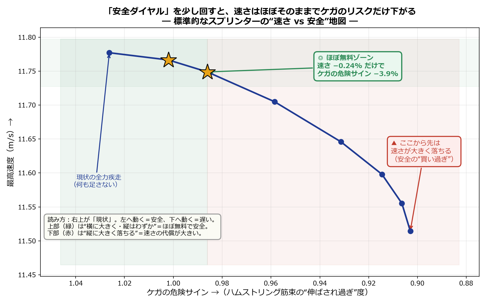
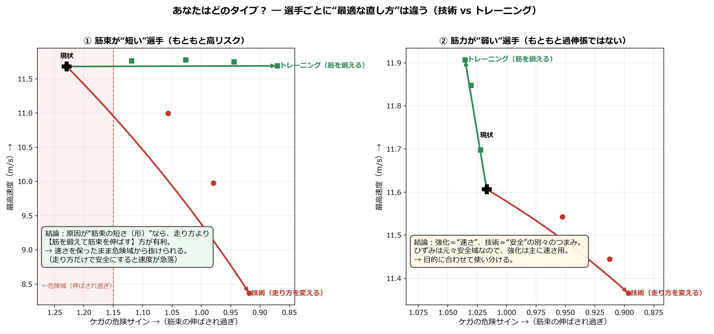
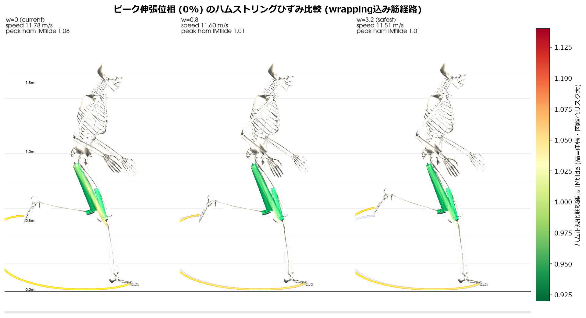
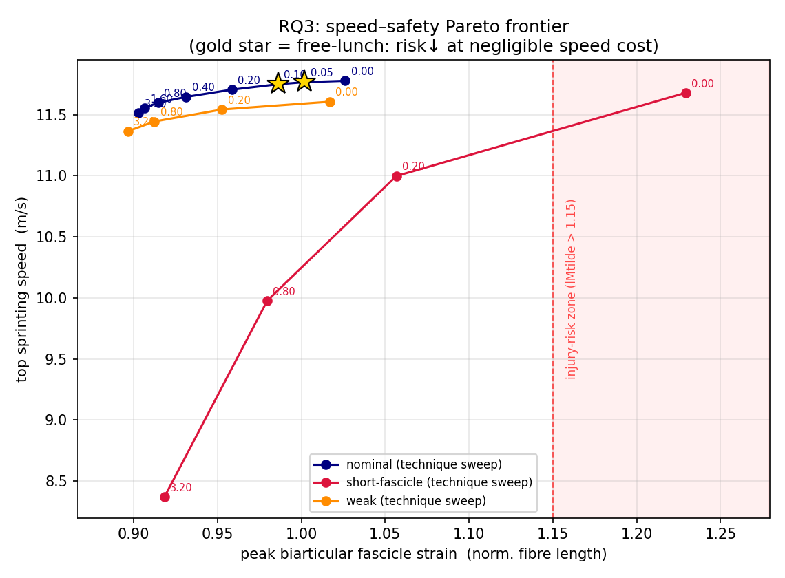
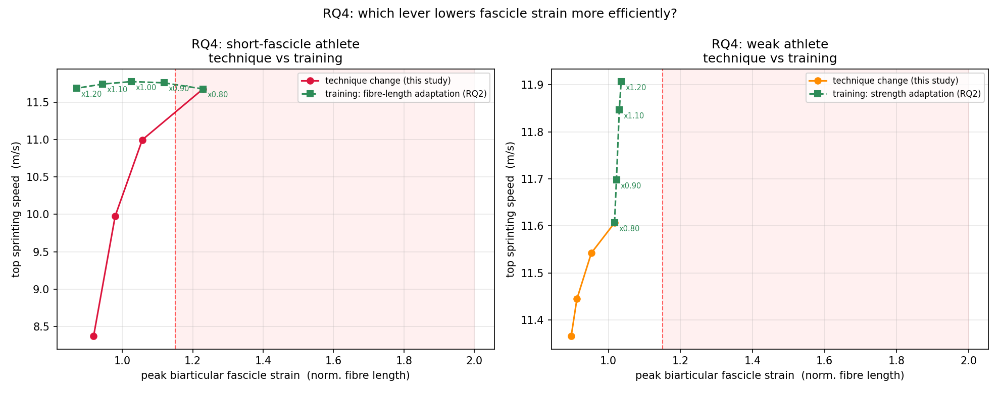
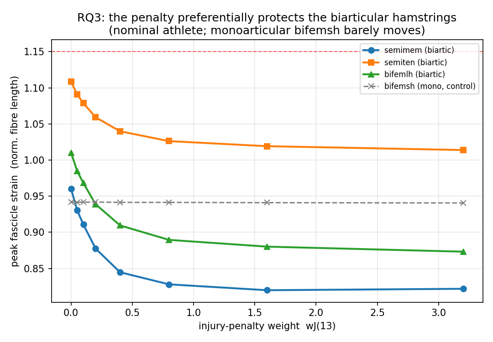
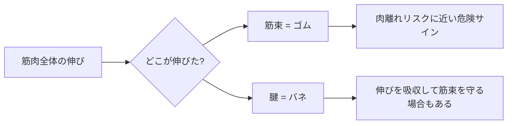

# ポスター・研究発表のためのわかりやすい説明レポート

## 目的

この資料は、ハムストリング**力学的負荷代理指標**の速度-負荷パレート研究を、**専門家にも専門外の人にも伝わる形**で説明するための発表レポートである（主張較正は [CLAIM_CALIBRATION.md](CLAIM_CALIBRATION.md) 準拠；肉離れの発生確率や予防効果を実証するものではない）。

最初に「この研究で実際に何をやったのか」を平易にまとめ、その後で専門家向け・専門外向けの発表展開に分ける。

共通する中心メッセージは次の一文である。

> コンピュータ内のスプリンターに「できるだけ速く走る」だけでなく「太もも裏を伸ばしすぎない」条件も少しずつ加えると、速さをどれだけ保ちながら肉離れに近い危険サインを下げられるかが見える。さらに、その最適な直し方は選手タイプによって変わる。

---

## まず、何をやった研究なのか

この研究は、実際の選手に何通りもの危険な全力疾走を試させる代わりに、**コンピュータ内の筋骨格モデル**を使って「速さ」と「ハムストリングの安全性」の関係を調べた。

重要なのは、単に「どの走り方が危ないか」を見るだけではない。今回は、走り方を最適化する目的そのものに「ハムストリングを伸ばしすぎるな」という条件を足して、**安全寄りの走りをコンピュータに設計させた**。

### 研究の流れ

### 何を入力して、何を変えて、何を見たのか

| 項目 | 平易な説明 | 正確な表現 |
| --- | --- | --- |
| 入力 | コンピュータ内の全身スプリンター | Hamner系の筋骨格モデルによる予測シミュレーション |
| もとの命令 | できるだけ速く走れ | 平均前進速度を最大化する最適制御問題 |
| 追加した命令 | 太もも裏の筋を伸ばしすぎるな | 二関節ハムストリングの `lMtilde > 1.0` への滑らかな過伸張ペナルティ |
| 少しずつ変えたもの | 安全をどれくらい重視するか | 新しい目的関数重み `wJ(13)` の掃引 |
| 見た結果 | 速さがどれだけ落ち、危険サインがどれだけ下がるか | 最高速度、ピーク正規化筋束長、受動張力、伸張性仕事 |
| 比較した選手 | 標準、筋束が短い、筋力が弱い選手 | Nominal、short-fascicle、weak virtual athletes |

---

## この研究の結論を一番短く言うと

### 結論1: 標準的な選手には「速さをほぼ落とさず安全に寄せる余地」がある

標準的なスプリンターでは、安全を少し重視した走りに変えると、**最高速度はほとんど落ちずに、ハムストリング筋束の危険サインが下がった**。

代表値:

- 速度損失: 0.24%
- ピーク筋束ひずみの低下: 3.91%

これは「ケガが必ず減る」と言っているのではない。正確には、肉離れと関係する筋束の伸びや受動張力という **injury-risk surrogate** が下がった、という意味である。

### 結論2: 危険な選手ほど、同じ直し方でよいとは限らない

筋束が短い選手では、走り方だけで安全にしようとすると速度の犠牲が大きかった。一方、筋束を長くする方向のトレーニングを想定すると、速さを保ちながら危険サインを下げられた。

筋力が弱い選手では、強化は主に速さを上げる方向に効き、筋束のピークひずみを大きく下げるわけではなかった。つまり、強化と技術修正は同じ目的の手段ではなく、**速さを上げるつまみ**と**筋束ひずみを下げるつまみ**として分けて考える必要がある。

### 結論3: 安全側の走りは、脚を前に振り出しすぎない方向に変わる

安全側の解では、骨盤の向きと遊脚脚の股関節屈曲が変わり、二関節ハムストリングが伸ばされすぎにくくなった。専門的には、股関節と膝をまたぐハムストリングの近位側伸張が減ったと解釈できる。

---

## 誤解を避けるための境界線

| 言ってよいこと | 言いすぎになること |
| --- | --- |
| 筋束ひずみ・受動張力などの危険サインが下がった | 実際の肉離れ発生率を直接予測した |
| 速度と安全の間には低コスト領域があった | すべての選手で速さを落とさず安全になる |
| 短筋束選手ではトレーニング経路が有利だった | 技術指導は不要である |
| 弱筋力選手では強化は主に速度に効いた | 筋力は肉離れリスクと無関係である |
| 単一モデルでの機序的な概念実証である | 全選手にそのまま一般化できる |

---

## 発表でそのまま使える説明

### 30秒版

> この研究は、全力疾走中のハムストリング肉離れを、コンピュータ内のスプリンターで調べたものです。普通は「できるだけ速く走る」走り方を計算しますが、今回はそこに「太もも裏を伸ばしすぎない」という条件を少しずつ加えました。すると、標準的な選手では速さをほとんど落とさずに危険サインを下げられる領域が見つかりました。一方で、筋束が短い選手では走り方だけで直すと速度低下が大きく、筋そのものを鍛え直す方が有利でした。

### 90秒版

> ハムストリング肉離れでは、外から見える脚の動きだけでなく、筋肉の中の「筋束」がどれだけ伸ばされているかが重要です。筋肉は大まかに言うと、力を出すゴムのような筋束と、伸びを受けるバネのような腱がつながった構造です。肉離れに近い危険サインを見るには、筋肉全体ではなく筋束の伸びを見る必要があります。
>
> 本研究では、コンピュータ内の筋骨格モデルにまず「できるだけ速く走れ」と命令し、次に「ただしハムストリング筋束を伸ばしすぎるな」という条件を少しずつ強めました。そのたびに、最高速度と筋束の危険サインを測り、速さと安全の地図を作りました。
>
> 結果として、標準的な選手では、速度損失0.24%でピーク筋束ひずみを3.91%下げられる低コスト領域がありました。ただし、筋束が短い選手では、走り方だけで安全側へ寄せると速度の犠牲が大きく、筋束を長くする方向のトレーニングが有利でした。弱筋力選手では、強化は主に速さに効き、安全性は技術修正と分けて考える必要がありました。

### 3分版の話す順番

| 順番 | 話す内容 | 図 |
| --- | --- | --- |
| 1 | 全力疾走ではハムストリング肉離れが問題になる | なし、または3D筋骨格図 |
| 2 | 見るべきなのは筋肉全体の伸びではなく、筋束の伸び | ゴム+バネの模式図 |
| 3 | コンピュータ内で「最速」と「伸ばしすぎない」を両方満たす走りを探した | 研究フロー図 |
| 4 | 標準選手では、速度をほぼ保って危険サインを下げる領域があった | `explainer_frontier_jp.png` |
| 5 | 短筋束選手と弱筋力選手では、最適な直し方が違った | `explainer_decision_jp.png` |
| 6 | ただし、これは肉離れ発生率ではなく、筋束ひずみ proxy の研究である | 境界線の表 |

### 専門用語を出す順番

専門外の人には、最初から `lMtilde` や `Pareto frontier` を出さない。以下の順に出すと理解が崩れにくい。

| 先に言う言葉 | その後で補足する専門語 |
| --- | --- |
| 太もも裏の危険サイン | 筋束ひずみ、正規化筋束長 `lMtilde` |
| 速さと安全の地図 | Pareto frontier |
| 安全をどれくらい重視するか | 目的関数重み `wJ(13)` |
| 筋を伸ばしすぎない条件 | smooth overstretch penalty |
| 実際のケガではなく危険サイン | injury-risk surrogate |

---

## 図で見る全体像

### 使う主要図

| 目的 | 専門家向けの図 | 専門外向けの図 |
| --- | --- | --- |
| 速度-安全の地図 |  |  |
| 個別化介入 |  |  |
| 機序説明 |  |  |

---

## 専門家向けの発表設計

### 専門家向けの入口

専門家には、既知の「前傾骨盤でハムストリングが伸びる」ではなく、**記述から処方への拡張**を最初に示す。

> 先行研究はハムストリング伸張の機序を説明してきたが、速度をどこまで保ちながら筋束ひずみ proxy を下げられるか、また選手タイプごとに技術修正とトレーニング介入のどちらが有利かは十分に設計されていない。

### 専門家向けポスター構成

| Panel | 見出し | 図 | 伝えること |
| --- | --- | --- | --- |
| 1 | Problem and Gap | 小さな研究フロー図 | 既知のリスク説明から、介入設計へ進む必要がある |
| 2 | Model Credibility | 文献整合の小表 | 基準速度と多くの運動学指標が文献範囲に整合する |
| 3 | Injury Penalty | 目的関数の式 | 二関節ハム `lMtilde > 1.0` の滑らかな片側ペナルティを追加した |
| 4 | Nominal Pareto Frontier | `pareto_frontier.png` | 速度損失ほぼゼロの低コスト領域がある |
| 5 | Individualized Intervention | `technique_vs_training.png` | 短筋束ではトレーニング、弱筋力では強化と技術を分ける |
| 6 | Mechanism and Limits | `permuscle_vs_weight.png` + 3D図 | 安全側フォームの機序と、proxy研究としての限界を明示する |

### 専門家向けの中心図1: Pareto frontier

読み上げる要点:

- `w=0.05`: 速度損失 0.09%、ピーク筋束ひずみ 2.36%低下。
- `w=0.10`: 速度損失 0.24%、ピーク筋束ひずみ 3.91%低下。
- `w=3.20`: 速度損失 2.23%、ピーク筋束ひずみ 12.01%低下、受動張力は約半分。

推奨表現:

> A near-zero speed-cost region exists close to the nominal sprint optimum.

避ける表現:

> This directly predicts hamstring injury probability.

この研究が示しているのは、肉離れ発生確率ではなく、筋束ひずみ・受動張力などの **fascicle-strain injury surrogate** の変化である。

### 専門家向けの中心図2: 技術 vs トレーニング

読み上げる要点:

- 標準選手では、軽い技術修正で速度をほぼ保ちながら筋束ひずみを下げられる。
- 短筋束選手では、技術だけで安全側へ寄せると速度代償が大きい。
- 短筋束を標準へ戻すトレーニング path は、ひずみを下げながら速度も保つ。
- 弱筋力選手では、強化は主に速度、技術修正は主にひずみを変える。

専門家向けの結論文:

> Fascicle length primarily controls the fascicle-strain safety margin, whereas strength primarily controls performance capacity.

### 専門家向けの研究発表スライド案

| Slide | タイトル | 内容 | 時間 |
| --- | --- | --- | ---: |
| 1 | Why prescription, not only description? | 既知のリスク説明と未解決の処方問題 | 1分 |
| 2 | Research Questions | RQ1: 筋束指標、RQ2: 個体差、RQ3/4: Paretoと個別化 | 1分 |
| 3 | Model and Validation | Hamner model、direct collocation、文献整合 | 1分 |
| 4 | Injury Penalty | `wJ(13)`、smoothpos、二関節ハム対象 | 2分 |
| 5 | Nominal Pareto Frontier | 低コスト領域の結果 | 2分 |
| 6 | Individualized Intervention | 短筋束・弱筋力の比較 | 2分 |
| 7 | Mechanism | 骨盤・股関節屈曲・二関節ハム伸張 | 1分 |
| 8 | Limits and Take-home | proxy、単一モデル、N=50中心、今後の感度解析 | 1分 |

### 専門家向けの締め方

> 本研究の新規性は、ハムストリング損傷リスク因子を説明するだけでなく、筋束ひずみ proxy と最高速度の Pareto frontier を使って、技術修正とトレーニング介入のどちらを選ぶべきかを個別化して設計した点にある。

---

## 専門外向けの発表設計

### 専門外向けの入口

専門外の人には、最初に数式ではなく問いを出す。

> 速く走るほど肉離れしやすいのか。それとも、速さをほとんど落とさずに危険サインだけを下げる走り方があるのか。

この後に、筋肉を「ゴムとバネ」で説明する。

### 専門外向けポスター構成

| Panel | 見出し | 図 | 伝えること |
| --- | --- | --- | --- |
| 1 | 速さと安全は両立できる? | 大きな問い | 肉離れ予防を「速さを犠牲にする話」だけにしない |
| 2 | 筋肉はゴム+バネ | ゴムとバネの模式図 | 傷つく側に近い筋束の伸びを見る必要がある |
| 3 | コンピュータに何をさせたか | 安全ダイヤル図 | 「速く走れ」に「伸ばしすぎるな」を少しずつ足した |
| 4 | 結果1: ほぼ無料の安全 | `explainer_frontier_jp.png` | 速度をほぼ落とさず危険サインを下げる領域がある |
| 5 | 結果2: 人によって直し方が違う | `explainer_decision_jp.png` | 短筋束ならトレーニング、弱筋力なら目的別に使い分ける |
| 6 | 実際の動き | `ham_pareto_musculoskeletal_hero.png` | 安全な走りは股関節の振り出しすぎを抑える |

### 専門外向けの中心図1: 安全ダイヤル

読み上げる要点:

- 横に動くほど危険サインが下がる。
- 下に落ちるほど速さを失う。
- 最初の少しの調整では、横には動くが下にはあまり落ちない。
- つまり、標準的な選手では「速さをほぼ保ったまま安全を少し買える」余地がある。

専門外向けの言い方:

> 安全ダイヤルを少し回すと、スピードメーターはほぼ動かないのに、危険サインだけが下がりました。

### 専門外向けの中心図2: 選手タイプ別の直し方

読み上げる要点:

- 筋束が短い選手は、走り方だけで安全にしようとすると速さが大きく落ちる。
- このタイプは、筋束を長くする方向のトレーニングが有利。
- 筋力が弱い選手では、強化は主に速さを戻すために効く。
- 危険サインを下げたい場合は、技術修正を別に考える。

専門外向けの結論文:

> 「ハムストリングが危ない」と一括りにせず、なぜ危ないのかを見れば、直し方も変わる。

### 専門外向けの中心図3: 3D筋骨格で見る安全な走り

読み上げる要点:

- 赤や黄色に近いほど、ハムストリング筋束が伸ばされている。
- 安全側の走りでは、ハムストリングの過伸張が減る。
- 主な機序は、骨盤の向きと遊脚脚の股関節屈曲が変わり、脚を前に振り出しすぎないこと。

### 専門外向けの研究発表スライド案

| Slide | タイトル | 内容 | 時間 |
| --- | --- | --- | ---: |
| 1 | 速く走るほど危ないのか? | 研究の問い | 30秒 |
| 2 | 肉離れで見るべき場所 | 筋束=ゴム、腱=バネ | 1分 |
| 3 | コンピュータ内のスプリンター | 予測シミュレーションの直感 | 1分 |
| 4 | 安全ダイヤルを回す | 目的関数を平易に説明 | 1分 |
| 5 | 結果1: 速さはほぼそのまま | `explainer_frontier_jp.png` | 2分 |
| 6 | 結果2: 人によって正解が違う | `explainer_decision_jp.png` | 2分 |
| 7 | 体の中で何が変わったか | 3D筋骨格図 | 1分 |
| 8 | 使い道と注意点 | 肉離れ確率ではなく危険サイン | 1分 |

### 専門外向けの締め方

> 速く走ることとケガしにくいことは、必ずしも完全なトレードオフではない。少し走り方を変えるだけで安全になる人もいれば、走り方より筋そのものを鍛え直すべき人もいる。この研究は、その違いをコンピュータの中で見分ける方法である。

---

## 聴衆別の言い換え表

| 伝えたい内容 | 専門家向け | 専門外向け |
| --- | --- | --- |
| 損傷指標 | fascicle-strain injury surrogate | 太もも裏の危険サイン |
| 方法 | direct collocation + smooth hinge penalty | コンピュータに「速く、でも伸ばしすぎない」と命令する |
| 結果 | speed-safety Pareto frontier | 速さと安全の地図 |
| 低コスト領域 | near-zero speed-cost region | 速さをほぼ落とさず安全だけ上がる場所 |
| 個別化 | morphology-specific intervention path | 人によって直し方が違う |
| 限界 | not injury probability | 肉離れそのものではなく危険サインを見ている |

---

## 最終的な使い分け

### 専門家向けの最重要メッセージ

> Predictive simulation can move from explaining hamstring injury mechanisms to prescribing individualized speed-safety trade-offs through a fascicle-strain Pareto frontier.

### 専門外向けの最重要メッセージ

> 速さと安全は全か無かではない。どの選手に、走り方の修正が効くのか、筋を鍛え直す方がよいのかを、コンピュータの中で見分けられる。

---

## 発表前チェックリスト

- 専門家向けでは「肉離れ確率」ではなく「fascicle-strain injury surrogate」と明記する。
- 専門外向けでは `lMtilde` を最初に出さず、「危険サイン」と言い換える。
- どちらの発表でも、低コスト領域の代表値として「速度損失 0.24%、ひずみ 3.91%低下」を使う。
- 短筋束選手の話では、「技術修正が無意味」ではなく「速度代償が大きく、筋束長トレーニングが有利」と表現する。
- 弱筋力選手の話では、「筋力はリスクと無関係」ではなく「強化は主に速度、技術は主にひずみ」と表現する。